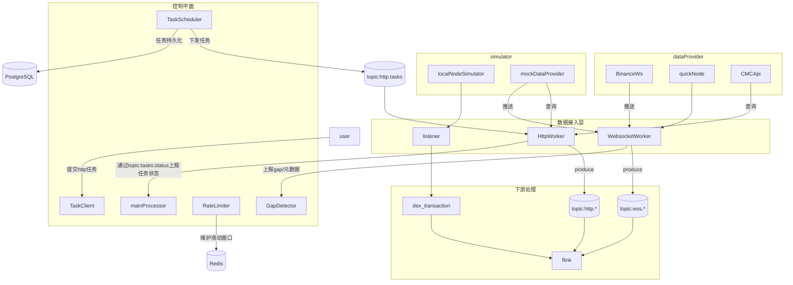
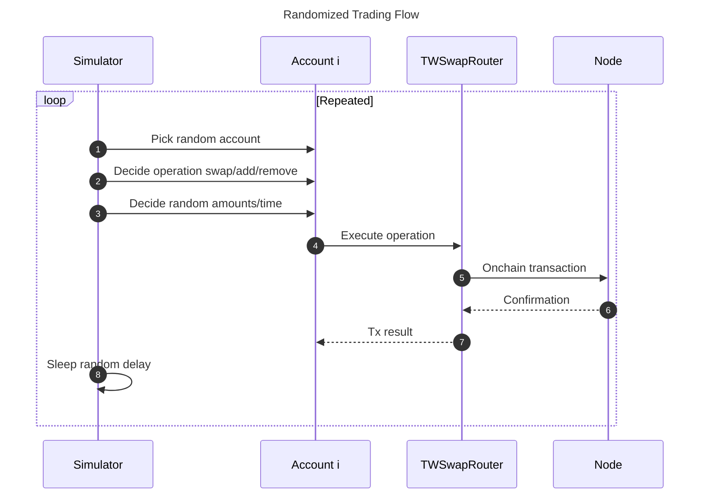
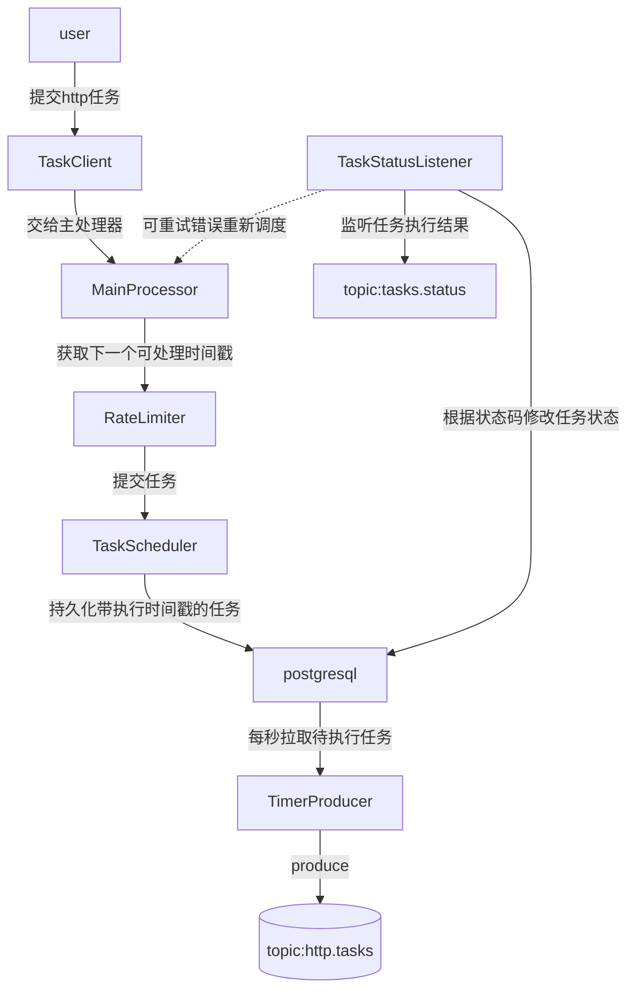
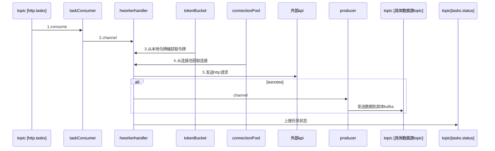

# **数据源dataSource**

为系统提供输入数据

- dataProvider：提供真实节点数据，包括quicknode,Binance WebSocket Stream，CoinMarketCap API
- simulator:提供本地mock数据源，来模拟偶发事件。
    - localNodeSimulator:在本地hardhat node中模拟多账户、多 Token、多场景的交易，目前聚焦 Uniswap V2 （如添加或移除流动性、swap），为后续分析提供丰富数据
    - mockDataProvider:用于验证数据接入层可靠性，提供http,websocket接口。通过故障注入器来注入数据缺失、连接断开等问题。



## **DataProvider**

### **binance websocket stream**

- 
- API Key：dTgvvkKyA2BH2xIlcEHImNEVfRSEnplChNRjhyV6ErP2kQuBilOm3ruTx3xfJUSP
- Secret Key：24J1NTTXzlZlo09tIRArsfS3XgNdkQFwVE5v1WwcpGIX7hBxlwkvuAWUrbtYZeUM

### **quicknode**

API Key QN_0a5b9df08d0b41a7b34253b8a9fe641 订阅以太坊区块链原生数据

### **cmcAPI**

- CMC_API_URL:https://pro-api.coinmarketcap.com/v1
- CMC_API_KEY:8760b558-6800-4cf3-879a-1ff40cba1a96
- 具体endpoint
    - /cryptocurrency/listings/latest
    - /global-metrics/quotes/latest

### **LocalNodeSimulator**

- 目标：在本地节点中模拟多账户、多 Token、多场景的交易，目前聚焦 Uniswap V2 （如添加或移除流动性、swap），为后续分析提供丰富数据。
- 主要组成
    - Accounts：5 个本地账户，每个账户拥有足量测试 Token，并持续发起交易。
    - Tokens：通过最小代理部署 5 个 MyERC20（WETH、USDC、DAI、TWI、WBTC）。给各账户 mint 大量代币。
    - TWSwap：自实现的Uniswap V2（包含 Factory、Router、Pair），可处理 add/remove 流动性、swap。
    - 模拟器循环：随机或脚本化地对 TWSwapRouter 发起多样化交易（addLiquidity、removeLiquidity、swap），生成持续事件流供后续处理。

### **MockDataProvider**

目的：真实的数据源难以精准命中各类故障，因此加入mock数据源来进行模拟测试，目前只提供区块链头获取. 语言：go 1.20

- mockController：提供websocket与http mock服务。
    - websocket: eth_subscribe newHeads
    - http:**eth_subscribe newHeads的补数据接口**
- dataGenerator:生成mock服务需要的数据
- faultInjector
    - http故障注入：随机请求失败，状态码包括可重试的状态码（如429）与不可重试的状态码。
    - websocket故障注入：
        - 连接断开模拟：随机断开连接
        - 数据缺失模拟：模拟数据丢失场景
        - 心跳异常： 忽略Pong响应

## **流程图**



# **DataInjector数据接入模块**

目标：接入并管理外部数据源写入消息队列

## **Listener 数据监听器**

目标：通过轮询获取本地hardhatnode数据写入topic：dex_transaction，使用 go-ethereum 的 ethclient 连接[http://127.0.0.1:8545，监听区块及拉取日志。](http://127.0.0.1:8545%EF%BC%8C%E7%9B%91%E5%90%AC%E5%8C%BA%E5%9D%97%E5%8F%8A%E6%8B%89%E5%8F%96%E6%97%A5%E5%BF%97%E3%80%82/)

## **控制平面**

语言:java

### **任务调度工作流**



### **RateLimiter**

采用redis滑动窗口，若当前窗口额度不足则返回下一个可处理时间戳，否则返回当前时间戳

### **任务状态**

1. pending 提交任务后
2. processing 处理中
3. success 任务成功
4. retry tasks.status为可重试任务
5. failure 不可重试任务

### **任务重试**

postgresql表中记录retry_count，最多3次

## **httpworker**

语言：go 1.20 HTTP Worker 模块用于接收控制平面下发的 HTTP 拉取任务，通过对接外部 API 完成数据拉取，并将数据写入 Kafka 数据通道，实现与第三方系统的数据集成。

### **httpworker工作流**



### **http.tasks示例**

```json
{
	"taskId":,
	"payload":{"dataSourceUrl":"https://pro-api.coinmarketcap.com/v1/cryptocurrency/listings/latest","method":"get","params":{"start":1,"limit":100,"convert":"US"},
	"apikey":"8760b558-6800-4cf3-879a-1ff40cba1a96"
	}
}

```

### **本地数据源配置**

map<datasourceId,json>

```json

{
"dataSourceUrl":"https://pro-api.coinmarketcap.com/v1/cryptocurrency/listings/latest",
"ratelimit":{"interval":60, //统一单位为s
"weight": 1200,
"costRule": //如果额度扣减复杂，比如根据参数确定，则使用自定义方法计算
}
}

```

### **tokenBucket**

本地令牌桶,补充间隔统一200ms,令牌补充数按照相应限流配置进行平滑，比如60s限流1200，则200ms补充4个令牌.

### **connectionpool**

使用连接池进行连接管理，支持 Keep-Alive，启用请求级超时控制，避免长时间阻塞。连接池根据数据供应商host:port进行隔离。