# **系统总览**

## **项目介绍**

本项目是一个**加密货币实时数据平台**。系统覆盖链上交易（DEX）、中心化交易所（Binance、Hyperliquid）、市场数据（CMC、QuickNode）等多源异构数据，提供从数据采集、实时处理到智能应用的端到端解决方案。

## **系统架构**

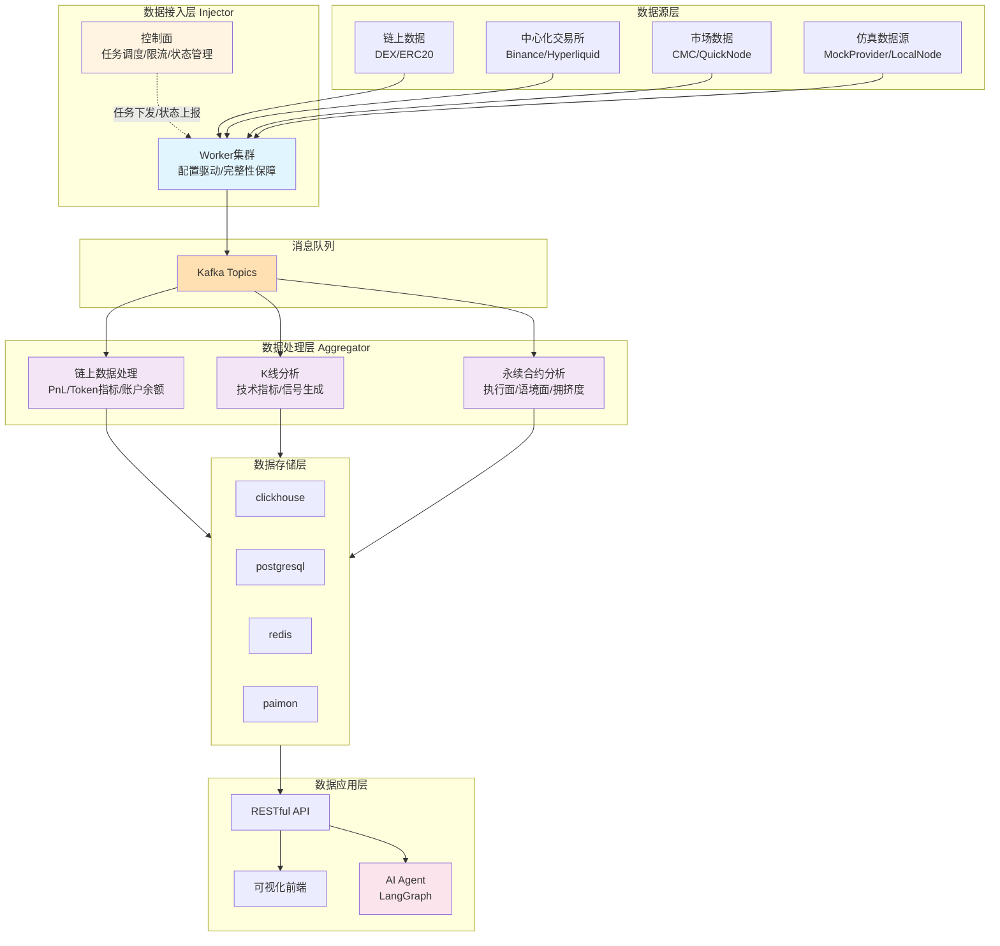
# 数据接入层

### 亮点

- **控制面与数据面分离：** 控制面负责任务生命周期管理（下发、重试与状态管理）、全局限流、数据质量检测等。数据面通过**配置驱动的方式拉取相应数据。**
- **配置驱动的统一worker架构：**数据接入任务可独立灵活开关，新需求无需修改原代码。worker实例不与通信协议强绑定。
- **高可靠性——四大亮点机制**：数据完整性保障模块、基于持久化时间戳的任务延时调度、任务状态管理与多级重试、多级限流。

## 整体架构

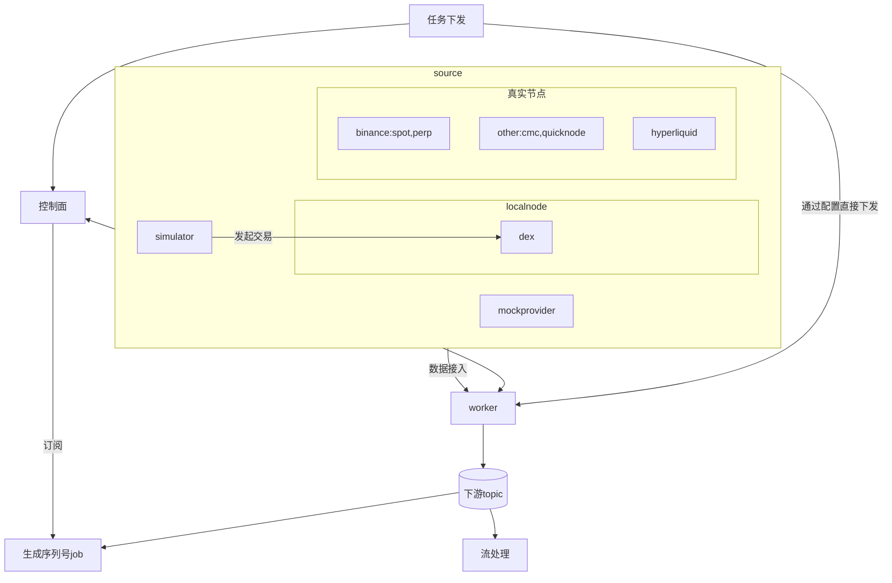

## 真实节点列表

- binance spot stream
- binance perp stream
- hyperliquid
- coinmarketcap
- quicknode

## 仿真数据源

除真实节点外，为了更好复现生产环境中的偶发事件，项目设计了仿真数据源。

### localnode

- **自建dex:** 参考uniswap v2并基于solidity 0.8.x在本地hardhat node搭建的dex。
- **交易仿真器**：模拟真实dex常见情况。如mint代币，为池子注入流动性、交易等。账户含cex、聪明钱、public figure,fresh wallet等标签。暂无对各标签的个性化行为。

### **MockDataProvider**

- 验证数据接入层非功能性处理能力，核心模块如下：
- **dataGenerator**: mock数据生成器
- **faultInjector：**故障注入器
    - **http故障注入**：请求失败（可重试、不可重试）
    - **websocket故障注入**：连接断开、数据缺失、心跳异常
    - **其他故障**：如链重组

## worker架构

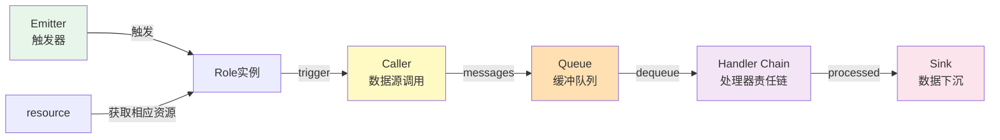

### 组件说明

- **Role:** 任务的执行单元，可弹性为worker集群分配任务，符合云原生理念。
- **Emitter**：控制任务触发时机,包括Polling(定时)/Single(基于配置变更)/KafkaCommand(事件驱动)
- **Resource**: 对资源的统一抽象，role调用caller需先获取相应resource，如http连接池、websocket连接数、限流token等。
- **Protocol:** 底层协议管理，负责单连接管理如websocket断线重连、心跳等。
- **Caller：**业务适配层，调用协议层完成数据拉取。
    - NativeCall(HTTP/WS)：原生协议，通常简单参数组装。
    - SDKCall(如go-ethereum)：通常需实现自定义caller类来调用相应api。
- **Queue：**解耦采集与处理的有界 channel
- **Handler：**责任链模式的数据处理链。handler与业务无关。

### 配置示例

```yaml
  roles:
  - role_id: "binance-perp-btc-orderbook"
    emitter: "single"
    caller: "native_call"
    caller_config:
      protocol: "websocket"
      url: "wss://fstream.binance.com/ws"  # 实盘数据源(默认)
      # url: "ws://localhost:8090/ws/binance/btcusdt@depth@100ms"  # 使用mock-data-provider时注释上一行并启用本行
      datasource_id: "binance.perp.depth"
      rate_limit:
        capacity: 80        # allow short bursts but stay under 2400 req/min (~40 rps)
        refill_rate: 30     # conservative vs Binance 40 rps limit
    caller_params:
      message_format: "binance"
      streams:
        - "btcusdt@depth@100ms"
      metadata_fields:
        symbol: "data.s"
        event_time: "data.E"
    handlers:
      - type: "binance"
        with:
          kind: "depth"
      - type: "integrity"
        with:
          profile: "binance_depth"
          sequence_field: "final_update_id"
          range_start_field: "first_update_id"
          stream_key_field: "binance_symbol"
          gate_mode: "snapshot_hold"
          eager_gap: 20
          max_range: 5
          max_delay_ms: 1500
          hard_timeout_ms: 4000
          max_gap: 200
          sweep_interval_ms: 400
          bucket_ttl_ms: 6000
          max_buckets: 500
          backfill_cooldown_ms: 15000
          backfill:
            http:
              enabled: true
              endpoint: "https://fapi.binance.com/fapi/v1/depth"  # 实盘补数
              # endpoint: "http://localhost:8090/fapi/v1/depth"   # mock 补数
              method: "GET"
              query:
                symbol: "BTCUSDT"
                limit: "500"
      - type: "orderbook_diff"
        with:
          symbol: "BTCUSDT"
          max_depth: 200
      - type: "orderbook_validator"
    sink:
      type: "kafka"
      with:
        brokers:
          - "localhost:9092"
        topic: "perp.orderbook"
        key_from: ["symbol", "exchange"]
    queue: { size: 5000 }
```

## 数据完整性模块

**核心目标**：保障流式数据的**完整性、顺序性、幂等性**，应对网络抖动、消息乱序、数据缺失等生产环境常见问题。

### **架构图**

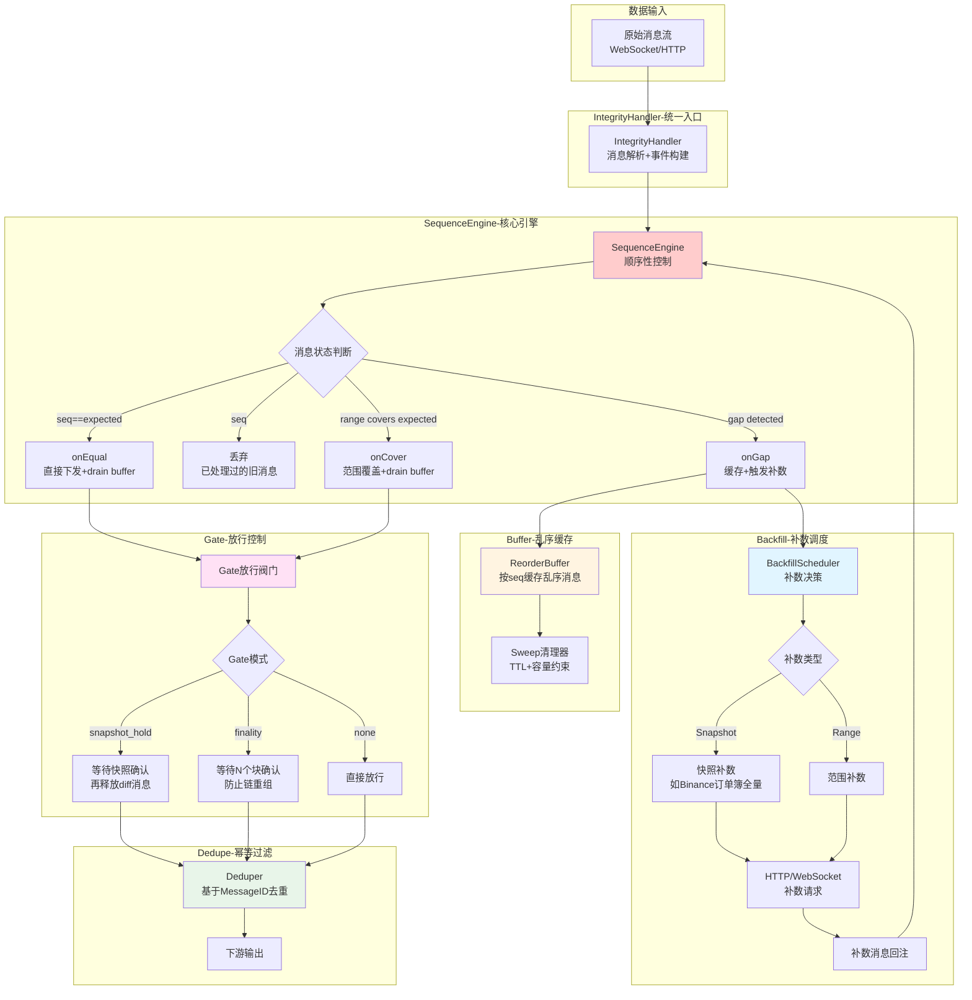

### **设计亮点**

### **1. 三维完整性保障**

- **顺序性（Sequence）**：基于序列号严格控制消息顺序，支持范围覆盖判断（如Binance depth的first_update_id到final_update_id）
- **完整性（Integrity）**：检测gap并自动触发补数，支持快照补数（订单簿）和范围补数（区块链）两种模式
- **幂等性（Dedupe）**：基于MessageID或StreamKey+Seq的去重机制，TTL窗口内自动过滤重复消息

### **2. 智能补数策略**

**触发条件**：

- **EagerGap**：gap超过阈值（如20）立即补数
- **MaxDelay**：软超时（如1.5秒），等待期间未收到预期消息触发补数
- **HardTimeout**：硬超时（如4秒），允许跳跃并继续处理

**补数类型**：

- **Snapshot补数**：适用于Binance订单簿，触发全量快照请求，通过snapshot_hold gate确保快照应用后再释放diff消息
- **Range补数**：适用于区块链数据，请求[start, end]范围的缺失块，支持多通道兜底（HTTP/WebSocket/RPC）

**冷却机制**：相同范围在冷却期内（如15秒）不重复补数，避免补数风暴

### **3. Gate放行控制**

**三种模式**：

- **snapshot_hold**：适用于订单簿场景，快照应用前阻塞所有diff消息，快照后一次性释放buffer
- **finality**：适用于区块链场景，等待N个块（如12个）确认后才放行，防止链重组导致的数据不一致
- **none**：无特殊控制，消息通过顺序检查后直接下发

### **4. 乱序缓存（ReorderBuffer）**

**核心机制**：

- 按序列号分桶缓存乱序消息
- drain操作：从expected开始连续取出所有可下发消息
- 双重约束：TTL（如3秒）+ 容量上限（如2000个bucket）
- 定期清理：sweep周期（如400ms）清理过期或超容量的bucket

### **5. 配置驱动的Profile机制**

**预设Profile**：

- **generic**：通用场景，默认参数
- **binance_depth**：Binance订单簿专用，自动启用range覆盖判断、snapshot_hold gate、快照补数
- **chain_blocks**：区块链场景，自动启用finality gate（12块确认）

**灵活配置**：

```yaml
handlers:
  - type: "integrity"
    with:
      profile: "binance_depth"
      sequence_field: "final_update_id"
      range_start_field: "first_update_id"
      stream_key_field: "binance_symbol"
      gate_mode: "snapshot_hold"
      eager_gap: 20              # 超过20个gap立即补数
      max_range: 5               # 单次补数最多5条
      max_delay_ms: 1500         # 1.5秒软超时
      hard_timeout_ms: 4000      # 4秒硬超时
      max_gap: 200               # 实时容忍最大gap
      sweep_interval_ms: 400     # 400ms清理周期
      bucket_ttl_ms: 6000        # 6秒TTL
      max_buckets: 500           # 最多500个bucket
      backfill_cooldown_ms: 15000 # 15秒补数冷却

```

### **6. 性能与可靠性**

- **内存可控**：buffer容量上限+TTL双重约束，防止内存泄漏
- **无锁设计**：核心路径使用单线程模型，避免锁竞争
- **补数兜底**：支持多通道补数（HTTP/WebSocket/RPC），自动fallback
- **状态隔离**：每个stream独立维护状态，互不干扰

## 分层限流

### 限流策略：控制面 + Worker 两级限流

- **背景**：调研了binance、cmc等各种数据源的限流额度文档，发现数据源限流策略存在差异，如带权重、按endpoint粒度、时间粒度、隐性限流（如瞬时高峰）。
- **策略**：配置化+层级化的限流方案
    - **配置化**：可灵活配置限流的范围、权重、时间粒度
    - **层级化**：月粒度定时校验与报警即可。其余粒度通过控制面全局限流管控，worker局部限流负责平滑高峰。

## 基于持久化时间戳的任务可延时下发

### 核心思想

**方案**：将任务持久化到 PostgreSQL，使用定时扫描器（TimerProducer）根据 `scheduled_time` 字段定期捞取到期任务并发送到 Kafka，实现**延时调度**和**可靠投递**。

- **亮点**
    - **任务不丢失**：要么持久化、要么返回失败到请求侧。
    - **可延时调度**：基于定时器+批量扫描投递kafka方式。
    - **限流管控**：若触发限流，支持直接计算并将调度时间设置为下一允许请求的时间。

### 完整流程

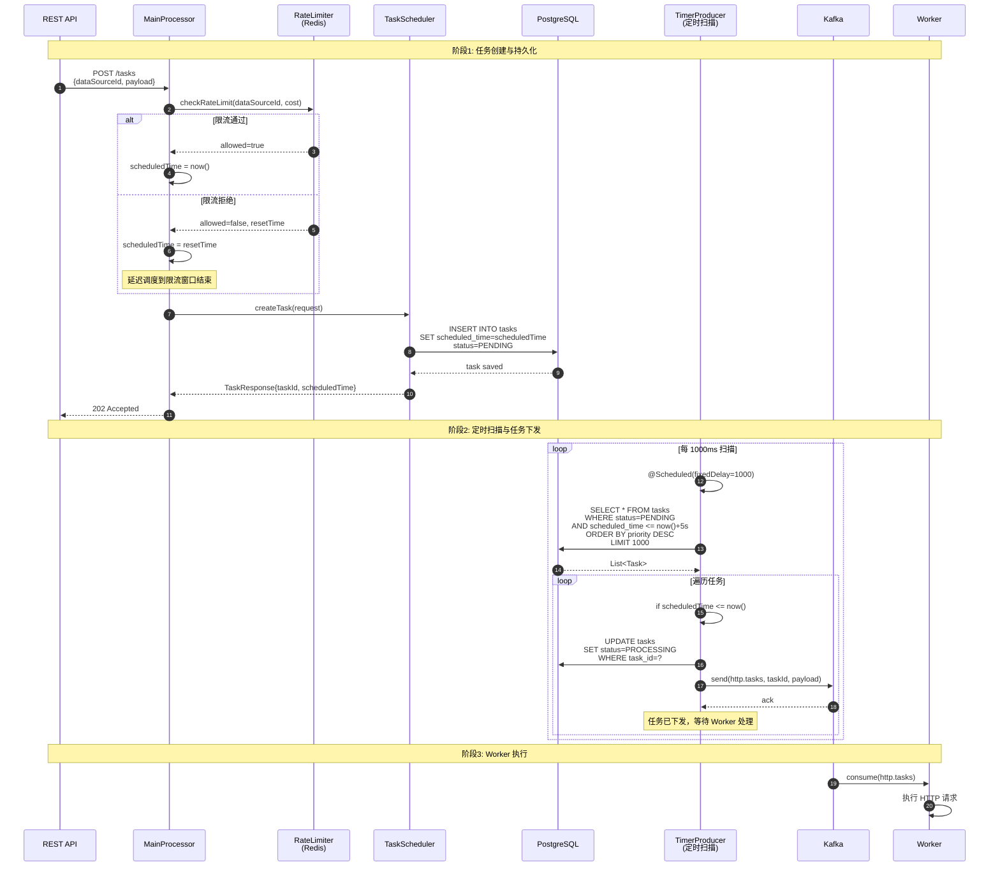

## 任务状态管理与重试机制

**方案**：采用**两级重试架构**：

1. **Worker 本地快速重试**：处理瞬时网络抖动
2. **控制面指数退避重试**：基于状态上报的智能重试

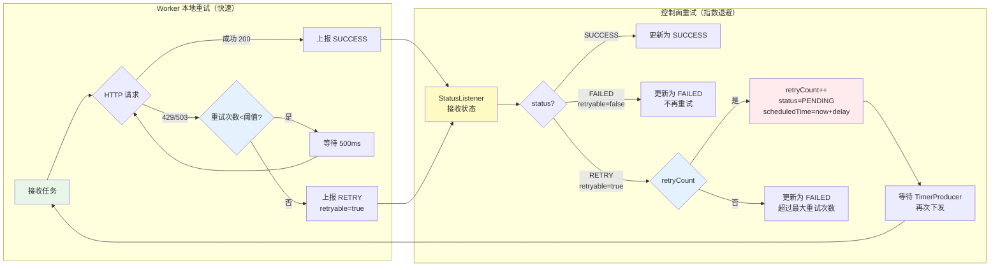

# 流处理

- 主流程为kafka—>flink—>clickhouse。附带starrocks+paimon的流式湖仓，但主要是存储，当前无应用。
- 当前主要包括三大业务：链上数据处理、kline数据分析、永续合约数据分析

## 链上数据处理

### 架构图

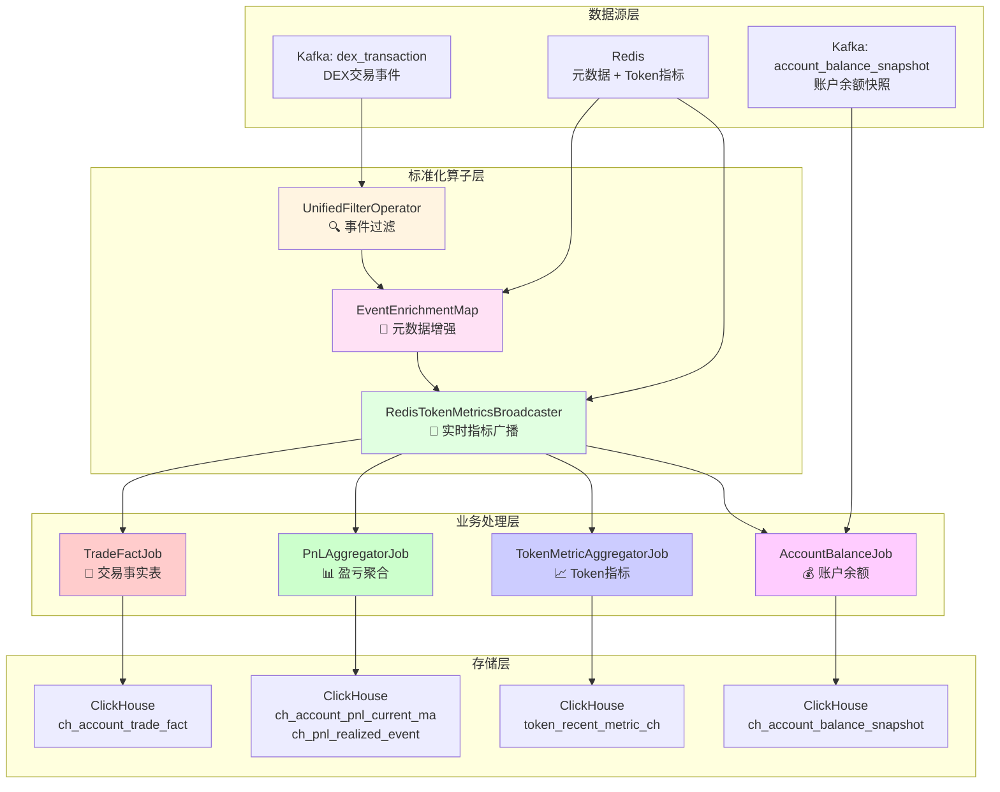

### 设计亮点

- **标准化流程** : 所有Job共享统一前置算子流
- **极小状态** ：PnL仅6个字段，内存占用小，性能高
- **层级窗口 ：**采用增量聚合，减少重复计算
- **双流对齐：**快照+增量协同，保证数据准确性

## 标准化算子层

- **UnifiedFilterOperator**:基于过滤策略的统一事件提取组件
- **EventEnrichmentMap：为原始消息注入元数据(account、token、pair)**
- **RedisTokenMetricsBroadcaster：使用**BroadcastStat为原始消息enrich token价格、mcap等指标

### **PnLAggregatorJob - 账户盈亏分析**

**核心算法**：移动平均成本法（Moving Average Cost）

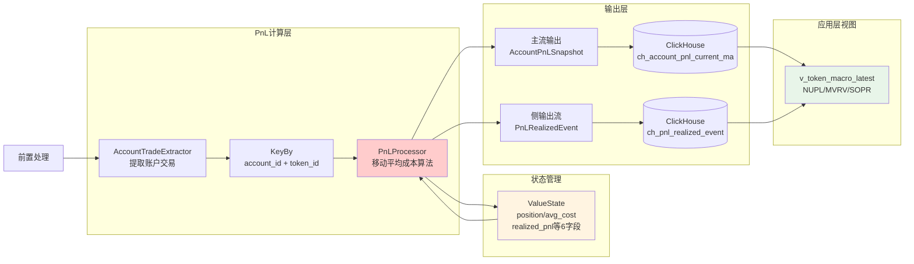

### **设计亮点**

- **极小状态设计**：每个账户-Token组合仅维护6个字段（position、avg_cost、realized_cost_usd、realized_proceeds_usd、realized_pnl_usd、last_price_usd），内存占用极小，支持百万级账户实时计算
- **双输出流架构**：
    - **主流**：实时输出当前持仓快照，支持未实现盈亏查询
    - **侧输出流**：每次卖出触发已实现盈亏事件，用于SOPR等宏观指标计算
- **精确成本追踪**：
    - 买入时：更新移动加权平均成本 `avg_cost = (position * avg_cost + buy_qty * buy_price) / (position + buy_qty)`
    - 卖出时：计算已实现盈亏 `realized_pnl = sell_qty * (sell_price - avg_cost)`
- **宏观指标支持**：基于PnL数据计算链上核心指标（NUPL、MVRV、SOPR），与Nansen/Glassnode对齐

### **TokenMetricAggregatorJob - Token指标聚合**

**核心架构**：层级化窗口聚合（Hierarchical Windowing）

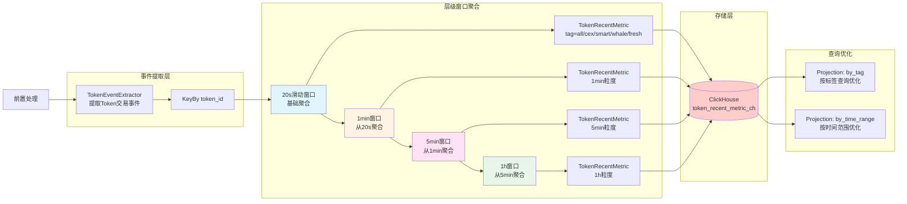

### **设计亮点**

- **层级化窗口聚合**：采用增量聚合策略，20s → 1min → 5min → 1h，避免重复计算，性能提升3-5倍
- **标签分层统计**：同时计算all（全部）、cex（交易所）、smart（聪明钱）、whale（巨鲸）、fresh（新钱包）五个维度的指标，支持用户分层分析
- **丰富指标体系**：
    - **交易指标**：txcnt、buy_count、sell_count、volume_usd、buy_pressure_usd
    - **价格指标**：token_price_usd、mcap_usd、fdv_usd、liquidity_usd
    - **行为指标**：买卖比、活跃地址数、交易频率
- **查询性能优化**：通过Projection实现按标签和时间范围的快速查询，支持毫秒级响应

### **AccountBalanceJob - 账户余额追踪**

**核心架构**：快照+增量双流对齐（Snapshot + Delta Alignment）

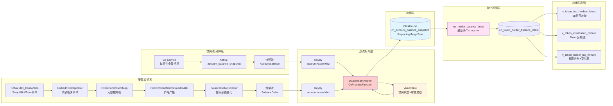

### **设计亮点**

- **双流对齐机制**：
    - **快照流**：Go服务每分钟全量扫描合约状态，生成完整余额快照，保证数据基准准确性
    - **增量流**：实时处理链上交易事件，提取余额变化，补充快照间隙的实时数据
    - **对齐策略**：按(account_id, asset_type, biz_id)三元组KeyBy，使用CoProcessFunction精确对齐，快照优先，增量补充
- **数据一致性保障**：
    - ReplacingMergeTree引擎按block_id去重，确保同一时刻只保留最新数据
    - 双Projection优化：by_token和by_time两个维度的查询加速
    - TTL机制：30天自动清理历史数据，控制存储成本
- **物化视图级联**：
    - **mv_holder_balance_latest**：实时提取最新两个snapshot的持仓数据
    - **v_token_top_holders_latest**：Top 100持币地址，支持按持仓占比排序
    - **v_token_distribution_minute**：Token分布统计（持币人数、中位数、Top2占比、新钱包占比）
    - **v_token_holder_tag_minute**：标签分布及1分钟变化率（exchange/smart_money/whale/fresh_wallet等）
- **价格增强**：通过BroadcastState为每笔余额实时注入Token价格，计算value_usd，支持美元维度的持仓分析
- **RocksDB状态后端**：支持百万级账户的大规模状态管理，内存占用可控

## **kline分析**

### **架构图**

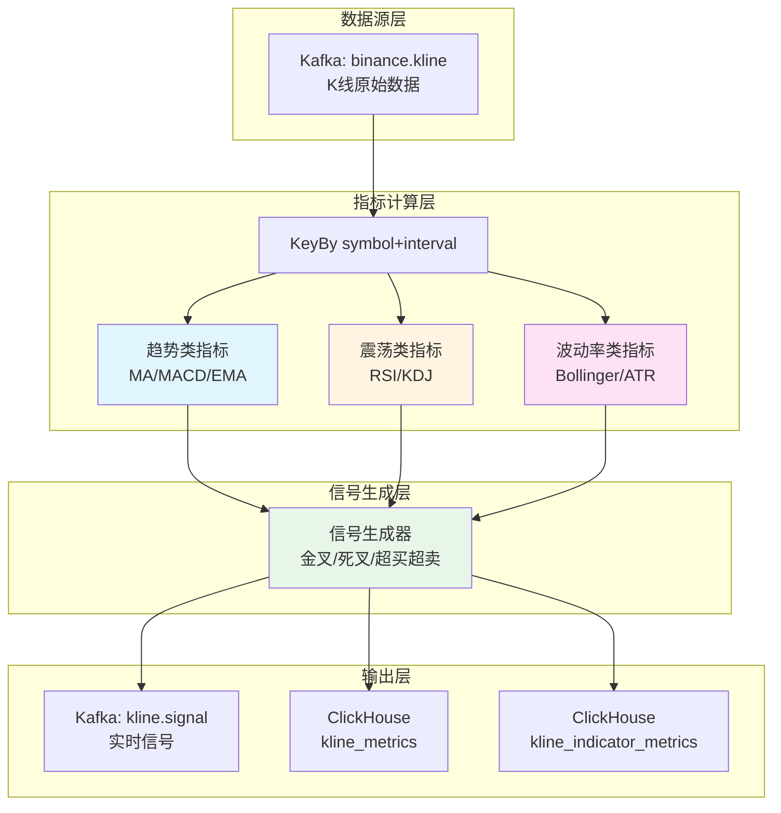

### **设计亮点**

- **多指标并行计算**：趋势类（MA/MACD/EMA）、震荡类（RSI/KDJ）、波动率类（Bollinger/ATR）独立并行处理
- **有状态流处理**：为每个交易对维护价格历史窗口，支持滑动窗口计算
- **实时信号生成**：基于技术指标阈值与交叉策略，生成买入/卖出信号
- **指标落库**：所有原始指标值与信号均落库ClickHouse，支持历史回测与分析

## **永续分析**

### **架构图**

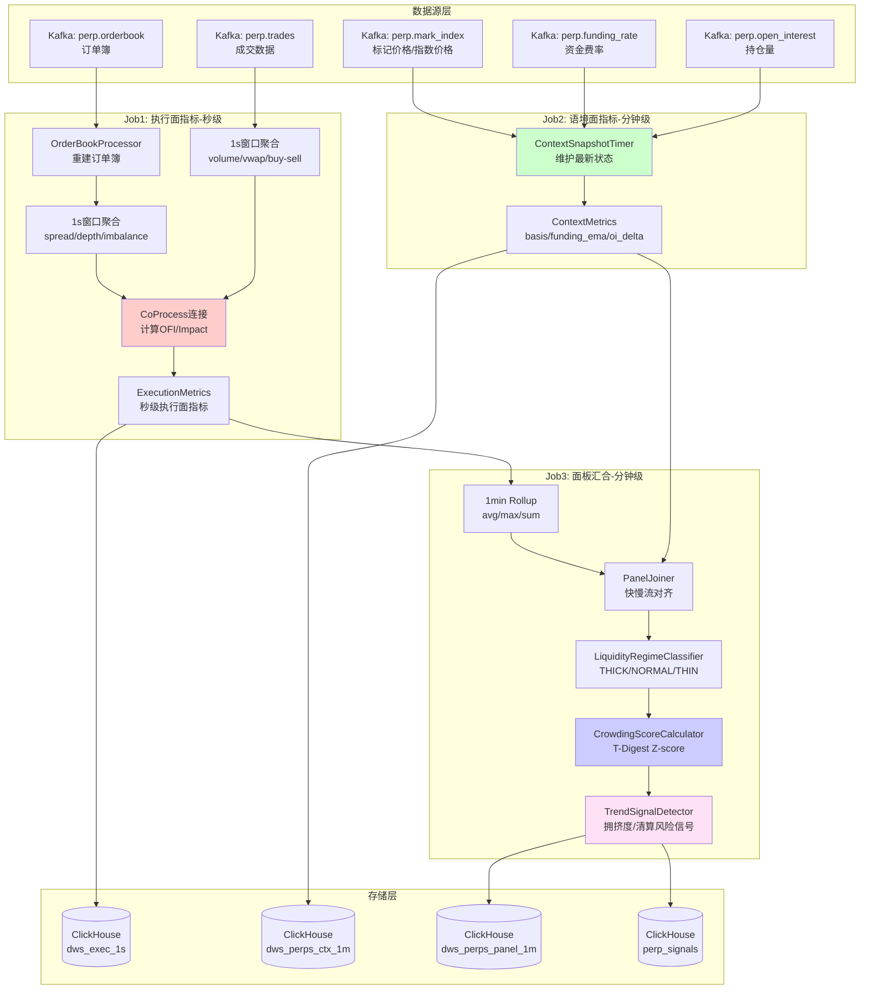

### **设计亮点**

- **快慢分离架构**：执行面（秒级）关注流动性与滑点，语境面（分钟级）关注市场情绪与拥挤度
- **三层Job流水线**：Job1处理高频订单簿与成交，Job2处理低频资金费率与持仓量，Job3汇合并生成综合信号
- **精细化指标体系**：
    - **执行面**：点差、盘口深度、订单流失衡（OFI）、市场冲击成本
    - **语境面**：现货-期货基差、资金费率EMA、持仓量变化率
    - **面板层**：流动性制度分类、拥挤度Z-score、清算风险信号
- **时间对齐与状态管理**：CoProcessFunction实现快慢流精确对齐，T-Digest算法维护24小时滚动分布

# 数据应用

## 查询侧

## 前端

## agent

**定位说明**：当前agent为MVP实现，核心目标是**展现端到端能力**与**数据管道的可应用性**，而非追求agent本身的可靠性与复杂度。通过agent层打通数据接入→处理→存储→应用的完整链路，证明数据平台的实用价值。

### **技术栈**

- **框架**：LangGraph（预构建ReAct Agent），基于LangChain生态
- **大模型**：DeepSeek
- **工具集**：当前仅封装后端api，无n2sql支持。
- **上下文管理**：当前仅短期记忆管理，基于sessionId维护多对话历史，超过阈值自动压缩为摘要。

### **典型场景**

- **市场分析**："比较OKX与Hyperliquid上BTCUSDT近30分钟的点差和冲击成本"
- **风险监控**："列出最近50条signalLevel≥WARNING的永续异常信号"
- **跨市场对比**："分析ETHUSDT现货涨幅与永续资金费率/拥挤度的关系"
- **标的筛选**："寻找现货成交量放大但永续crowdingScore<0.4的标的"

### **未来改进方向**

- 观测+执行反馈闭环：通过langsmith等搭建环境来异常告警、不断优化agent.
- **Text-to-SQL**：集成NL2SQL模块，支持自由查询ClickHouse表
- **多模态输出**：集成图表库（ECharts/Plotly），自动生成K线图、持仓分布图
- **Prompt优化：**提升复杂问题准确率
- **多Agent协同**：拆分为数据分析Agent、风险评估Agent、交易执行Agent，协同决策
- **策略执行**：集成交易API，支持自动下单、止损、仓位调整（需严格风控）
- 工具管理：通过分组、细化描述等来提升工具使用准确度。
