# **System Overview**

## **Project Introduction**

This project is a **real-time cryptocurrency data platform**.

The system integrates multiple heterogeneous data sources—including on-chain transactions (DEX), centralized exchanges (Binance, Hyperliquid), and market data providers (CMC, QuickNode)—to deliver an end-to-end solution covering data ingestion, real-time processing, and intelligent applications.

### Partial chart display

kline and perp (data from binance stream and hyperliquid), on-chain Kanban (data from local trading simulator), ai investment assistant


## **System Architecture**

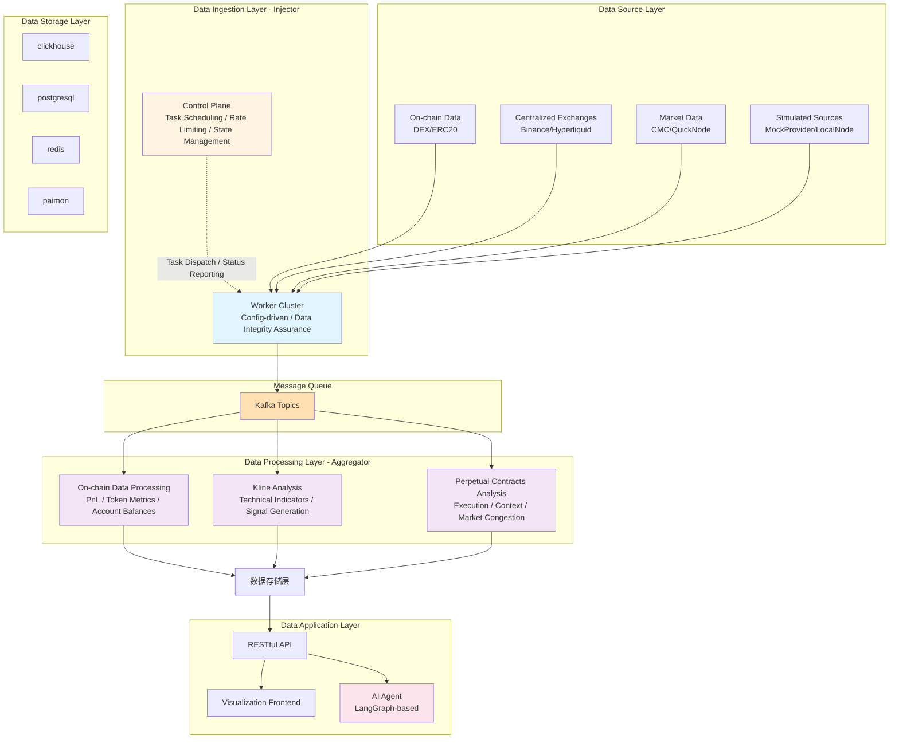

# Data Ingestion Layer

### Highlights

- **Separation of control plane and data plane:**
    - The control plane is responsible for task lifecycle management (dispatch, retry, status tracking), global rate limiting, and data quality checks.
    - The data plane pulls data from sources in a **configuration-driven** way.
- **Configuration-driven unified worker architecture:** Ingestion tasks can be switched on/off independently. New requirements usually do not require modifying existing code. Worker instances are not tightly bound to any specific communication protocol.
- **High reliability — four key mechanisms:** Data integrity guard module, timestamp-based delayed scheduling, task state management with multi-level retries, and multi-level rate limiting.

## Overall Architecture

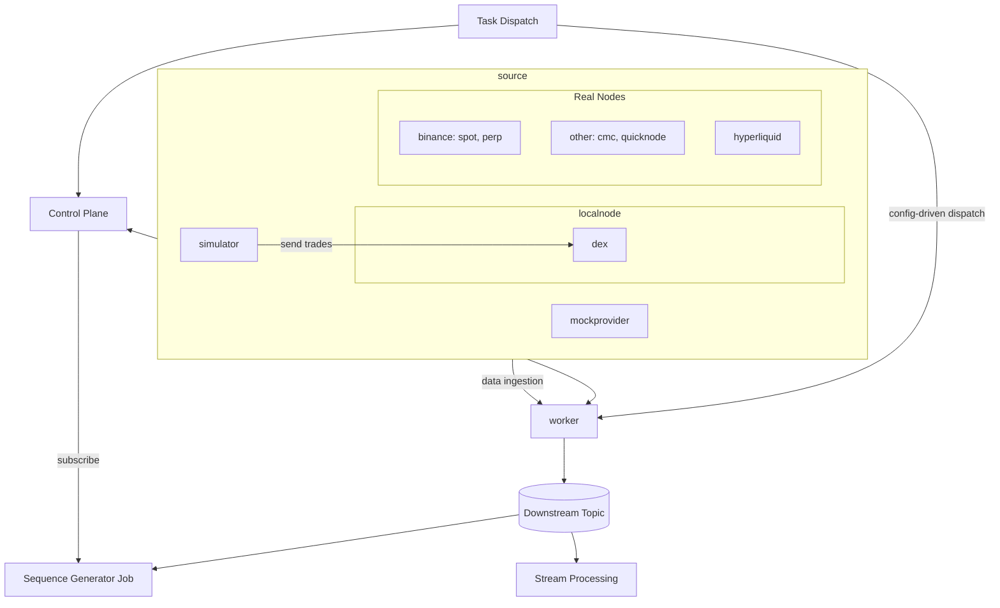

## Real Data Sources

- Binance spot stream
- Binance perp stream
- Hyperliquid
- CoinMarketCap
- QuickNode

## Simulated Data Sources

Besides real nodes, the project introduces simulated data sources to better reproduce rare events that occur in production.

### `localnode`

- **Self-hosted DEX:**
    
    A local DEX built on a Hardhat node, modeled after Uniswap V2 and implemented with Solidity 0.8.x.
    
- **Trade simulator:**
    - Simulates common patterns on real DEXes: minting tokens, adding liquidity to pools, executing trades, etc.
    - Accounts are tagged as CEX, smart money, public figure, fresh wallet, etc. Per-tag behavioral patterns are not yet differentiated.
    

### `MockDataProvider`

Used to validate **non-functional behavior** of the ingestion layer. Core modules:

- **dataGenerator:** mock data generator
- **faultInjector:** fault injector
    - **HTTP fault injection:** request failures (retryable and non-retryable)
    - **WebSocket fault injection:** connection drops, missing messages, heartbeat anomalies
    - **Other faults:** e.g., chain reorg

---

## Worker Architecture

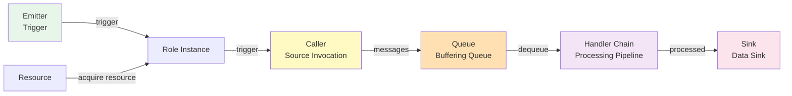

### Component Descriptions

- **Role:** The execution unit of a task. Tasks can be elastically assigned to worker instances, in line with cloud-native principles.
- **Emitter:**
    
    Controls when tasks are triggered, including:
    
    - `Polling` — time-based / periodic
    - `Single` — triggered by configuration change
    - `KafkaCommand` — event-driven
- **Resource:** Unified abstraction for resources. Before a role invokes a caller, it must acquire the required resources, such as HTTP connection pools, WebSocket connection slots, rate-limit tokens, etc.
- **Protocol:** Low-level protocol management, responsible for managing individual connections (e.g., WebSocket reconnection, heartbeats, etc.).
- **Caller：** Business adaptation layer that uses the protocol layer to fetch data.
    - **NativeCall (HTTP/WS):** raw protocol calls with simple parameter assembly.
    - **SDKCall (e.g., go-ethereum):** custom caller classes that invoke SDK APIs.
- **Queue:** Bounded channel that decouples data collection from downstream processing.
- **Handler:** Chain-of-responsibility data processing pipeline. Handlers are business-agnostic.

### Example Configuration

```yaml
roles:
  - role_id: "binance-perp-btc-orderbook"
    emitter: "single"
    caller: "native_call"
    caller_config:
      protocol: "websocket"
      url: "wss://fstream.binance.com/ws"  # Live data source (default)
      # url: "ws://localhost:8090/ws/binance/btcusdt@depth@100ms"  # Comment out the line above and enable this when using mock-data-provider
      datasource_id: "binance.perp.depth"
      rate_limit:
        capacity: 80        # allow short bursts but stay under 2400 req/min (~40 rps)
        refill_rate: 30     # conservative vs Binance 40 rps limit
    caller_params:
      message_format: "binance"
      streams:
        - "btcusdt@depth@100ms"
      metadata_fields:
        symbol: "data.s"
        event_time: "data.E"
    handlers:
      - type: "binance"
        with:
          kind: "depth"
      - type: "integrity"
        with:
          profile: "binance_depth"
          sequence_field: "final_update_id"
          range_start_field: "first_update_id"
          stream_key_field: "binance_symbol"
          gate_mode: "snapshot_hold"
          eager_gap: 20
          max_range: 5
          max_delay_ms: 1500
          hard_timeout_ms: 4000
          max_gap: 200
          sweep_interval_ms: 400
          bucket_ttl_ms: 6000
          max_buckets: 500
          backfill_cooldown_ms: 15000
          backfill:
            http:
              enabled: true
              endpoint: "https://fapi.binance.com/fapi/v1/depth"  # Live backfill
              # endpoint: "http://localhost:8090/fapi/v1/depth"   # Mock backfill
              method: "GET"
              query:
                symbol: "BTCUSDT"
                limit: "500"
      - type: "orderbook_diff"
        with:
          symbol: "BTCUSDT"
          max_depth: 200
      - type: "orderbook_validator"
    sink:
      type: "kafka"
      with:
        brokers:
          - "localhost:9092"
        topic: "perp.orderbook"
        key_from: ["symbol", "exchange"]
    queue: { size: 5000 }

```

## Data Integrity Module

**Core objective:**

Ensure **integrity**, **ordering**, and **idempotency** for streaming data, handling common production issues like network jitter, out-of-order messages, and missing data.

### Architecture

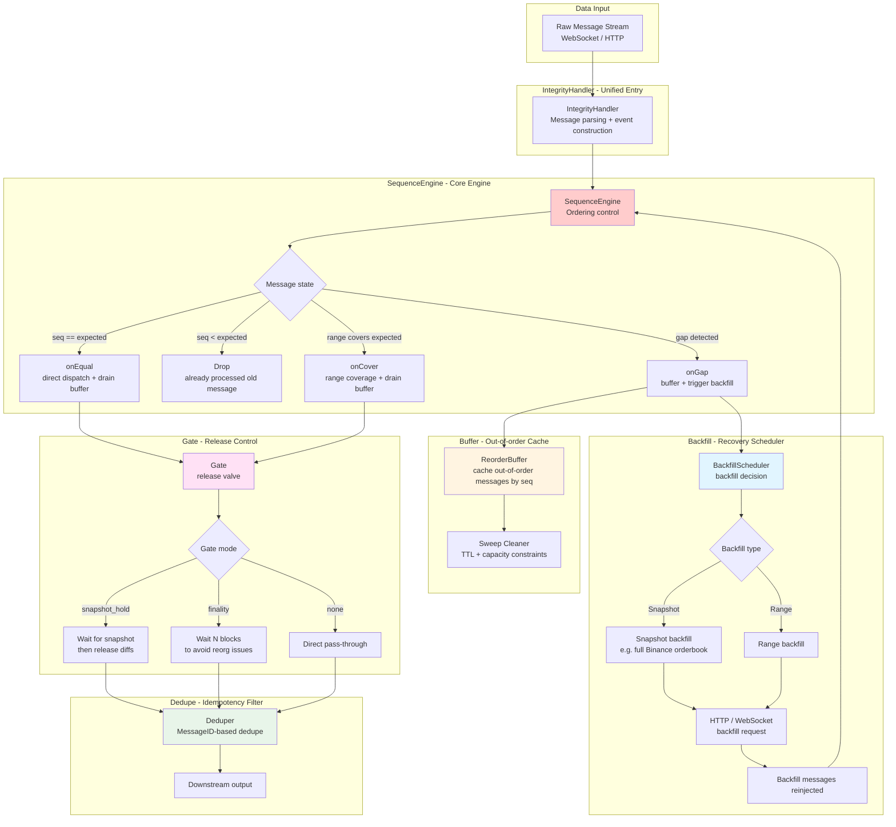

### Design Highlights

### 1. Three-dimensional integrity guarantees

- **Ordering (Sequence):** Strict sequence-number based ordering, with support for range coverage checks (e.g., Binance depth’s `first_update_id` → `final_update_id`).
- **Integrity (Completeness):** Detect gaps and automatically trigger backfill. Supports:
    - Snapshot backfill (e.g., orderbooks)
    - Range backfill (e.g., blockchain blocks)
- **Idempotency (Dedupe):** Dedup based on `MessageID` or `StreamKey + Seq` within a TTL window to automatically filter duplicates.

### 2. Smart backfill strategy

**Trigger conditions:**

- **EagerGap:**
    
    When the gap exceeds a threshold (e.g., 20), immediately trigger backfill.
    
- **MaxDelay:**
    
    Soft timeout (e.g., 1.5s). If the expected message isn’t received during the waiting window, trigger backfill.
    
- **HardTimeout:**
    
    Hard timeout (e.g., 4s). Allows skipping over gaps and continuing processing.
    

**Backfill types:**

- **Snapshot backfill:**
    
    For orderbooks like Binance depth, request a full snapshot. With `snapshot_hold` gate, diffs are buffered until the snapshot is applied, then released.
    
- **Range backfill:**
    
    For blockchain data, request the missing [start, end] block range. Supports multi-channel recovery (HTTP / WebSocket / RPC).
    

**Cooldown mechanism:** The same gap/range will not be backfilled repeatedly within a cooldown window (e.g., 15s), preventing backfill storms.

### 3. Gate-based release control

Three modes:

- **`snapshot_hold`:** For orderbooks. Block all diff messages until a snapshot is applied, then release the buffered diffs in order.
- **`finality`:** For blockchain data. Wait for N blocks (e.g., 12) of confirmation before releasing messages to avoid inconsistencies from chain reorgs.
- **`none`:** No special gating; messages pass through after sequence checks.

### 4. Out-of-order cache (`ReorderBuffer`)

**Core mechanisms:**

- Cache out-of-order messages in buckets keyed by sequence number.
- `drain` operation: starting from `expected`, continuously take all dispatchable messages.
- Dual constraints:
    - TTL (e.g., 3s)
    - Maximum capacity (e.g., 2000 buckets)
- Periodic cleanup:
    - `sweep_interval` (e.g., 400ms) to clean expired / over-capacity buckets.

### 5. Configuration-driven profile mechanism

**Built-in profiles:**

- **`generic`:** default, generic parameters
- **`binance_depth`:** for Binance orderbook, enabling range coverage checks, `snapshot_hold` gate, snapshot backfill
- **`chain_blocks`:** for blockchain data, enabling `finality` gate (e.g., 12 confirmations)

**Flexible configuration example:**

```yaml
handlers:
  - type: "integrity"
    with:
      profile: "binance_depth"
      sequence_field: "final_update_id"
      range_start_field: "first_update_id"
      stream_key_field: "binance_symbol"
      gate_mode: "snapshot_hold"
      eager_gap: 20              # trigger immediate backfill if gap > 20
      max_range: 5               # at most 5 records per backfill
      max_delay_ms: 1500         # 1.5s soft timeout
      hard_timeout_ms: 4000      # 4s hard timeout
      max_gap: 200               # max tolerable gap during streaming
      sweep_interval_ms: 400     # 400ms sweep interval
      bucket_ttl_ms: 6000        # 6s TTL
      max_buckets: 500           # up to 500 buckets
      backfill_cooldown_ms: 15000 # 15s backfill cooldown

```

### 6. Performance & reliability

- **Bounded memory usage:**
    
    Buffer has both capacity and TTL constraints to prevent leaks.
    
- **Lock-free core path:**
    
    Core logic can run single-threaded to avoid lock contention.
    
- **Backfill resilience:**
    
    Supports multiple backfill channels (HTTP / WebSocket / RPC) with automatic fallback.
    
- **State isolation:**
    
    Each stream maintains its own independent state.
    

## Layered Rate Limiting

### Strategy: Two-level rate limiting (Control Plane + Worker)

- **Background:** After reviewing rate-limit documentation for Binance, CMC, etc., I found that APIs differ widely: weighted limits, per-endpoint limits, different time windows, and implicit throttling (e.g., short-term bursts).
- **Strategy:** configuration-driven and hierarchical rate limiting
    - **Configuration-driven:** Flexible configuration of scope, weights, and time granularity.
    - **Hierarchical:**
        - Monthly granularity: periodic checks and alerting are sufficient.
        - Finer granularities:
            - Control plane enforces **global** limits.
            - Worker-local rate limiting smooths local bursts.

## Delayed Task Dispatch Based on Persisted Timestamps

### Core Idea

**Approach:**

Persist tasks into PostgreSQL, and use a periodic scanner (`TimerProducer`) to fetch tasks whose `scheduled_time` has arrived and push them to Kafka. This provides **delayed scheduling** and **reliable delivery**.

- **Highlights**
    - **No task loss:**
        
        Either the task is persisted, or the request fails fast to the caller.
        
    - **Delayed scheduling:**
        
        Implemented via timer + batched DB scan + Kafka dispatch.
        
    - **Rate-limit coupling:**
        
        When rate limiting is hit, the scheduled time can be computed and set directly to the next allowable time.
        

### End-to-end Flow

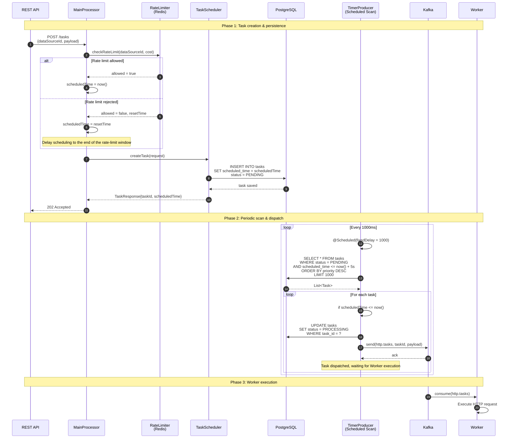

## Task State Management & Retry Mechanism

**Approach:** Two-level retry architecture:

1. **Fast local retry in the worker** — handles transient network issues.
2. **Exponential backoff retry in the control plane** — driven by worker status reports.

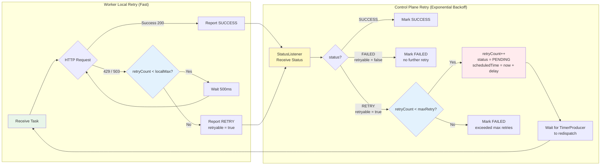

# Streaming Layer

- Main pipeline: **Kafka → Flink → ClickHouse**.
    
    StarRocks + Paimon are also wired in as streaming lakehouse sinks, but currently used only as storage (no production consumers yet).
    
- Currently three main business domains:
    - On-chain data processing
    - Kline (candlestick) analytics
    - Perpetual futures analytics

## On-chain Data Processing

### Architecture

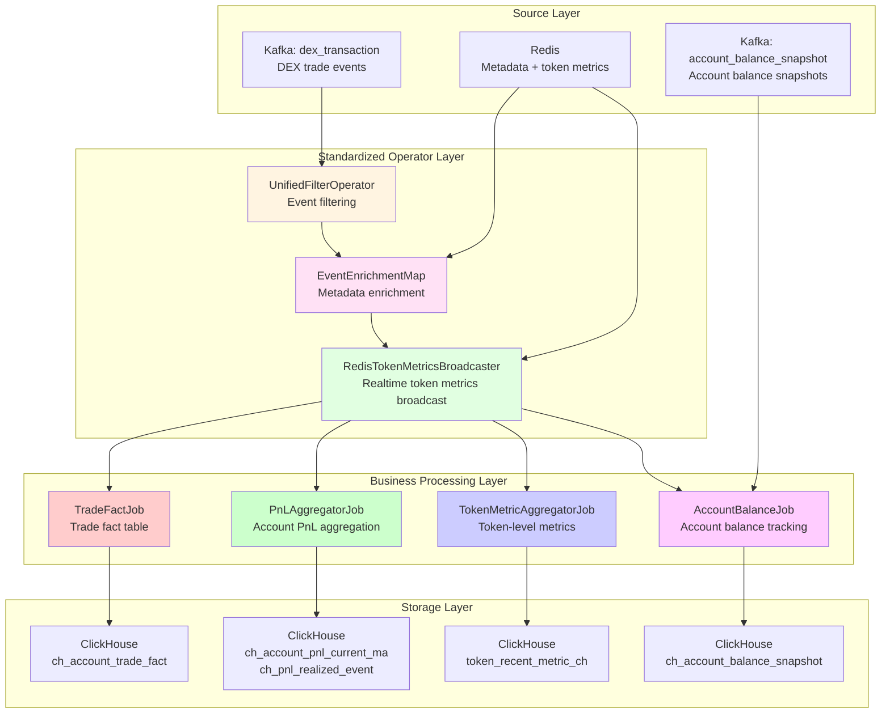

### Design Highlights

- **Standardized pre-processing pipeline:**
    
    All jobs share a unified set of upstream operators (filtering → enrichment → token metrics broadcast).
    
- **Minimal state:**
    
    The PnL operator keeps only 6 fields per account–token pair, resulting in very small state size and high throughput.
    
- **Hierarchical windowing:**
    
    Uses incremental aggregation across window levels, avoiding repeated computation.
    
- **Dual-stream alignment:**
    
    Snapshot + delta streams work together to ensure correctness and up-to-date data.
    

## Standardized Operator Layer

- **UnifiedFilterOperator**
    
    Unified event extraction based on configurable filter strategies.
    
- **EventEnrichmentMap**
    
    Injects metadata into raw messages (account, token, pair, etc.).
    
- **RedisTokenMetricsBroadcaster**
    
    Uses Flink broadcast state to enrich events with token metrics (price, mcap, etc.) from Redis.
    

## `PnLAggregatorJob` – Account PnL Analytics

**Core algorithm:** Moving Average Cost

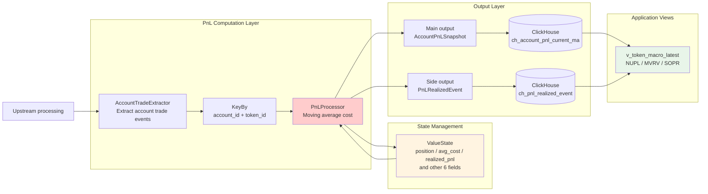

### Design Highlights

- **Minimal state design**
    
    For each `(account_id, token_id)` key, only 6 fields are maintained:
    
    `position, avg_cost, realized_cost_usd, realized_proceeds_usd, realized_pnl_usd, last_price_usd`.
    
    This keeps memory usage extremely low and supports real-time computation for millions of accounts.
    
- **Dual-output stream architecture**
    - **Main output:** current position snapshot, used for unrealized PnL and current holdings.
    - **Side output:** realized PnL events on every sell, used for macro indicators like SOPR.
- **Accurate cost tracking**
    - **Buy:** update moving average cost
        
        `avg_cost = (position * avg_cost + buy_qty * buy_price) / (position + buy_qty)`
        
    - **Sell:** compute realized PnL
        
        `realized_pnl = sell_qty * (sell_price - avg_cost)`
        
- **Macro indicator support**
    
    Based on PnL data, compute core on-chain macro metrics (NUPL, MVRV, SOPR) in a way aligned with Nansen / Glassnode style indicators.
    

## `TokenMetricAggregatorJob` – Token-level Metrics

**Core architecture:** Hierarchical windowed aggregation

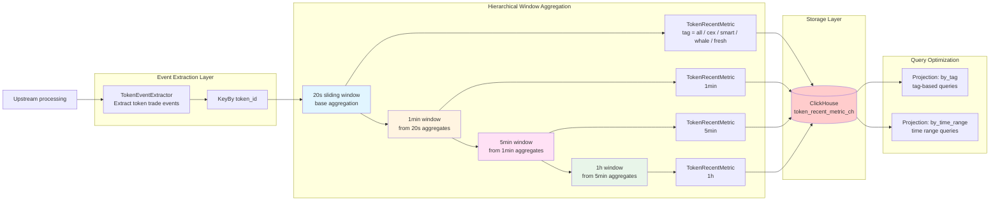

### Design Highlights

- **Hierarchical windowing**
    
    Incremental aggregation across 20s → 1min → 5min → 1h windows.
    
    Avoids recomputing from raw events at each level, improving performance by ~3–5x.
    
- **Segmented by participant tags**
    
    For each window, metrics are computed across five segments:
    
    - `all` (all addresses)
    - `cex` (exchange)
    - `smart` (smart money)
    - `whale`
    - `fresh` (fresh wallets)
        
        This supports user-base segmentation and behavior analysis.
        
- **Rich metric set**
    - **Trading metrics:** `txcnt, buy_count, sell_count, volume_usd, buy_pressure_usd`
    - **Price metrics:** `token_price_usd, mcap_usd, fdv_usd, liquidity_usd`
    - **Behavior metrics:** buy/sell ratio, active address count, trading frequency
- **Query performance optimization**
    
    ClickHouse projections are used for:
    
    - tag-first queries
    - time-range-first queries
        
        enabling millisecond-level query latency.
        

---

## `AccountBalanceJob` – Account Balance Tracking

**Core architecture:** Snapshot + delta dual-stream alignment


### Design Highlights

- **Dual-stream alignment**
    - **Snapshot stream:**
        
        A Go service scans contract state once per minute and emits full account balance snapshots, providing a strong correctness baseline.
        
    - **Delta stream:**
        
        Processes on-chain events in real time, extracting balance deltas to fill the gaps between snapshots.
        
    - **Alignment strategy:**
        
        Keyed by `(account_id, asset_type, biz_id)` and joined via a `CoProcessFunction`. Snapshot takes precedence; deltas are layered on top between snapshots.
        
- **Data consistency guarantees**
    - `ReplacingMergeTree` deduplicates by `block_id`, ensuring only the latest version for each point in time.
    - Projections on `(token, time)` dimensions optimize both token-first and time-first queries.
    - TTL (e.g., 30 days) automatically cleans up historical snapshots to control storage cost.
- **Chained materialized views**
    - `mv_holder_balance_latest`:
        
        Maintains the latest two snapshots of holder balances.
        
    - `v_token_top_holders_latest`:
        
        Top-N holders (e.g., top 100), sorted by balance ratio.
        
    - `v_token_distribution_minute`:
        
        Distribution metrics (holder count, median, top-2 share, fresh-wallet share).
        
    - `v_token_holder_tag_minute`:
        
        Tag distribution and 1-minute change rate for tags like `exchange / smart_money / whale / fresh_wallet`.
        
- **Price enrichment**
    
    Each balance snapshot is enriched with token prices via broadcast state to compute `value_usd`, enabling USD-denominated position analytics.
    
- **RocksDB state backend**
    
    Enables scaling to millions of accounts with controlled memory usage.
    

---

## Kline Analytics

### Architecture

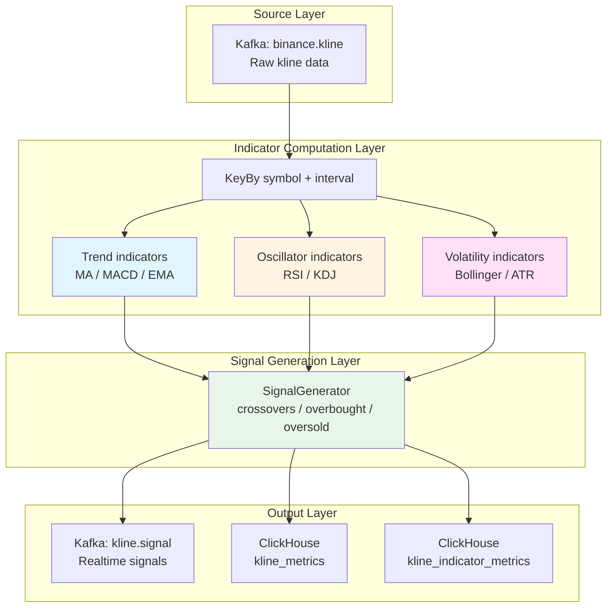

### Design Highlights

- **Parallel computation of multiple indicator families**
    - Trend: MA / MACD / EMA
    - Oscillator: RSI / KDJ
    - Volatility: Bollinger / ATR
- **Stateful streaming computation**
    
    Maintains price history windows per `(symbol, interval)` key to support sliding-window indicators.
    
- **Realtime signal generation**
    
    Generates buy/sell signals based on indicator thresholds and crossovers (e.g., golden cross / death cross, overbought / oversold).
    
- **Full metric persistence**
    
    All raw indicator values and signals are stored in ClickHouse to support backtesting, strategy evaluation, and research.
    

---

## Perpetual Futures Analytics

### Architecture

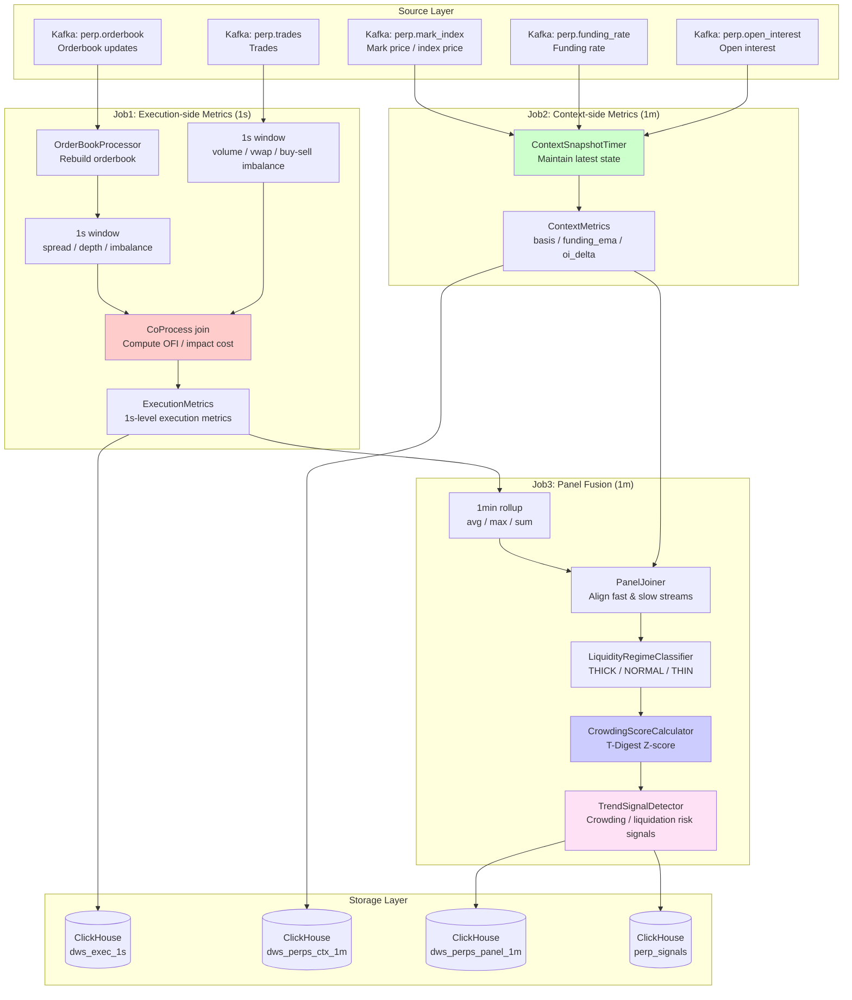

### Design Highlights

- **Fast vs. slow separation**
    - **Execution-side (fast, 1s):**
        
        Focuses on microstructure: liquidity, spread, order book depth, impact cost.
        
    - **Context-side (slow, 1m):**
        
        Focuses on market regime: basis, funding, open interest, crowding.
        
- **Three-stage job pipeline**
    - **Job1:** High-frequency orderbook + trade metrics.
    - **Job2:** Low-frequency context metrics (funding, OI, mark/index).
    - **Job3:** Panel fusion and signal generation across both dimensions.
- **Rich metric system**
    - **Execution-side:** spread, depth, order flow imbalance (OFI), impact cost.
    - **Context-side:** spot–perp basis, funding rate EMA, open interest delta.
    - **Panel layer:** liquidity regime classification, crowding Z-score, liquidation risk signals.
- **Time alignment & state management**
    - `CoProcessFunction` aligns fast and slow streams into a consistent panel.
    - T-Digest maintains rolling 24h distributions for crowding / regime scoring.

# Data Application

## Query Layer

*(Omitted here – this section is a placeholder for API / SQL query patterns over ClickHouse / StarRocks / Paimon.)*

## Frontend

*(Omitted here – placeholder for dashboard / UI usage of the above metrics.)*

## Agent Layer

**Positioning:**The current agent is an MVP. Its purpose is to:

- Demonstrate **end-to-end capability** (ingestion → streaming → storage → application).
- Prove the **practical usability** of the data platform.

It is **not** designed yet for maximum robustness or complexity on the agent side.

### Tech Stack

- **Framework:** LangGraph (prebuilt ReAct-style agent) on top of LangChain.
- **LLM:** DeepSeek.
- **Tooling:** Currently only wrapped backend APIs; **no NL2SQL** yet.
- **Context management:**Short-term memory only. Conversations are keyed by `sessionId`.
    
    When history exceeds a threshold, older messages are summarized into a compressed context.
    

### Typical Scenarios

- **Market microstructure analysis** “Compare the BTCUSDT spread and impact cost on OKX vs Hyperliquid over the last 30 minutes.”
- **Risk monitoring** “List the latest 50 perpetual anomaly signals with `signalLevel ≥ WARNING`.”
- **Cross-market relationship analysis** “Analyze the relationship between ETHUSDT spot returns and perp funding rate / crowding score.”
- **Asset screening** “Find tokens where spot volume is expanding while perp `crowdingScore < 0.4`.”

### Future Improvements

- **Observation + execution feedback loop** Use tools like LangSmith to build evaluation environments, anomaly alerts, and iterative improvement for the agent.
- **Text-to-SQL** Integrate NL2SQL to support free-form querying over ClickHouse tables.
- **Multi-modal output**  Integrate charting libraries (ECharts / Plotly) to automatically render Kline charts, position distributions, etc.
- **Prompt refinement** Improve accuracy on complex, multi-step analytical questions.
- **Multi-agent collaboration** Split roles into:
    - Data Analysis Agent
    - Risk Assessment Agent
    - Trade Execution Agent
        
        and have them coordinate decisions.
        
- **Strategy execution** Integrate with trading APIs to support:
    - automated order placement
    - stop-loss
    - position rebalancing
        
        (with strict risk controls).
        
- **Tooling management**
    
    Improve tool documentation, grouping, and routing to raise tool-usage accuracy.
