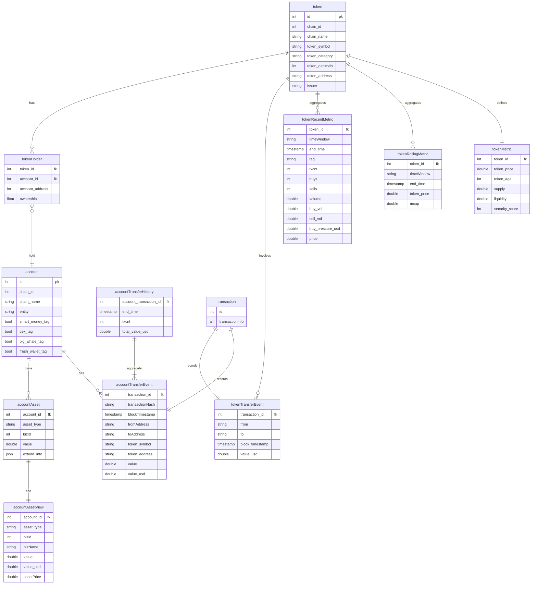
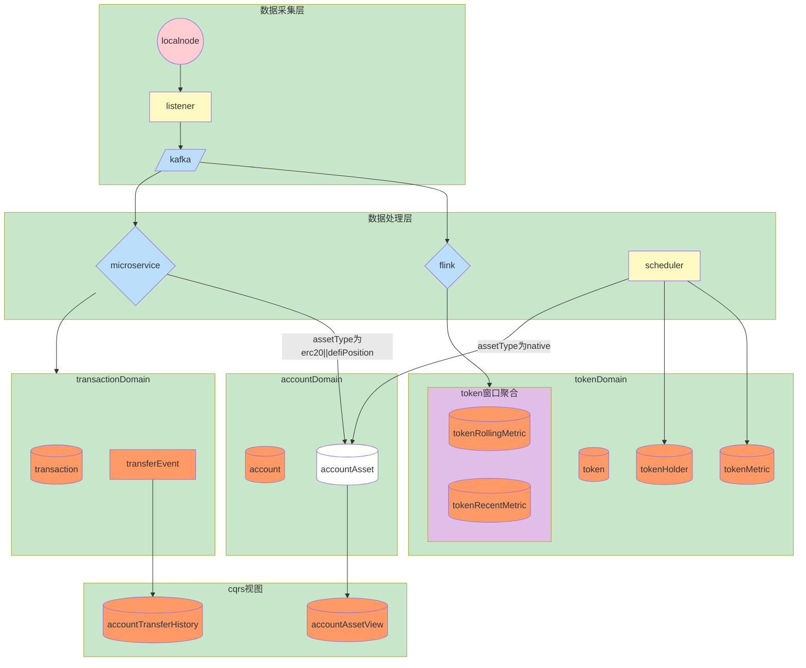
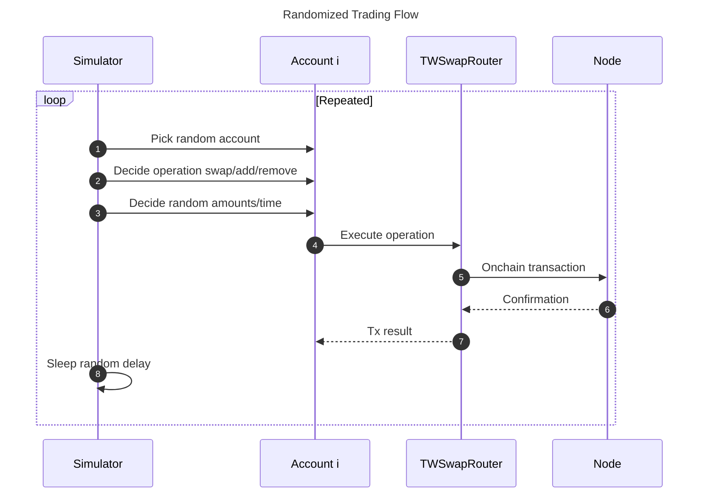

# **系统整体设计**

- 项目名称：加密货币实时数据平台。
- 主要服务对象：为ai投资辅助智能体提供数据基础设施
- 主要工作流：数据接入、数据处理、数据存储、数据应用

## 

## **核心模块**

1. **交易模拟器（simulator）**：在本地 Hardhat 节点上模拟多账户多场景的链上操作，为其他模块提供持续数据流。
2. **数据接入模块(listener)**：接入并管理外部数据源，数据格式标准化写入消息队列。
3. **处理器（processor）**：数据处理微服务，消费标准化后的消息，处理后写入数据存储。
4. **聚合器（aggregator）**：使用flink聚合标准化消息流，sink到数据库或消息队列
5. **查询器(uniquery)**，为前端提供查询服务，以可视化方式呈现交易趋势、dex流动性等。
6. **智能体（agent）**：基于推理模型及大模型进行决策，通过工具执行链上操作。

## **主要原理图**

### **数据模型**



### **数据流图**



## **项目约定**

1. 链合约部署信息位于 deployment.json
2. 相同含义字段名称统一，比如只使用transactionHash而不使用txHash，如果外部依赖命名与系统约定不一致，转换成系统约定。
3. 使用usdc作为唯一美元价格锚定，代币价格为与usdc交易对价格
4. 使用项目根目录的docker-compose.yml作为唯一docker容器

### **指标命名规则**

指标全名唯一，对应唯一当前值指标由以下四部分组成： `{scope}_{metrictype}_{unit}_{interval}`

- **scope**: 指标作用域，可由多部分组成，如eth_uni2_pair
- **metrictype**: 指标类型，如volume, liquidity, txcnt
- **interval**: 窗口时间，如20s, 1min, 1h，省略则代表总量
- **unit**: 单位，如usd，可根据共识省略，如次数


# **交易模拟器**

```
1.	目标：在本地节点中模拟多账户、多 Token、多场景的交易，目前聚焦 Uniswap V2 （如添加或移除流动性、swap），为后续分析提供丰富数据。
2.	主要组成
•	Accounts：5 个本地账户，每个账户拥有足量测试 Token，并持续发起交易。
•	Tokens：通过最小代理部署 5 个 MyERC20（WETH、USDC、DAI、TWI、WBTC）。给各账户 mint 大量代币。
•	TWSwap：自实现的Uniswap V2（包含 Factory、Router、Pair），可处理 add/remove 流动性、swap。
•	模拟器循环：随机或脚本化地对 TWSwapRouter 发起多样化交易（addLiquidity、removeLiquidity、swap），生成持续事件流供后续处理。

```

## **流程图**



# **项目初始化**

本项目尽量避免繁琐的crud,采用初始化的方式为数据库里的元数据赋值.初始化文件位置：localnode/scripts/initialize.js

## **blockchain初始化**

1. updateInitCodeHash
2. Deploy Contract
3. 为account mint Tokens
4. InitializePairs
5. 保存deploymentInfo

## **数据存储初始化**

### **initializeRedis**

redis初始化内容

1. token_price:{all token address}
2. tokenMetadata,accountMetadata,pairMetadata from deployment.json

### **initializeDatabase**

根据deployment.json写入token,account表 account_asset初始化:遍历account,从链上查找所有资产信息（eoa account balance,token balance,pair balance）分别写入asset_type为native,erc20,defiPosition中，bizId分别为1,token_id,pair_id.

## **定时任务**

### **startAccountAssetUpdater**

遍历account获取链上balance，bizId默认为1，bizName,accountAsset为native，写入accountAsset.

### **startTokenUpdater**

```
for(token in all token){

get totalsupply from localnode

for(相关的pair ){

reserveSum+=reserveInPair

if pair含usdc

token_price=reserve比

}

if token is usdc

token_price=1

security_score，token_age=1～100随机数
liquidity_usd=reserveSum*token_price
fdv=mcap=totalsupply*token_price
更新token_metric表

for(account in all account){

get token balance from localnode
value_usd=balance*token_price
ownership=balance/totalsupply
更新token _holder表
}
}

```

### **tokenRollingMetric**

使用定时任务写token_rolling_metric表，周期为20s,end_time与整点对齐，token_price_usd从redis取，mcap=totalsupply*tokenprice ,totalsupply从链上查询。这张表用于前端绘制折线图
