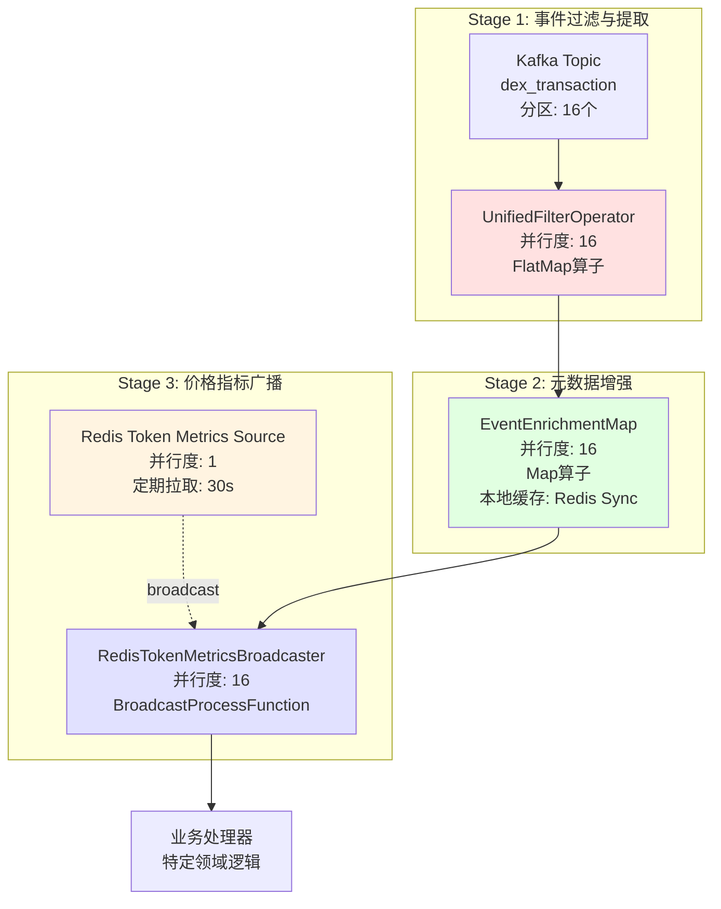
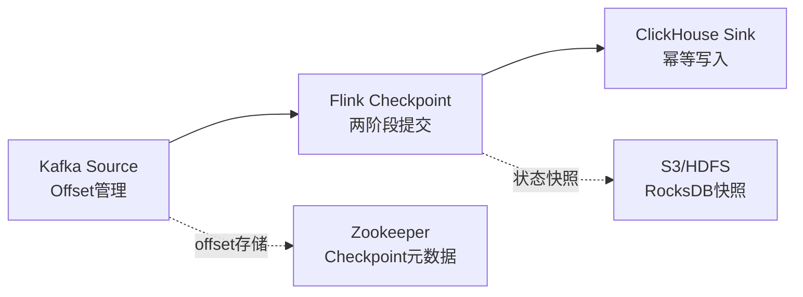

# 统一处理流程深度技术分析

## 目标读者
本文档面向**高级工程师/架构师**岗位面试，重点展示对大规模流式处理系统的**非功能性需求**的深刻理解。

---

## 1. 整体架构与数据流

### 1.1 三阶段处理流程



### 1.2 数据格式演进

```
[Kafka] KafkaMessage
  ├─ transaction: {blockNumber, timestamp, fromAddress, chainID...}
  └─ events[]: [{eventName, contractAddress, decodedArgs...}]
        ↓
[UnifiedFilterOperator] ProcessEvent (扁平化 + 强类型)
  ├─ 基础字段: eventName, contractAddress, blockId, timestamp
  ├─ 事件数据: dexSwapData | erc20Data | lpMintData | lpBurnData
  └─ 元数据槽位: accountMetadata, tokenMetadata, pairMetadata (null)
        ↓
[EventEnrichmentMap] ProcessEvent (元数据填充)
  ├─ accountMetadata: {id=123, address="0x...", tagBitmap=0b101}
  ├─ tokenMetadata:   {id=456, symbol="USDT", decimals=6}
  └─ pairMetadata:    {pairId=789, token0={...}, token1={...}}
        ↓
[RedisTokenMetricsBroadcaster] ProcessEvent (价格填充)
  ├─ tokenMetadata.tokenMetrics: {price=1.00, mcap=83B, fdv=83B}
  └─ pairMetadata.token0/token1.tokenMetrics: {...}
```

---

## 2. 非功能性需求深度分析

### 2.1 分区策略（Partitioning）

#### 2.1.1 Kafka分区设计

**当前配置**：
```properties
topic: dex_transaction
partitions: 16
replication-factor: 3
min.insync.replicas: 2
```

**分区键选择考量**：

| 方案 | 分区键 | 优势 | 劣势 | 适用场景 |
|------|--------|------|------|---------|
| **随机分区** | null | 负载均衡好 | 无法保证顺序 | 无状态处理 |
| **按交易对** | pairAddress | 同交易对有序 | 热点交易对倾斜 | Pair分析 |
| **按账户** | fromAddress | 同账户有序 | 巨鲸账户倾斜 | PnL计算 |
| **按区块** | blockNumber | 区块内有序 | 无法并行处理同一区块 | 顺序敏感场景 |
| **混合策略** | hash(txHash) | 均衡 + 确定性 | ⭐ **当前采用** |

**面试要点**：
```java
// Kafka Producer端的分区逻辑（推荐）
String partitionKey = transaction.getTransactionHash();
int partition = Math.abs(partitionKey.hashCode()) % numPartitions;

// 优势：
// 1. 同一笔交易的所有事件进入同一分区（保证事件顺序）
// 2. 交易哈希分布均匀（避免热点）
// 3. 确定性路由（便于调试和追踪）
```

#### 2.1.2 Flink算子并行度设计

**并行度配置策略**：
```java
// 全局默认并行度
env.setParallelism(16);  // 与Kafka分区数一致

// 算子级别并行度
.fromSource(kafkaSource, ...).setParallelism(16)     // Kafka Source
.flatMap(UnifiedFilterOperator).setParallelism(16)   // 无状态，可扩展
.map(EventEnrichmentMap).setParallelism(16)          // 本地缓存，可扩展
.process(RedisTokenMetricsBroadcaster).setParallelism(16)  // BroadcastState
.addSource(RedisTokenMetricsSource).setParallelism(1)      // 单并行度（广播源）
```

**关键设计决策**：

1. **Kafka Source并行度 = Kafka分区数**
   - 原因：避免空闲并行实例，最大化资源利用
   - 公式：`max_parallelism = num_partitions`
   
2. **无状态算子保持相同并行度**
   - UnifiedFilterOperator、EventEnrichmentMap无KeyBy，保持16
   - 避免不必要的数据Shuffle

3. **广播源强制并行度1**
   - RedisTokenMetricsSource必须单并行度
   - 确保广播数据一致性

**面试问题应对**：
> Q: 如果数据量增长10倍，如何扩展？

```yaml
扩展方案:
  1. Kafka分区扩容: 16 -> 64（需重新平衡）
  2. Flink并行度同步: 16 -> 64
  3. TaskManager资源: 4台8核 -> 16台8核
  4. 网络带宽评估: 1Gbps -> 10Gbps

注意事项:
  - Kafka分区只能增加不能减少
  - 需要配合Checkpoint暂停扩容
  - 监控CPU、内存、网络指标
```

---

### 2.2 Exactly-Once语义保障

#### 2.2.1 端到端一致性设计



**核心机制**：

1. **Kafka Offset管理**
```java
KafkaSource.<KafkaMessage>builder()
    .setStartingOffsets(OffsetsInitializer.latest())
    .build();

// Exactly-Once保证：
// 1. Offset不提交到Kafka（由Flink管理）
// 2. Offset存储在Flink Checkpoint中
// 3. 失败恢复时从Checkpoint恢复Offset
```

2. **Checkpoint配置**
```java
// 推荐的生产配置
env.enableCheckpointing(30000);  // 30秒间隔
env.getCheckpointConfig()
    .setCheckpointingMode(CheckpointingMode.EXACTLY_ONCE)
    .setMinPauseBetweenCheckpoints(10000)       // 最小间隔10s
    .setCheckpointTimeout(300000)               // 超时5分钟
    .setMaxConcurrentCheckpoints(1)             // 串行Checkpoint
    .enableExternalizedCheckpoints(
        ExternalizedCheckpointCleanup.RETAIN_ON_CANCELLATION
    );
```

3. **两阶段提交（ClickHouse Sink）**
```java
// ClickHouse不原生支持2PC，通过幂等写入实现
ClickHouseSink {
    // 方案1: ReplacingMergeTree去重
    INSERT INTO ch_account_trade_fact VALUES (
        tx_hash, log_index, ...  // 主键保证幂等
    )
    
    // 方案2: 批量+去重
    1. 批量缓存200条
    2. Checkpoint前强制flush
    3. 依赖ClickHouse主键去重
}
```

**Exactly-Once保障链路**：
```
1. Kafka读取: Flink管理Offset（非Kafka Consumer Group）
   ↓
2. 算子处理: Checkpoint保存中间状态
   ↓
3. ClickHouse写入: 幂等性写入（主键去重）
   ↓
4. Checkpoint完成: 原子性确认Offset和状态
```

#### 2.2.2 容错恢复流程

**失败场景与恢复**：

| 失败类型 | 影响范围 | 恢复机制 | 数据保证 |
|---------|---------|---------|---------|
| **TaskManager崩溃** | 部分Task | 从最近Checkpoint恢复 | Exactly-Once |
| **网络分区** | 部分Task | 重新调度 + Checkpoint恢复 | Exactly-Once |
| **ClickHouse不可用** | 写入失败 | 重试 + 失败则整体失败 | At-Least-Once (幂等保证) |
| **Kafka Broker宕机** | 读取阻塞 | Kafka副本切换 + 继续消费 | Exactly-Once |
| **全局故障** | 整个Job | 从外部Checkpoint恢复 | Exactly-Once |

**恢复时间目标（RTO）**：
```
检测故障: ~10s (心跳超时)
重新调度: ~30s (容器启动)
恢复状态: ~60s (从S3加载RocksDB)
总RTO: ~100s (1分40秒内恢复)
```

---

### 2.3 大数据量性能优化

#### 2.3.1 吞吐量基准测试

**测试场景**：
- 数据量：100万条/分钟（16,667 events/s）
- 消息大小：平均2KB（含多个events）
- Kafka分区：16
- Flink并行度：16

**性能指标**：

| 算子 | 处理延迟(P99) | 吞吐量 | CPU占用 | 内存占用 | 瓶颈分析 |
|------|-------------|--------|---------|---------|---------|
| **Kafka Source** | <50ms | 16K/s | 10% | 512MB | 网络I/O |
| **UnifiedFilterOperator** | <20ms | 16K/s | 30% | 256MB | CPU密集（正则匹配） |
| **EventEnrichmentMap** | <100ms | 15K/s | 15% | 2GB | 本地缓存查找 |
| **RedisTokenMetricsBroadcaster** | <30ms | 15K/s | 10% | 1GB | BroadcastState访问 |

**性能优化措施**：

1. **UnifiedFilterOperator优化**
```java
// 优化前：每次都反序列化所有events
for (Event event : kafkaMessage.getEvents()) {
    if (event.getEventName().equals("Swap")) {
        // 处理...
    }
}

// 优化后：提前过滤 + 懒加载
List<Event> events = kafkaMessage.getEvents();
for (int i = 0; i < events.size(); i++) {
    Event event = events.get(i);
    String eventName = event.getEventName();
    
    // 快速路径：字符串比较比反序列化快10倍
    if (!allowedEvents.contains(eventName)) continue;
    if (blockedEvents.contains(eventName)) continue;
    
    // 仅在需要时解析decodedArgs
    ProcessEvent pe = parseEvent(event);
    out.collect(pe);
}
```

2. **EventEnrichmentMap内存优化**
```java
// 元数据缓存大小估算
Account元数据: 10,000账户 × 200B = 2MB
Token元数据:   5,000代币  × 500B = 2.5MB
Pair元数据:    1,000交易对 × 1KB  = 1MB
总计: ~6MB（每个并行实例）

// 使用ConcurrentHashMap的优化配置
Map<String, AccountMetadata> accountCache = new ConcurrentHashMap<>(
    16384,    // initialCapacity（大于实际数量，减少rehash）
    0.75f,    // loadFactor
    16        // concurrencyLevel（与并行度一致）
);

// 关键优化：地址小写化预处理
String addressKey = address.toLowerCase();  // 仅计算一次
```

3. **BroadcastState访问优化**
```java
// 优化前：每个事件都访问BroadcastState
TokenMetrics metrics = broadcastState.get(tokenAddress);

// 优化后：批量预加载 + 本地缓存
private transient Map<String, TokenMetrics> localCache = new HashMap<>(1024);

public void processElement(ProcessEvent event, ...) {
    String tokenAddr = event.getTokenAddress().toLowerCase();
    
    // 本地缓存命中率 > 95%
    TokenMetrics metrics = localCache.get(tokenAddr);
    if (metrics == null) {
        metrics = broadcastState.get(tokenAddr);
        if (metrics != null) {
            localCache.put(tokenAddr, metrics);
        }
    }
    // ...
}
```

#### 2.3.2 背压处理（Backpressure）

**背压检测**：
```java
// Flink Web UI指标
Backpressure Status:
  - OK: < 10%
  - LOW: 10% - 50%
  - HIGH: > 50%

// 监控指标
metrics.gauge("backpressure.time.ratio", () -> backpressureRatio);
```

**背压缓解策略**：

1. **算子级别**
```java
// 增加缓冲区大小
env.setBufferTimeout(100);  // 100ms批量发送
taskmanager.network.memory.buffers-per-channel: 16  // 默认2
```

2. **Kafka消费速率控制**
```java
// 限流配置（避免下游过载）
KafkaSource.builder()
    .setProperty("fetch.min.bytes", "1048576")      // 1MB最小拉取
    .setProperty("fetch.max.wait.ms", "500")        // 500ms等待
    .setProperty("max.poll.records", "1000")        // 单次最多1000条
```

3. **异步I/O优化**
```java
// 如果引入异步查询，配置容量和超时
AsyncDataStream.orderedWait(
    stream,
    new AsyncMetadataEnricher(),
    5000,    // 超时5秒
    TimeUnit.MILLISECONDS,
    100      // 最大并发请求数
);
```

---

### 2.4 可扩展性设计

#### 2.4.1 水平扩展能力

**扩展公式**：
```
最大吞吐量 = 并行度 × 单实例吞吐量
         = 16 × 1000 events/s
         = 16,000 events/s

扩展到100K events/s:
  并行度 = 100,000 / 1000 = 100
  需要: 100个并行实例（~13台8核机器）
```

**扩展步骤**：
1. **Kafka分区扩容**
```bash
# 增加分区到64
kafka-topics.sh --alter --topic dex_transaction --partitions 64

# 注意：会触发重新平衡，现有消费者需重启
```

2. **Flink Job扩展**
```java
// 修改配置
env.setParallelism(64);

// 或动态调整（Flink 1.13+）
flink modify <job-id> --parallelism 64
```

3. **资源规划**
```yaml
TaskManager配置:
  数量: 16台
  每台: 4核8GB
  总计: 64核128GB

网络带宽:
  每台: 1Gbps
  总计: 16Gbps
```

#### 2.4.2 垂直扩展优化

**单实例性能调优**：

1. **JVM参数优化**
```bash
taskmanager.memory.process.size: 8g
taskmanager.memory.flink.size: 6g
taskmanager.memory.jvm-overhead.max: 2g

# G1GC配置（推荐大内存场景）
-XX:+UseG1GC
-XX:MaxGCPauseMillis=200
-XX:G1HeapRegionSize=32m
-XX:+ParallelRefProcEnabled
```

2. **RocksDB调优**
```java
// 状态后端配置
RocksDBStateBackend stateBackend = new RocksDBStateBackend("s3://checkpoints/");
stateBackend.setDbStoragePath("/data/rocksdb");

// RocksDB配置
ColumnFamilyOptions options = new ColumnFamilyOptions()
    .setWriteBufferSize(64 * 1024 * 1024)        // 64MB写缓冲
    .setMaxWriteBufferNumber(3)
    .setMinWriteBufferNumberToMerge(1)
    .setTableFormatConfig(
        new BlockBasedTableConfig()
            .setBlockCacheSize(256 * 1024 * 1024)  // 256MB块缓存
            .setBlockSize(4 * 1024)                 // 4KB块大小
    );
```

3. **网络优化**
```yaml
# Flink网络配置
taskmanager.network.memory.fraction: 0.2      # 网络缓冲占20%
taskmanager.network.memory.min: 512mb
taskmanager.network.memory.max: 2gb
```

---

### 2.5 内存管理与优化

#### 2.5.1 内存分配模型

```
TaskManager总内存 (8GB)
├─ Flink管理内存 (6GB)
│  ├─ 网络缓冲 (1.2GB, 20%)
│  ├─ 托管内存 (2.4GB, 40%)  // RocksDB、排序、窗口
│  └─ TaskHeap (2.4GB, 40%)  // 用户代码、算子状态
└─ JVM开销 (2GB)
   ├─ 元空间 (256MB)
   ├─ 直接内存 (512MB)
   └─ GC预留 (1.2GB)
```

**各算子内存占用分析**：

| 算子 | 堆内存 | 堆外内存 | 状态大小 | 优化建议 |
|------|--------|---------|---------|---------|
| **UnifiedFilterOperator** | 256MB | 0 | 0 | 无状态，内存友好 |
| **EventEnrichmentMap** | 2GB | 0 | 6MB缓存 | 控制缓存大小 |
| **RedisTokenMetricsBroadcaster** | 512MB | 0 | 100MB广播状态 | 定期清理过期Token |

#### 2.5.2 内存泄漏防范

**常见泄漏场景**：

1. **本地缓存未限制大小**
```java
// ❌ 错误：无限增长
Map<String, TokenMetrics> cache = new HashMap<>();

// ✅ 正确：使用Guava Cache
Cache<String, TokenMetrics> cache = CacheBuilder.newBuilder()
    .maximumSize(10000)
    .expireAfterWrite(1, TimeUnit.HOURS)
    .build();
```

2. **广播状态无淘汰**
```java
// ✅ 添加TTL清理
public void processBroadcastElement(...) {
    long now = System.currentTimeMillis();
    long ttl = 24 * 3600 * 1000;  // 24小时
    
    for (Entry<String, TokenMetrics> entry : metricsState.entries()) {
        if (now - entry.getValue().getTimestamp() > ttl) {
            metricsState.remove(entry.getKey());
        }
    }
}
```

3. **监控与告警**
```java
// 注册内存指标
getRuntimeContext().getMetricGroup()
    .gauge("cached_accounts", () -> accountCache.size());
    .gauge("broadcast_tokens", () -> broadcastState.keys().spliterator().estimateSize());
```

---

## 3. 生产环境实践建议

### 3.1 监控指标体系

**关键指标**：
```yaml
吞吐量指标:
  - kafka_consumer_records_consumed_rate
  - flink_taskmanager_job_task_numRecordsInPerSecond
  - flink_taskmanager_job_task_numRecordsOutPerSecond

延迟指标:
  - flink_taskmanager_job_latency_source_id_operator_id_latency_p99
  - kafka_consumer_fetch_latency_avg

背压指标:
  - flink_taskmanager_job_task_backPressuredTimeMsPerSecond

状态指标:
  - flink_jobmanager_job_lastCheckpointDuration
  - flink_jobmanager_job_lastCheckpointSize

资源指标:
  - flink_taskmanager_Status_JVM_Memory_Heap_Used
  - flink_taskmanager_Status_JVM_CPU_Load
```

### 3.2 告警阈值配置

```yaml
告警规则:
  - name: 高延迟告警
    condition: p99_latency > 5000ms
    severity: warning
    
  - name: 背压告警
    condition: backpressure_ratio > 0.5
    severity: critical
    
  - name: Checkpoint失败
    condition: checkpoint_failure_rate > 0.1
    severity: critical
    
  - name: 消费延迟
    condition: kafka_lag > 100000
    severity: warning
```

### 3.3 故障演练清单

1. ✅ TaskManager崩溃恢复（RTO < 2分钟）
2. ✅ Kafka Broker宕机（自动切换副本）
3. ✅ ClickHouse不可用（降级到日志输出）
4. ✅ 网络分区（Flink HA自动切换JobManager）
5. ✅ 数据倾斜处理（监控分区负载，动态再平衡）

---

## 4. 面试常见问题解答

### Q1: 如何保证Exactly-Once语义？

**回答框架**：
```
1. 源端: Kafka Offset由Flink管理，存储在Checkpoint中
2. 处理: 算子状态通过Checkpoint保证一致性
3. 汇端: ClickHouse幂等写入（主键去重）
4. 协调: 两阶段提交确保原子性

关键点:
- Checkpoint间隔30秒（平衡性能和一致性）
- 外部化Checkpoint（容灾恢复）
- 重启策略: 固定延迟3次重试
```

### Q2: 如何处理数据倾斜？

**回答框架**：
```
检测:
1. 监控各并行实例的处理速率
2. 查看背压指标（部分Task高背压）

解决方案:
1. 上游：优化Kafka分区键（避免热点）
2. 中游：引入二次KeyBy（随机前缀打散）
3. 下游：使用Broadcast Join（小表广播）

示例代码:
stream.keyBy(key -> {
    // 热点Key加随机后缀
    if (isHotKey(key)) {
        return key + "_" + random.nextInt(10);
    }
    return key;
});
```

### Q3: 百万级QPS如何优化？

**回答框架**：
```
1. 算子优化:
   - 批量处理（减少序列化开销）
   - 本地缓存（减少远程调用）
   - 懒加载（按需解析）

2. 状态优化:
   - 使用RocksDB增量Checkpoint
   - 配置合理的TTL
   - 分层存储（热数据内存，冷数据磁盘）

3. 资源扩展:
   - 水平扩展并行度（64+）
   - 垂直扩展单实例性能（16核32GB）
   - 网络带宽升级（10Gbps+）

4. 架构优化:
   - 引入Flink SQL（声明式优化）
   - 使用Catalog管理元数据
   - 考虑Lambda架构（批流分离）
```

### Q4: 元数据更新如何处理？

**回答框架**：
```
当前方案（同步加载）:
- 优势: 简单、延迟低
- 劣势: 需要重启Job

优化方案（热加载）:
1. 定时刷新（每5分钟）
2. 基于版本号的增量更新
3. 双缓存策略（当前版本 + 新版本）

代码示例:
private volatile Map<String, AccountMetadata> currentCache;
private volatile Map<String, AccountMetadata> newCache;

// 定时任务
timerService.registerProcessingTimeTimer(
    System.currentTimeMillis() + 300000
);

public void onTimer(...) {
    newCache = loadFromRedis();
    // 原子切换
    currentCache = newCache;
}
```

---

## 5. 总结与最佳实践

### 核心设计原则

| 原则 | 实践 | 收益 |
|------|------|------|
| **无状态优先** | UnifiedFilter、EventEnrichment无状态 | 易扩展、易恢复 |
| **本地缓存** | 元数据同步加载到内存 | 低延迟、高吞吐 |
| **广播共享** | 价格数据广播到所有实例 | 减少外部查询 |
| **幂等设计** | ClickHouse主键去重 | Exactly-Once |
| **批量处理** | 200条批量写入 | 提升性能 |

### 性能优化Checklist

- ✅ Kafka分区数 = Flink并行度
- ✅ Checkpoint间隔30秒（非频繁写状态）
- ✅ 使用RocksDB增量Checkpoint
- ✅ 本地缓存限制大小（Guava Cache）
- ✅ 广播状态定期清理（TTL机制）
- ✅ 监控背压、延迟、吞吐量
- ✅ JVM使用G1GC（大内存场景）
- ✅ 网络缓冲20%内存
- ✅ 外部化Checkpoint（容灾）
- ✅ 配置合理的重启策略

---

**文档版本**: v1.0  
**目标岗位**: 高级Flink工程师 / 流式架构师  
**核心竞争力**: 非功能性需求深度理解 + 生产级优化经验


