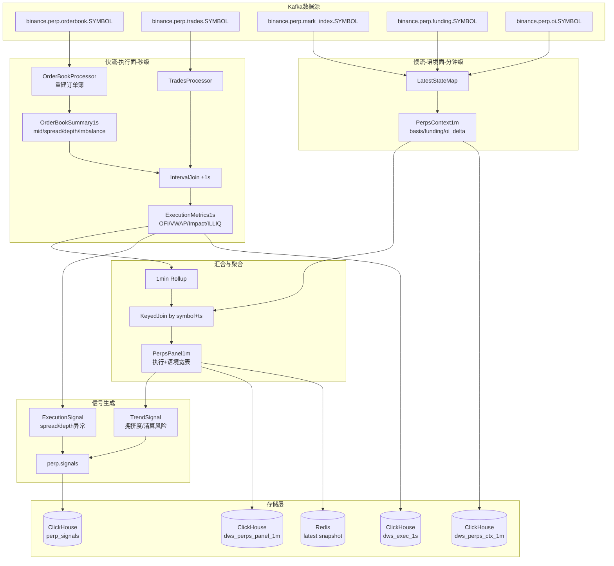
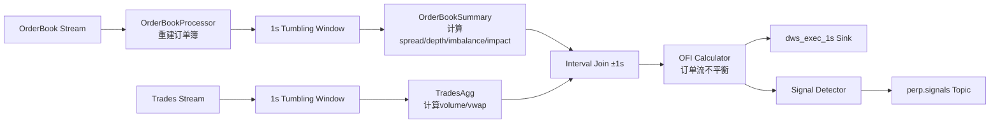
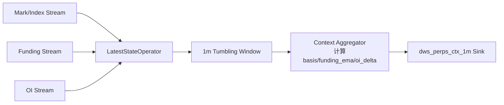
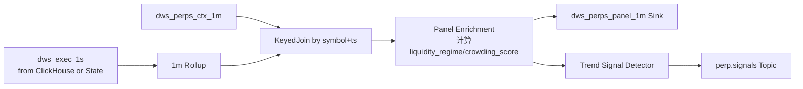

# 永续合约实时流数据处理设计方案

## 1. 整体架构设计

### 1.1 核心设计理念

基于你提供的文字建议，采用**快慢分离**架构：

- **快流（执行面）**：OrderBook + Trades，秒级处理，关注滑点、可成交性、流动性
- **慢流（语境面）**：Mark/Index、Funding、OI，分钟级处理，关注趋势、拥挤度、市场情绪
- **不使用CEP**：用窗口统计+最新态富集替代，降低复杂度
- **原生指标落库**：所有指标既输出信号也落库ClickHouse，支持历史查询和回测

### 1.2 数据流架构



## 2. 数据模型设计

### 2.1 Kafka Topic 数据模型

### OrderBook (binance.perp.orderbook.{symbol})

```json
{
  "symbol": "BTCUSDT",
  "exchange": "binance",
  "depth": {
    "bids": [[price, size], ...],
    "asks": [[price, size], ...]
  },
  "seq": 1234567890,
  "snapshot": false,
  "exchange_ts": 1712209123456,
  "ingest_ts": 1712209123470
}

```

### Trades (binance.perp.trades.{symbol})

```json
{
  "symbol": "BTCUSDT",
  "price": "64231.1",
  "size": "0.021",
  "side": "buy",
  "buyer_maker": false,
  "exchange_ts": 1712209123400,
  "ingest_ts": 1712209123415,
  "trade_id": 1234567890123
}

```

### Mark/Index (binance.perp.mark_index.{symbol})

```json
{
  "symbol": "BTCUSDT",
  "mark_price": "64225.5",
  "index_price": "64220.8",
  "fair_basis": "0.0007",
  "next_funding_time": 1712227200000,
  "last_funding_rate": "0.00010",
  "exchange_ts": 1712209123000,
  "ingest_ts": 1712209123015
}

```

### Funding (binance.perp.funding.{symbol})

```json
{
  "symbol": "BTCUSDT",
  "funding_rate": "0.00010",
  "funding_time": 1712208000000,
  "funding_interval": "8h",
  "exchange_ts": 1712208000000,
  "ingest_ts": 1712209125000
}

```

### Open Interest (binance.perp.oi.{symbol})

```json
{
  "symbol": "BTCUSDT",
  "oi": "98765.432",
  "oi_usd": "634210000.12",
  "exchange_ts": 1712209080000,
  "ingest_ts": 1712209081000
}

```

### 2.2 ClickHouse 表设计

### 执行面秒级表 (dws_exec_1s)

```sql
CREATE TABLE IF NOT EXISTS dws_exec_1s
(
    symbol              LowCardinality(String),
    exchange            LowCardinality(String),
    end_time            DateTime,                    -- 秒级窗口结束时间

    -- 订单簿指标
    mid_price           Decimal(24, 8),             -- 中间价
    spread_bps          Float64,                     -- 点差(基点)
    spread_abs          Decimal(24, 8),             -- 绝对点差

    -- 深度指标 (累计深度，单位：USD)
    depth_10k           Decimal(24, 2),             -- ±10k USD内的深度
    depth_50k           Decimal(24, 2),             -- ±50k USD内的深度
    depth_100k          Decimal(24, 2),             -- ±100k USD内的深度

    -- 订单簿不平衡
    imbalance_top5      Float64,                     -- 前5档不平衡 (bid-ask)/(bid+ask)
    imbalance_total     Float64,                     -- 总不平衡

    -- 冲击成本 (买入X USD需要的滑点，基点)
    impact_10k_bps      Float64,                     -- 10k冲击成本
    impact_50k_bps      Float64,                     -- 50k冲击成本
    impact_100k_bps     Float64,                     -- 100k冲击成本

    -- OFI (Order Flow Imbalance)
    ofi                 Float64,                     -- 订单流不平衡

    -- 成交指标
    trade_count         UInt32,                      -- 成交笔数
    volume_usd          Decimal(24, 2),             -- 成交量(USD)
    vwap                Decimal(24, 8),             -- 成交均价
    buy_volume_usd      Decimal(24, 2),             -- 主动买成交量
    sell_volume_usd     Decimal(24, 2),             -- 主动卖成交量

    -- 流动性指标 (可选)
    illiq_lambda        Float64,                     -- Amihud流动性系数 λ

    -- 元数据
    process_time        DateTime DEFAULT now(),

    INDEX idx_time (end_time) TYPE minmax GRANULARITY 1
)
ENGINE = MergeTree
PARTITION BY toYYYYMM(end_time)
ORDER BY (symbol, exchange, end_time)
TTL end_time + INTERVAL 7 DAY
SETTINGS index_granularity = 8192;

```

### 语境面分钟级表 (dws_perps_ctx_1m)

```sql
CREATE TABLE IF NOT EXISTS dws_perps_ctx_1m
(
    symbol              LowCardinality(String),
    exchange            LowCardinality(String),
    end_time            DateTime,                    -- 分钟级窗口

    -- 价格指标
    mark_price          Decimal(24, 8),
    index_price         Decimal(24, 8),
    basis_bps           Float64,                     -- 基差 (mark-index)/index * 10000

    -- 资金费率
    funding_rate        Float64,                     -- 当前资金费率
    funding_rate_8h     Float64,                     -- 8h资金费率
    funding_ema_24h     Float64,                     -- 24h资金费率EMA
    next_funding_time   DateTime,

    -- 持仓量
    oi                  Decimal(24, 2),             -- 持仓量(张)
    oi_usd              Decimal(24, 2),             -- 持仓量(USD)
    oi_delta_1m         Decimal(24, 2),             -- 1分钟OI变化
    oi_delta_pct        Float64,                     -- OI变化百分比

    -- 元数据
    process_time        DateTime DEFAULT now(),

    INDEX idx_time (end_time) TYPE minmax GRANULARITY 1
)
ENGINE = ReplacingMergeTree(end_time)
PARTITION BY toYYYYMM(end_time)
ORDER BY (symbol, exchange, end_time)
TTL end_time + INTERVAL 30 DAY
SETTINGS index_granularity = 8192;

```

### 汇合面板表 (dws_perps_panel_1m)

```sql
CREATE TABLE IF NOT EXISTS dws_perps_panel_1m
(
    symbol              LowCardinality(String),
    exchange            LowCardinality(String),
    end_time            DateTime,

    -- 执行面聚合 (从1s rollup)
    avg_spread_bps      Float64,
    max_spread_bps      Float64,
    avg_depth_50k       Decimal(24, 2),
    avg_impact_50k_bps  Float64,
    avg_imbalance       Float64,
    sum_ofi             Float64,
    volume_usd          Decimal(24, 2),
    trade_count         UInt32,

    -- 语境面
    mark_price          Decimal(24, 8),
    basis_bps           Float64,
    funding_rate        Float64,
    funding_ema_24h     Float64,
    oi_usd              Decimal(24, 2),
    oi_delta_1m         Decimal(24, 2),

    -- 衍生指标
    liquidity_regime    LowCardinality(String),     -- THICK/NORMAL/THIN
    crowding_score      Float64,                     -- 拥挤度得分

    -- 元数据
    process_time        DateTime DEFAULT now(),

    INDEX idx_time (end_time) TYPE minmax GRANULARITY 1,

    -- 投影：按时间查询优化
    PROJECTION by_time
    (
        SELECT end_time, symbol, avg_spread_bps, volume_usd, funding_rate, oi_usd
        ORDER BY (end_time, symbol)
    )
)
ENGINE = MergeTree
PARTITION BY toYYYYMM(end_time)
ORDER BY (symbol, exchange, end_time)
TTL end_time + INTERVAL 90 DAY
SETTINGS index_granularity = 8192,
         deduplicate_merge_projection_mode = 'rebuild';

```

### 信号表 (perp_signals)

```sql
CREATE TABLE IF NOT EXISTS perp_signals
(
    symbol              LowCardinality(String),
    exchange            LowCardinality(String),
    signal_time         DateTime,
    signal_type         LowCardinality(String),     -- EXEC_HEALTH/CROWDING/LIQUIDATION_RISK
    signal_level        LowCardinality(String),     -- INFO/WARNING/CRITICAL

    -- 信号内容
    metric_name         String,                      -- spread_anomaly/depth_thin/funding_extreme
    metric_value        Float64,
    threshold           Float64,

    -- 上下文
    context_json        String,                      -- 完整上下文JSON

    -- 元数据
    process_time        DateTime DEFAULT now(),

    INDEX idx_time (signal_time) TYPE minmax GRANULARITY 1
)
ENGINE = MergeTree
PARTITION BY toYYYYMM(signal_time)
ORDER BY (symbol, signal_type, signal_time)
TTL signal_time + INTERVAL 30 DAY
SETTINGS index_granularity = 8192;

```

## 3. Flink Job 设计

### 3.1 Job拆分策略

采用**两个独立Job**的方式，避免快慢流相互影响：

### Job 1: PerpExecutionMetricsJob (快流)

- 输入：orderbook + trades
- 输出：dws_exec_1s + exec_signals
- 并行度：8-16（高吞吐）
- Checkpoint：5s

### Job 2: PerpContextMetricsJob (慢流)

- 输入：mark_index + funding + oi
- 输出：dws_perps_ctx_1m
- 并行度：2-4（低吞吐）
- Checkpoint：10s

### Job 3: PerpPanelAggregatorJob (汇合)

- 输入：从ClickHouse读取exec_1s + ctx_1m（或从内存State）
- 输出：dws_perps_panel_1m + trend_signals
- 并行度：4-8
- Checkpoint：10s

### 3.2 Job 1: 执行面处理流程



**关键算子说明**：

1. **OrderBookProcessor**:
    - 有状态算子，维护每个symbol的完整订单簿
    - 使用MapState存储档位
    - 基于seq字段去重和排序
2. **OrderBookSummary计算**:
    - mid_price = (best_bid + best_ask) / 2
    - spread_bps = (best_ask - best_bid) / mid * 10000
    - depth计算：累加到指定USD金额的档位
    - imbalance = (Σbid_size - Σask_size) / (Σbid_size + Σask_size)
    - impact：模拟市价单吃单到指定金额的加权平均价差
3. **OFI计算**:
    - OFI = Δbid_volume - Δask_volume (跨窗口计算)

### 3.3 Job 2: 语境面处理流程



**关键算子说明**：

1. **LatestStateOperator**:
    - 维护每个symbol的最新Mark/Index/Funding/OI
    - 使用ValueState存储
    - 允许慢流独立水位
2. **Context Aggregator**:
    - basis_bps = (mark - index) / index * 10000
    - funding_ema: 指数移动平均
    - oi_delta: 当前OI - 上一分钟OI

### 3.4 Job 3: 面板汇合流程



**关键算子说明**：

1. **1m Rollup**:
    - avg(spread), max(spread), avg(depth), sum(ofi), sum(volume)
2. **Liquidity Regime分类**:
    - THICK: avg_spread < p25 && avg_depth > p75
    - THIN: avg_spread > p75 || avg_depth < p25
    - NORMAL: 其他
3. **Crowding Score计算**:
    - 基于funding_rate, basis, oi_delta的Z-score加权
    - crowding_score = z(funding) * 0.4 + z(|basis|) * 0.3 + z(oi_delta) * 0.3

## 4. 水位与乱序策略

### 4.1 快流水位配置

```java
// OrderBook & Trades
WatermarkStrategy.<OrderBook>forBoundedOutOfOrderness(Duration.ofMillis(300))
    .withIdleness(Duration.ofSeconds(60))
    .withTimestampAssigner((event, ts) -> event.getExchangeTs());

```

### 4.2 慢流水位配置

```java
// Mark/Index, Funding, OI
WatermarkStrategy.<MarkIndex>forBoundedOutOfOrderness(Duration.ofSeconds(5))
    .withIdleness(Duration.ofMinutes(2))
    .withTimestampAssigner((event, ts) -> event.getExchangeTs());

```

### 4.3 状态TTL配置

```java
// OrderBook State: 2小时
StateTtlConfig ttlConfig = StateTtlConfig
    .newBuilder(Time.hours(2))
    .setUpdateType(StateTtlConfig.UpdateType.OnCreateAndWrite)
    .setStateVisibility(StateTtlConfig.StateVisibility.NeverReturnExpired)
    .build();

```

## 5. 信号生成规则

### 5.1 执行健康信号 (秒级)

```java
// 点差异常
if (spread_bps > spread_p95 && spread_bps > 10) {
    signal("EXEC_HEALTH", "spread_anomaly", WARNING);
}

// 深度骤降
if (depth_50k < depth_p10 || depth_50k < 10000) {
    signal("EXEC_HEALTH", "depth_thin", CRITICAL);
}

// 冲击成本过高
if (impact_50k_bps > 50) {
    signal("EXEC_HEALTH", "high_impact", WARNING);
}

```

### 5.2 拥挤度/清算风险信号 (分钟级)

```java
// 拥挤度警告
if (crowding_score > 2.5 && liquidity_regime == "THIN") {
    signal("CROWDING", "crowded_thin_market", CRITICAL);
}

// 资金费率极端
if (abs(funding_rate_8h) > 0.01) { // 1%
    signal("CROWDING", "extreme_funding", WARNING);
}

// OI快速增长+薄流动性
if (oi_delta_pct > 5 && liquidity_regime == "THIN") {
    signal("LIQUIDATION_RISK", "oi_surge_thin", WARNING);
}

```

## 6. Redis缓存设计

### 6.1 热点数据缓存

```
Key: perp:latest:{symbol}
Value: JSON
{
  "symbol": "BTCUSDT",
  "update_time": 1712209123456,
  "exec": {
    "mid_price": 64225.5,
    "spread_bps": 2.3,
    "depth_50k": 125000,
    "impact_50k_bps": 3.2
  },
  "ctx": {
    "mark_price": 64226.1,
    "basis_bps": 0.8,
    "funding_rate": 0.0001,
    "oi_usd": 634210000
  }
}
TTL: 60s

```

## 7. 部署与性能参数

### 7.1 资源配置

| Job | 并行度 | TaskManager内存 | Checkpoint间隔 | 预估吞吐 |
| --- | --- | --- | --- | --- |
| PerpExecutionMetricsJob | 12 | 4GB | 5s | 10k events/s |
| PerpContextMetricsJob | 4 | 2GB | 10s | 1k events/s |
| PerpPanelAggregatorJob | 6 | 3GB | 10s | 500 panels/s |

### 7.2 端到端延迟目标

- 快流（执行面）：**p95 < 1s**（从Kafka到ClickHouse）
- 慢流（语境面）：**p95 < 5s**
- 面板汇合：**p95 < 10s**

## 8. 扩展方向

### 8.1 短期可加（不需CEP）

- 强平监控：接入liquidations流，关联OI和价格
- 跨所择路：多交易所orderbook对比，输出最优venue
- 历史分位数：维护滚动窗口的spread/depth分位数

### 8.2 长期演进（可引入CEP）

- 复杂事件模式：资金费骤升→OFI连续异常→spread扩大的序列
- 多symbol联动：相关性分析，basket信号

## 9. 开发检查清单

- [ ]  定义Java数据模型 (OrderBook, Trade, MarkIndex, Funding, OI)
- [ ]  实现OrderBookProcessor状态算子
- [ ]  实现秒级窗口聚合（spread/depth/impact/OFI）
- [ ]  实现分钟级语境聚合（basis/funding_ema/oi_delta）
- [ ]  实现IntervalJoin和KeyedJoin
- [ ]  实现信号检测器（阈值+规则引擎）
- [ ]  配置ClickHouse Sink（批量写入，5s flush）
- [ ]  配置Kafka Sink（信号topic）
- [ ]  实现Redis异步写入（热点快照）
- [ ]  编写单元测试（窗口逻辑、OFI计算）
- [ ]  编写集成测试（端到端延迟）
- [ ]  配置Grafana监控看板

---

**总结**：这个方案遵循"快慢分离、简单有效"的原则，用**窗口+富集**替代CEP，既保证低延迟又便于扩展。所有原生指标落库，既能实时信号也能历史回测，为agent决策提供完整数据支持。