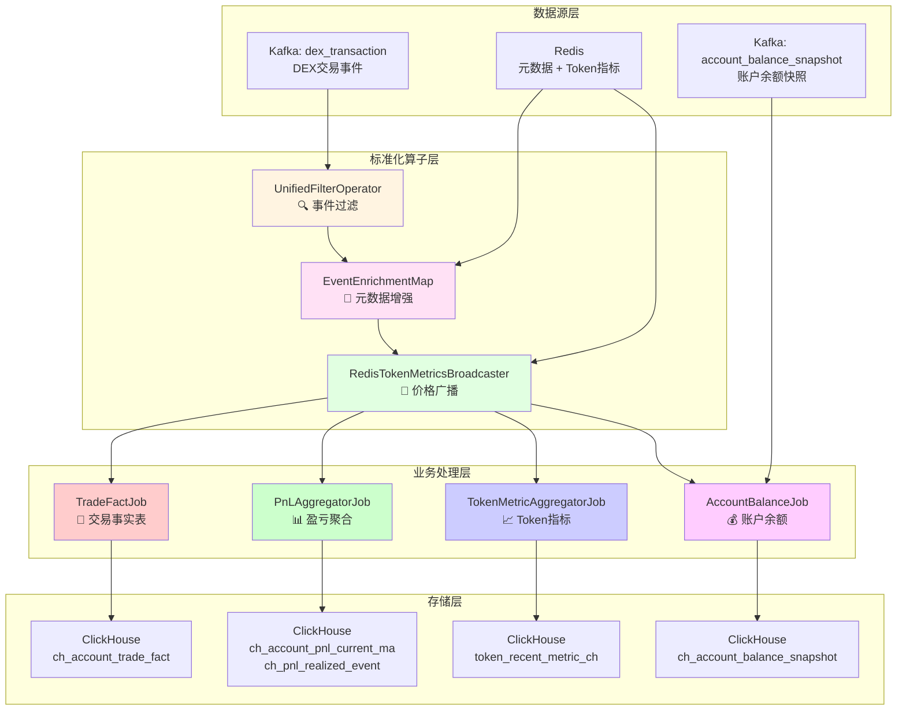

# Flink聚合器架构总览

## 整体架构图



## 核心设计模式

### 1. 标准化算子流（所有Job共享）

```
┌─────────────┐    ┌──────────────────┐    ┌──────────────────┐
│Kafka Source │ -> │UnifiedFilter     │ -> │EventEnrichment   │
│dex_trans    │    │事件提取+过滤      │    │元数据同步加载     │
└─────────────┘    └──────────────────┘    └──────────────────┘
                                                      |
                                                      v
┌─────────────┐    ┌──────────────────┐    ┌──────────────────┐
│ClickHouse   │ <- │业务处理器         │ <- │TokenMetrics      │
│各业务表      │    │特定领域逻辑       │    │价格指标广播       │
└─────────────┘    └──────────────────┘    └──────────────────┘
                                                      ^
                                                      |
                                            ┌──────────────────┐
                                            │Redis Source      │
                                            │定期拉取(30s)      │
                                            └──────────────────┘
```

### 2. ProcessEvent - 统一事件模型

```
ProcessEvent {
  基础字段: eventName, contractAddress, blockId, timestamp...
  
  业务类型: contractType ("erc20" | "dex")
  
  事件数据 (互斥):
    - erc20Data:    {toAddress, amount}
    - dexSwapData:  {amount0In, amount0Out, amount1In, amount1Out}
    - lpMintData:   {amount0, amount1, sender, to}
    - lpBurnData:   {amount0, amount1, sender, to}
  
  元数据 (增强后填充):
    - accountMetadata: {id, address, tagBitmap}
    - tokenMetadata:   {id, symbol, tokenMetrics}
    - pairMetadata:    {pairId, token0, token1}
}
```

## 四大Job对比

| Job | 输入事件 | 核心算法 | 输出表 | 关键特性 |
|-----|---------|---------|--------|---------|
| **TradeFactJob** | Swap | 纯映射提取 | `ch_account_trade_fact` | 双投影：Token维度+Account维度 |
| **PnLAggregatorJob** | Swap | 移动平均成本 | `ch_account_pnl_current_ma`<br/>`ch_pnl_realized_event` | 有状态聚合，侧输出流 |
| **TokenMetricAggregatorJob** | Swap | 层级窗口聚合 | `token_recent_metric_ch` | 20s→1min→5min→1h |
| **AccountBalanceJob** | Transfer | 双流对齐 | `ch_account_balance_snapshot` | 快照流+增量流 |

## 核心算法详解

### 移动平均成本算法（PnL）

```
状态 PnLState {
  position:        当前持仓数量
  avgCost:         移动加权平均成本
  realizedPnL:     已实现盈亏累计
}

买入:
  新持仓 = 原持仓 + 买入数量
  新成本 = (原持仓×原成本 + 买入数量×买入价) / 新持仓

卖出:
  已实现盈亏 = 卖出数量 × (卖出价 - 平均成本)
  新持仓 = 原持仓 - 卖出数量

指标:
  未实现盈亏 = 持仓数量 × (当前价 - 平均成本)
  总盈亏 = 已实现盈亏 + 未实现盈亏
  ROI = 总盈亏 / 投资成本
```

### 双流对齐机制（Balance）

```
规则:
  快照流: blockId >= 当前记录blockId -> 写入
  增量流: blockId >  快照流blockId   -> 写入

状态:
  snapshotBlockId:  快照基线
  currentAmount:    累计余额
  pendingQueue:     等待快照的增量

流程:
  1. 收到快照 -> 更新基线 -> 冲刷队列
  2. 收到增量 -> 
     - 有基线 -> 累加并写入
     - 无基线 -> 进入队列等待
```

### 层级窗口聚合（Token）

```
20s基础窗口 (原始Token事件)
    |
    v
1min窗口 (聚合3个20s窗口)
    |
    v
5min窗口 (聚合5个1min窗口)
    |
    v
1h窗口 (聚合12个5min窗口)
    |
    v
Union合并输出到ClickHouse
```

## 数据流向总览

```
                    ┌──────────────────────────────────┐
                    │      Kafka: dex_transaction      │
                    └──────────────┬───────────────────┘
                                   │
                    ┌──────────────┴───────────────┐
                    │   UnifiedFilterOperator      │
                    │   提取Swap/Transfer/Mint/Burn│
                    └──────────────┬───────────────┘
                                   │
                    ┌──────────────┴───────────────┐
                    │   EventEnrichmentMap         │
                    │   同步加载Account/Token/Pair  │
                    └──────────────┬───────────────┘
                                   │
                    ┌──────────────┴───────────────┐
                    │ RedisTokenMetricsBroadcaster │
                    │ 广播price/mcap/fdv/liquidity │
                    └──────────────┬───────────────┘
                                   │
         ┌─────────────────────────┼─────────────────────────┐
         │                         │                         │
         v                         v                         v
┌────────────────┐      ┌────────────────┐      ┌────────────────┐
│TradeFactJob    │      │PnLAggregatorJob│      │TokenMetricJob  │
│提取交易事实     │      │移动平均成本算法│      │层级窗口聚合     │
└────────┬───────┘      └────────┬───────┘      └────────┬───────┘
         │                       │                       │
         v                       v                       v
┌────────────────┐      ┌────────────────┐      ┌────────────────┐
│ch_account_     │      │ch_account_pnl_ │      │token_recent_   │
│trade_fact      │      │current_ma      │      │metric_ch       │
│                │      │ch_pnl_realized_│      │                │
│投影:by_token   │      │event           │      │投影:by_tag     │
│    by_account  │      │                │      │    by_time     │
└────────────────┘      └────────────────┘      └────────────────┘


                 ┌──────────────────────────┐
                 │ Kafka: balance_snapshot  │
                 └──────────┬───────────────┘
                            │
                 ┌──────────┴───────────────┐
                 │  DualStreamAligner       │
                 │  快照流+增量流对齐        │
                 └──────────┬───────────────┘
                            │
                 ┌──────────┴───────────────┐
                 │ch_account_balance_       │
                 │snapshot                  │
                 │投影:by_token, by_time    │
                 └──────────────────────────┘
```

## 设计亮点速览

| 亮点 | 描述 | 收益 |
|------|------|------|
| 🎯 **标准化流程** | 所有Job共享统一算子流 | 降低复杂度，易于维护 |
| 🔀 **分离关注点** | 元数据同步 vs 价格广播 | 各司其职，性能优化 |
| 💎 **极小状态** | PnL仅6个字段 | 内存占用小，性能高 |
| 🪜 **层级窗口** | 20s→1min→5min→1h | 减少重复计算 |
| 🔄 **双流对齐** | 快照+增量协同 | 保证数据准确性 |
| 🚀 **投影优化** | Token/Account双投影 | 查询性能10-100倍提升 |
| 🏷️ **标签位图** | 支持EX/SM/WH等标签 | 用户分层分析 |

## 优化方向速览

| 方向 | 优先级 | 预期收益 |
|------|--------|---------|
| 元数据热加载 | ⭐⭐⭐ | 支持动态更新 |
| 广播状态淘汰 | ⭐⭐ | 降低内存占用 |
| 价格Fallback策略 | ⭐⭐⭐ | 提高数据完整性 |
| 状态后端优化 | ⭐⭐⭐⭐ | 减少checkpoint时间 |
| 监控告警增强 | ⭐⭐⭐⭐⭐ | 快速发现问题 |
| 水印策略优化 | ⭐⭐ | 更好处理乱序 |

---

**快速索引**:
- 详细设计文档: [DESIGN_DOCUMENT.md](./DESIGN_DOCUMENT.md)
- 项目进度: [project_status.md](./project_status.md)


