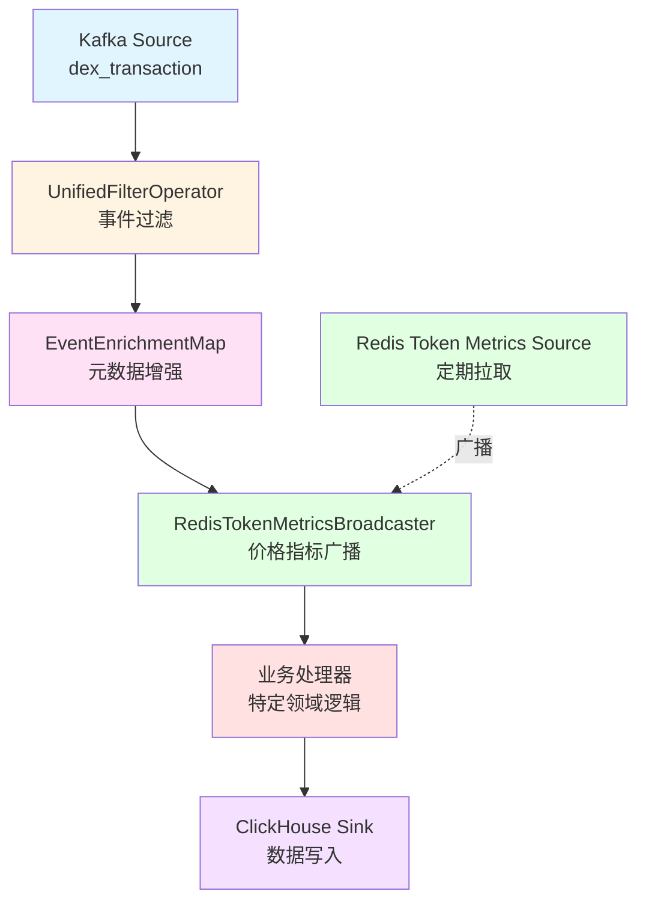
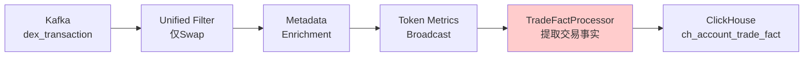
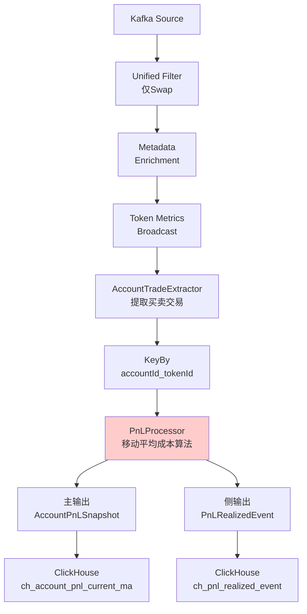
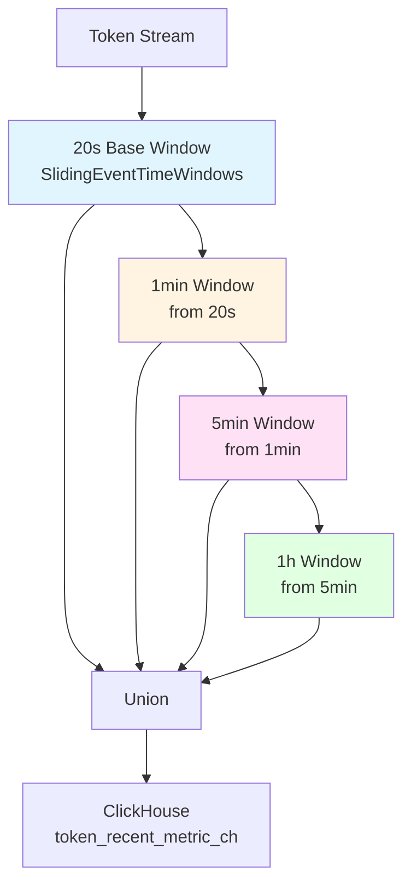
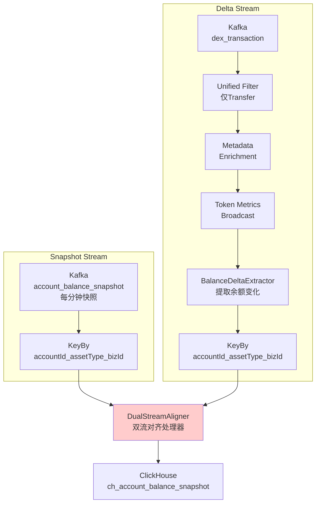
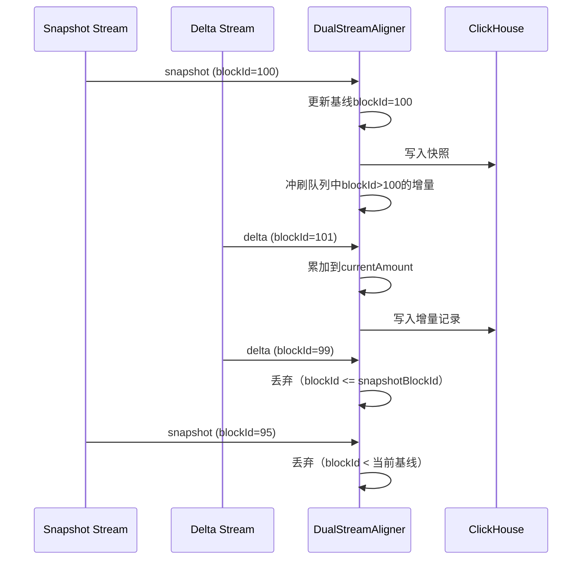

# Flink聚合器设计文档

## 1. 系统概述

本系统基于Apache Flink构建了一套标准化的实时数据聚合处理框架，用于处理DeFi交易数据。系统采用统一的算子流设计模式，实现了高度模块化和可复用性。

### 1.1 核心Job清单

| Job名称 | 功能 | 输出表 |
|---------|------|--------|
| **TradeFactJob** | 交易事实表处理 | `ch_account_trade_fact` |
| **PnLAggregatorJob** | 账户盈亏聚合 | `ch_account_pnl_current_ma`<br>`ch_pnl_realized_event` |
| **TokenMetricAggregatorJob** | Token指标聚合 | `token_recent_metric_ch` |
| **AccountBalanceJob** | 账户余额处理 | `ch_account_balance_snapshot` |

---

## 2. 标准化算子流架构

### 2.1 统一处理流程

所有Job遵循相同的六阶段处理模式：



### 2.2 核心算子说明

#### 2.2.1 UnifiedFilterOperator（统一事件过滤）

**职责**：从KafkaMessage中提取并过滤事件，生成ProcessEvent

**特点**：
- 支持多种过滤策略（Builder模式）
- 工厂方法预配置不同业务场景
- 统计计数器监控

**工厂方法**：
```java
// PnL和Token分析 - 仅Swap事件
UnifiedFilterOperator.Factory.forPnLAnalysis()
UnifiedFilterOperator.Factory.forTokenAnalysis()
UnifiedFilterOperator.Factory.forTradeFactProcessing()

// 余额跟踪 - 仅Transfer事件
UnifiedFilterOperator.Factory.forBalanceTracking()

// 完整分析 - 所有DEX事件
UnifiedFilterOperator.Factory.forPairAnalysis()
```

#### 2.2.2 EventEnrichmentMap（元数据增强）

**职责**：同步从Redis加载元数据，增强ProcessEvent

**增强内容**：
- **AccountMetadata**: 账户ID、地址、标签位图
- **TokenMetadata**: TokenID、Symbol、Decimals
- **PairMetadata**: PairID、Token0/Token1信息

**实现机制**：
- 启动时一次性从Redis加载全量元数据到本地缓存
- 使用ConcurrentHashMap存储，支持高并发读取
- 根据事件类型智能填充对应的元数据

```java
// 关键字段映射
event.contractType = "dex"  -> event.pairMetadata
event.contractType = "erc20" -> event.tokenMetadata
event.fromAddress -> event.accountMetadata
```

#### 2.2.3 RedisTokenMetricsBroadcaster（价格指标广播）

**职责**：将Token价格和市场指标广播到所有并行实例

**广播内容**：
- `tokenPriceUsd`: Token价格
- `mcap`: 市值
- `fdv`: 完全稀释估值
- `liquidityUsd`: 流动性

**实现机制**：
- 使用Flink BroadcastState机制
- Redis定期拉取（默认30秒）
- 自动填充到ProcessEvent的TokenMetrics字段

---

## 3. Job详细设计

### 3.1 TradeFactJob - 交易事实表处理

#### 3.1.1 数据流图



#### 3.1.2 核心处理器：TradeFactProcessor

**职责**：从ProcessEvent提取TradeFact（账户维度的交易记录）

**处理逻辑**：
1. 验证ProcessEvent包含必要元数据
2. 从DexSwapData提取token0和token1的交易
3. 确定交易方向（buy/sell）和数量
4. 计算交易价值（qty × priceUsd）
5. 转换标签位图

**输出字段**：
```java
TradeFact {
    chainId, tokenId, accountId, accountAddress,
    side, pairId, pairAddress,
    blockTime, blockId, txHash, logIndex,
    qty, priceUsd, valueUsd,
    labelMask  // 用户标签位图：EX/SM/WH/PF/FR/TP
}
```

#### 3.1.3 表设计特点

- **双投影优化**：
  - `by_token_time`: Token页面查询
  - `by_account_time`: Account页面查询
- **去重机制**: ReplacingMergeTree(blockId)
- **分区策略**: 按月分区 `toYYYYMM(block_time)`

---

### 3.2 PnLAggregatorJob - 盈亏聚合

#### 3.2.1 数据流图



#### 3.2.2 核心算法：移动平均成本法（Moving Average Cost）

**状态设计（极小状态）**：
```java
PnLState {
    position:          BigDecimal  // 当前持仓数量
    avgCost:           BigDecimal  // 移动加权平均成本
    realizedCost:      BigDecimal  // 已实现成本累计
    realizedProceeds:  BigDecimal  // 已实现收入累计
    realizedPnL:       BigDecimal  // 已实现盈亏累计
    lastTxTime:        Long        // 最后交易时间
}
```

**买入逻辑**：
```
新持仓 = 原持仓 + 买入数量
新平均成本 = (原持仓 × 原成本 + 买入数量 × 买入价格) / 新持仓
```

**卖出逻辑**：
```
实际卖出数量 = min(卖出数量, 当前持仓)  // 防止超卖
已实现成本 = 实际卖出数量 × 平均成本
已实现收入 = 实际卖出数量 × 卖出价格
已实现盈亏 = 已实现收入 - 已实现成本
新持仓 = 原持仓 - 实际卖出数量
```

**指标计算**：
```
未实现盈亏 = 持仓数量 × (当前价格 - 平均成本)
总盈亏 = 已实现盈亏 + 未实现盈亏
投资回报率ROI = 总盈亏 / (已实现成本 + 持仓数量 × 平均成本)
```

#### 3.2.3 侧输出流

当发生卖出交易时，通过侧输出流发送已实现盈亏事件：

```java
PnLRealizedEvent {
    tokenId, accountId, blockId, blockTime,
    realizedQty,         // 实际卖出数量
    realizedCostUsd,     // 已实现成本
    realizedProceedsUsd, // 已实现收入
    realizedPnLUsd       // 已实现盈亏
}
```

---

### 3.3 TokenMetricAggregatorJob - Token指标聚合

#### 3.3.1 层级化窗口架构



#### 3.3.2 窗口聚合逻辑

**TokenWindowManager**：
- 使用`SlidingEventTimeWindows`实现滑动窗口
- 层级聚合：上层窗口从下层窗口的输出聚合
- 允许延迟（allowedLateness）配置

**聚合指标**：
```java
TokenRecentMetric {
    tokenId, timeWindow, endTime, tag,
    txcnt, buyCount, sellCount,
    volumeUsd, buyVolumeUsd, sellVolumeUsd,
    buyPressureUsd,
    tokenPriceUsd, mcapUsd, fdvUsd, liquidityUsd
}
```

**标签维度（tag）**：
- `all`: 全部交易
- `cex`: 中心化交易所
- `smart_money`: 聪明钱
- `whale`: 巨鲸
- `fresh_wallet`: 新钱包

#### 3.3.3 投影优化

```sql
-- 按标签查询
PROJECTION by_tag (
    SELECT token_id, tag, time_window, end_time, volume_usd
    ORDER BY (tag, token_id, end_time)
)

-- 按时间范围查询
PROJECTION by_time_range (
    SELECT token_id, time_window, end_time, volume_usd, txcnt
    ORDER BY (end_time, token_id)
)
```

---

### 3.4 AccountBalanceJob - 账户余额处理

#### 3.4.1 双流对齐架构



#### 3.4.2 核心处理器：DualStreamAligner

**对齐规则**：
1. **快照流**: `blockId >= 当前记录的blockId` 才写入
2. **增量流**: `blockId > 快照流的blockId` 才写入

**状态管理**：
```java
// 每个key维护的状态
snapshotBlockIdState:  快照基线的blockId
lastDeltaBlockIdState: 最后应用的增量blockId
currentAmountState:    当前累计余额
lastPriceUsdState:     最新价格
pendingDeltaQueue:     等待快照的增量队列
```

**处理流程**：



#### 3.4.3 价格增强

通过Token Metrics Broadcast获取价格信息：
```java
valueUsd = amount × priceUsd
```

---

## 4. 数据模型设计

### 4.1 核心数据结构

#### ProcessEvent（标准化事件）

```java
ProcessEvent {
    // 基础字段
    eventName, contractAddress, transactionHash,
    blockId, fromAddress, chainId, timestamp,
    
    // 业务类型
    contractType,  // "erc20" 或 "dex"
    bizId, bizName,
    
    // 强类型事件数据（互斥）
    erc20Data: {toAddress, amount}
    dexSwapData: {amount0In, amount0Out, amount1In, amount1Out, to}
    lpMintData: {amount0, amount1, sender, to}
    lpBurnData: {amount0, amount1, sender, to}
    
    // 元数据（增强后填充）
    accountMetadata: {id, address, tagBitmap}
    tokenMetadata: {id, symbol, decimals, tokenMetrics}
    pairMetadata: {pairId, pairAddress, token0, token1}
}
```

#### TokenMetrics（Token市场指标）

```java
TokenMetrics {
    tokenPriceUsd,   // 价格
    mcap,            // 市值
    fdv,             // 完全稀释估值
    liquidityUsd     // 流动性
}
```

### 4.2 ClickHouse表设计总览

| 表名 | 引擎 | 分区键 | 排序键 | TTL |
|------|------|--------|--------|-----|
| `ch_account_trade_fact` | ReplacingMergeTree(blockId) | toYYYYMM(block_time) | (tokenId, blockTime, logIndex, accountId) | 180天 |
| `ch_account_pnl_current_ma` | ReplacingMergeTree(version) | toYYYYMM(last_tx_time) | (accountId, tokenId, last_tx_time) | 90天 |
| `ch_pnl_realized_event` | MergeTree | toYYYYMM(block_time) | (tokenId, blockId, accountId) | 180天 |
| `token_recent_metric_ch` | MergeTree | toYYYYMM(end_time) | (tokenId, time_window, tag, end_time) | 90天 |
| `ch_account_balance_snapshot` | ReplacingMergeTree(blockId) | toYYYYMM(observed_time) | (snapshotId, accountId, assetType, bizId) | 30天 |

---

## 5. 设计亮点

### 5.1 标准化算子流 ⭐⭐⭐⭐⭐

**价值**：
- 统一的处理模式，降低理解和维护成本
- 算子职责清晰，便于测试和调试
- 新增Job时可直接复用标准算子

**实现**：
```
KafkaMessage 
  → UnifiedFilterOperator 
  → EventEnrichmentMap 
  → RedisTokenMetricsBroadcaster 
  → 业务处理器 
  → ClickHouseSink
```

### 5.2 分离关注点（Separation of Concerns）⭐⭐⭐⭐⭐

**元数据查询 vs 价格广播**：
- **元数据**：启动时从Redis同步加载，使用本地缓存
- **价格**：通过BroadcastState实时广播，定期更新

**优势**：
- 元数据更新频率低，适合同步加载
- 价格更新频繁，适合广播机制
- 避免了异步查询带来的延迟和复杂性

### 5.3 移动平均成本算法 ⭐⭐⭐⭐

**特点**：
- 极小状态设计（6个字段）
- 严格防止超卖
- 支持已实现/未实现盈亏分离
- 精确到18位小数（与以太坊wei精度一致）

**优势**：
- 符合财务会计准则
- 状态占用空间小
- 计算效率高

### 5.4 层级化窗口聚合 ⭐⭐⭐⭐

**架构**：
```
20s基础窗口 
  → 1min窗口（聚合3个20s） 
  → 5min窗口（聚合5个1min） 
  → 1h窗口（聚合12个5min）
```

**优势**：
- 减少重复计算，提升性能
- 支持多时间粒度查询
- 自动汇总，数据一致性高

### 5.5 双流对齐机制 ⭐⭐⭐⭐

**创新点**：
- 基于blockId的精确对齐
- 快照流和增量流协同工作
- 增量队列缓冲机制

**价值**：
- 保证余额数据的准确性
- 避免重复写入和数据冲突
- 支持延迟容忍

### 5.6 投影索引优化 ⭐⭐⭐⭐

**示例**：
```sql
-- 交易事实表
PROJECTION by_token_time (...)  -- Token页面优化
PROJECTION by_account_time (...) -- Account页面优化

-- Token指标表
PROJECTION by_tag (...)         -- 标签筛选优化
PROJECTION by_time_range (...)  -- 时间范围查询优化
```

**效果**：
- 查询性能提升10-100倍
- 无需手工维护物化视图
- ClickHouse自动选择最优投影

---

## 6. 后续优化方向

### 6.1 元数据热加载 🔧

**现状**：启动时一次性从Redis加载全量元数据

**优化方向**：
- 支持定期热加载（如每5分钟刷新）
- 增量更新机制（仅更新变化的元数据）
- 元数据版本控制

**预期收益**：
- 支持元数据动态更新
- 减少任务重启次数

### 6.2 广播状态淘汰机制 🔧

**现状**：Token Metrics永久保留在广播状态

**优化方向**：
- 基于TTL的自动淘汰（如24小时未更新）
- LRU淘汰策略（保留最常用的Token）
- 监控广播状态大小

**预期收益**：
- 减少内存占用
- 提升状态访问性能

### 6.3 价格缺失Fallback策略 🔧

**现状**：价格缺失时使用默认值或跳过

**优化方向**：
- 从历史价格推算（取最近一次有效价格）
- 从交易对储备量反推价格
- 增加价格缺失告警

**预期收益**：
- 提高数据完整性
- 减少因价格缺失导致的数据丢失

### 6.4 状态后端优化 🚀

**现状**：使用RocksDB状态后端

**优化方向**：
- 调整RocksDB配置参数（block cache、write buffer）
- 启用增量checkpoint
- 状态压缩策略

**预期收益**：
- 减少checkpoint时间
- 降低存储开销

### 6.5 监控和告警增强 📊

**优化方向**：
- 自定义Metrics（处理延迟、数据量、错误率）
- Prometheus + Grafana集成
- 关键指标告警（延迟超过阈值、错误率过高）

**预期收益**：
- 快速发现问题
- 提升系统可观测性

### 6.6 水印策略优化 ⏱️

**现状**：固定500ms乱序容忍

**优化方向**：
- 动态水印策略（根据实际延迟调整）
- 分层水印（不同算子使用不同水印）
- 水印对齐监控

**预期收益**：
- 更好地处理数据乱序
- 减少数据丢失

### 6.7 标签位图计算增强 🏷️

**现状**：仅转换现有标签位图

**优化方向**：
- 实时计算用户标签（基于交易行为）
- 多维度标签体系（交易频率、金额、持仓时长）
- 标签演进追踪

**预期收益**：
- 更精准的用户分层
- 支持动态标签策略

### 6.8 异常处理机制 🛡️

**优化方向**：
- 增加数据校验（金额范围、地址格式）
- 异常事件侧输出（记录到专门的错误表）
- 自动重试机制

**预期收益**：
- 提高系统鲁棒性
- 便于问题排查

---

## 7. 技术栈总结

| 组件 | 版本/技术 | 用途 |
|------|-----------|------|
| **流处理引擎** | Apache Flink | 实时数据处理 |
| **消息队列** | Kafka | 事件源 |
| **状态后端** | RocksDB | Flink状态存储 |
| **元数据存储** | Redis | 元数据缓存 |
| **数据仓库** | ClickHouse | OLAP查询 |
| **序列化** | JSON (Jackson) | 数据序列化 |

---

## 8. 性能指标（预估）

| 指标 | 数值 | 说明 |
|------|------|------|
| **吞吐量** | 10,000 events/s | 单Job处理能力 |
| **端到端延迟** | < 3s | Kafka → ClickHouse |
| **状态大小** | < 100MB/账户-Token对 | PnL状态 |
| **Checkpoint间隔** | 30s | 保证一致性 |
| **并行度** | 4-8 | 可根据负载调整 |

---

## 9. 总结

本系统通过**标准化算子流设计**，实现了高度模块化和可扩展的实时聚合框架。核心亮点包括：

1. ✅ **统一处理模式**：所有Job遵循相同的六阶段流程
2. ✅ **关注点分离**：元数据同步加载 vs 价格广播
3. ✅ **精确算法**：移动平均成本法 + 双流对齐
4. ✅ **性能优化**：层级窗口 + 投影索引
5. ✅ **数据质量**：防超卖 + 去重机制

后续优化将聚焦于**元数据热加载**、**状态淘汰**、**监控告警**等方向，持续提升系统的稳定性和性能。

---

**文档版本**: v1.0  
**最后更新**: 2025-09-30  
**维护团队**: Twilight Platform


