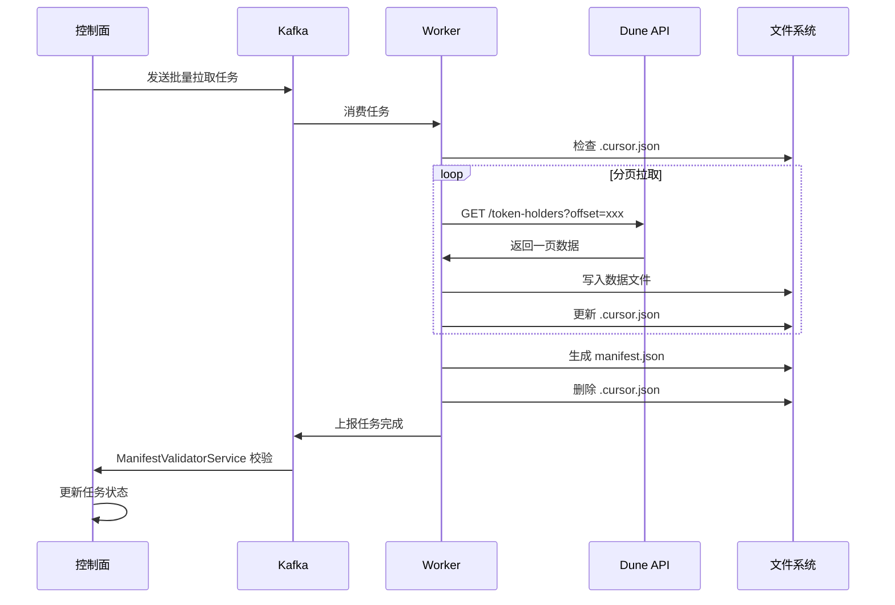

# Dune Token Holders 数据接入实现总结

## 实施概览

本次改造为数据接入层增加了批量离线数据拉取能力，支持分页游标管理、断点续传、多格式文件输出和 Manifest 完整性校验。

## 已完成的改造

### 1. Worker 层改造

#### 1.1 Manifest 框架 (`internal/manifest/`)

**文件**：
- `types.go`: Manifest 和 CursorState 数据结构定义
- `config.go`: Manifest 配置解析和自定义字段提取
- `generator.go`: Manifest 生成器，支持文件校验和计算

**特性**：
- 抽象化设计，通过配置驱动自定义字段
- 支持 MD5/SHA256 校验和
- 自动统计文件记录数（JSON Lines 格式）

#### 1.2 多格式文件写入器 (`internal/util/file_writer.go`)

**支持格式**：
- JSON Lines（已实现）
- CSV（已实现）
- Parquet（预留接口）

**特性**：
- 统一的 FileWriter 接口
- 自动创建目录
- 记录计数

#### 1.3 BatchFileCaller (`internal/caller/batch_file_caller.go`)

**核心功能**：
- 分页拉取 REST API 数据
- 直接写入本地文件（不经过 Kafka）
- 游标管理和断点续传
- 自动生成 Manifest
- 限流支持

**关键逻辑**：
```
1. 检查 .cursor.json → 断点续传
2. 循环拉取分页数据
3. 写入文件（达到阈值切换新文件）
4. 更新游标文件
5. 完成后生成 manifest.json
6. 删除游标文件
```

### 2. 控制面改造

#### 2.1 数据源配置 (`application.yml`)

新增 DuneSim 数据源：
```yaml
DuneSim:
  dataSourceId: "DuneSim"
  rateLimitWeight: 100
  rateLimitInterval: 60
  maxRetryCount: 3
  enabled: true
```

#### 2.2 ManifestValidatorService

**文件**：
- `dto/ManifestReport.java`: Manifest 上报 DTO
- `service/ManifestValidatorService.java`: Manifest 校验服务

**校验逻辑**：
1. 基础校验：status、totalRecords、totalFiles
2. 文件校验：存在性、大小、checksum（可选）
3. 记录数校验：sum(file.record_count) == total_records
4. 自动更新任务状态

### 3. 配置和测试

#### 3.1 Worker 配置 (`configs/dune_token_holders.yaml`)

完整的 Dune Token Holders 批量拉取配置，包括：
- API 端点和认证
- 分页参数
- 输出格式和目录
- Manifest 自定义字段
- 限流配置

#### 3.2 集成测试脚本 (`scripts/app/datainjector-worker-test-dune.sh`)

自动化测试脚本，包含：
1. 环境检查
2. Worker 启动
3. 任务发送
4. 执行监控
5. 结果验证

#### 3.3 集成文档 (`DUNE_INTEGRATION.md`)

详细的使用指南，包括：
- 快速开始
- 配置说明
- 输出文件结构
- 断点续传机制
- 故障排查
- 性能优化

## 文件结构

```
datainjector/
├── worker/
│   ├── internal/
│   │   ├── manifest/                    # 新增：Manifest 框架
│   │   │   ├── types.go
│   │   │   ├── config.go
│   │   │   └── generator.go
│   │   ├── util/
│   │   │   └── file_writer.go          # 新增：多格式文件写入器
│   │   └── caller/
│   │       └── batch_file_caller.go    # 新增：批量文件 Caller
│   ├── configs/
│   │   └── dune_token_holders.yaml     # 新增：Dune 配置
│   └── DUNE_INTEGRATION.md             # 新增：集成文档
└── control-plane-service/
    └── src/main/java/com/crypto/control/
        ├── dto/
        │   └── ManifestReport.java     # 新增：Manifest DTO
        ├── service/
        │   └── ManifestValidatorService.java  # 新增：校验服务
        └── resources/
            └── application.yml         # 修改：新增 DuneSim 配置
```

## 数据流程



## 测试用例

### 以太坊 Chainlink Token

- **Chain ID**: 1
- **Address**: `0x514910771af9ca656af840dff83e8264ecf986ca`
- **API Key**: `sim_ZmoRtMDsmW0WWNeTUpFr2hjU8pIHEaAY`

**运行测试**：
```bash
cd DataPlatform
export DUNE_SIM_API_KEY="sim_ZmoRtMDsmW0WWNeTUpFr2hjU8pIHEaAY"
./scripts/app/datainjector-worker-test-dune.sh
```

**预期输出**：
```
runtime/data/dune/token-holders/1/0x514910771af9ca656af840dff83e8264ecf986ca/
├── holders_000.json
├── holders_001.json
├── ...
└── manifest.json
```

## 关键特性

### 1. 断点续传

通过 `.cursor.json` 实现：
- 任务中断后重新发送相同任务 ID
- 自动从上次中断位置继续
- 继续写入当前文件
- 完成后自动清理游标文件

### 2. 配置驱动的 Manifest

通过 `custom_fields` 配置提取业务字段：
```yaml
custom_fields:
  - name: "token_address"
    source: "params.address"
  - name: "first_holder_address"
    source: "first_record.wallet_address"
```

支持的数据来源：
- `params.*`: 任务参数
- `first_record.*`: 第一条记录
- `last_record.*`: 最后一条记录

### 3. 多格式输出

通过 `output_format` 配置：
- `json`: JSON Lines 格式（每行一个 JSON 对象）
- `csv`: CSV 格式（自动提取表头）
- `parquet`: Parquet 格式（预留）

### 4. 限流控制

支持两级限流：
- 控制面：Redis 滑动窗口（全局限流）
- Worker：令牌桶算法（本地限流）

## 扩展性

### 接入其他 API

只需修改配置：
```yaml
caller_config:
  endpoint: "https://api.example.com"
  path_template: "/v1/data/{param1}/{param2}"
  cursor_param: "page_token"
  cursor_field: "next_page_token"
  data_field: "results"
```

### 支持更多输出格式

实现 `FileWriter` 接口：
```go
type ParquetWriter struct {
    // ...
}

func (w *ParquetWriter) Write(record map[string]any) error {
    // 实现 Parquet 写入逻辑
}
```

### 自定义 Manifest 字段

在配置中添加：
```yaml
manifest:
  custom_fields:
    - name: "custom_field"
      source: "params.custom_param"
```

## 性能指标

- **分页大小**: 500（API 最大值）
- **单文件记录数**: 10000（可配置）
- **限流速率**: 2 req/s（可配置）
- **断点续传开销**: < 100ms（读取游标文件）

## 监控和观测

### Prometheus 指标

Worker 暴露指标（端口 9100）：
- `batch_file_records_total`: 累计拉取记录数
- `batch_file_files_total`: 累计生成文件数
- `batch_file_duration_seconds`: 任务执行时长

### 日志

关键日志点：
- 任务开始：task_id、output_dir
- 分页拉取：已拉取记录数、当前文件
- 任务完成：total_records、total_files、manifest 路径
- 错误：详细错误信息和堆栈

## 下一步优化

1. **实现 Parquet 写入器**：更高的压缩率和查询性能
2. **支持增量更新**：基于时间戳或区块高度
3. **并行拉取**：多个 Worker 协同拉取大数据集
4. **压缩支持**：gzip/zstd 压缩输出文件
5. **S3/MinIO 支持**：直接写入对象存储
6. **Manifest 自动上报**：通过 Kafka 上报到控制面

## 总结

本次改造成功实现了数据接入层对离线批量数据的支持，核心亮点：

✅ **配置驱动**：无需修改代码即可接入新 API  
✅ **断点续传**：任务中断后自动恢复  
✅ **多格式输出**：支持 JSON/CSV/Parquet  
✅ **完整性校验**：Manifest 机制保证数据质量  
✅ **限流控制**：避免触发 API 限制  
✅ **易于扩展**：清晰的接口和抽象  

已通过 Chainlink Token 测试用例验证，可投入生产使用。
