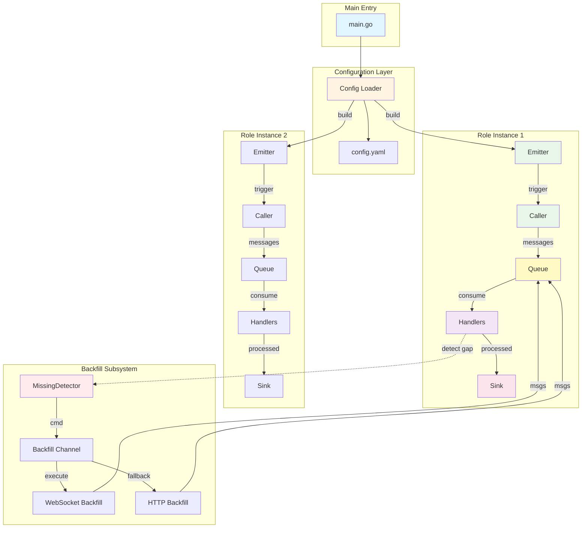
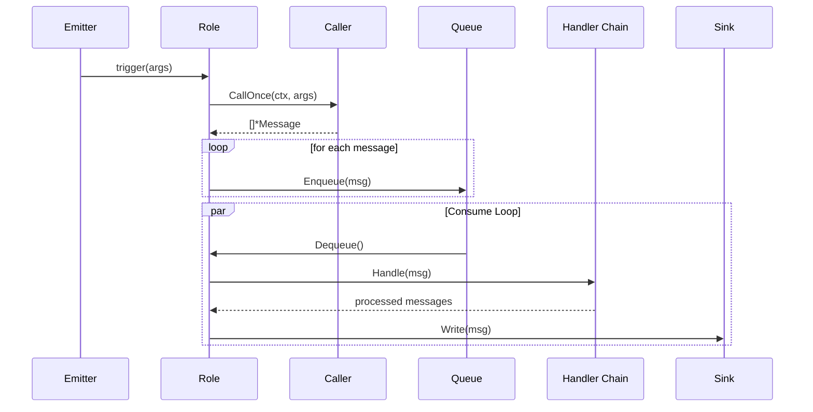
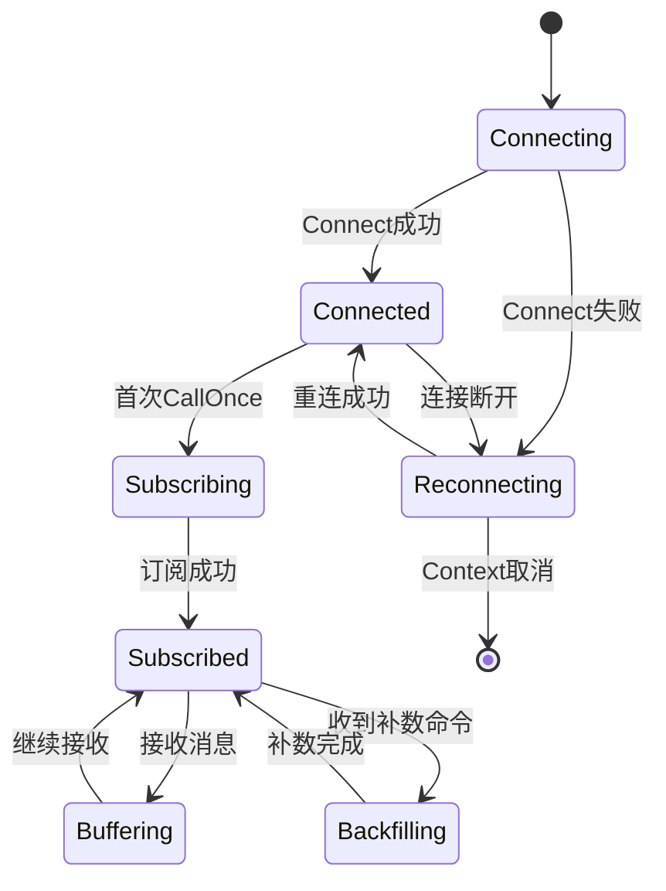
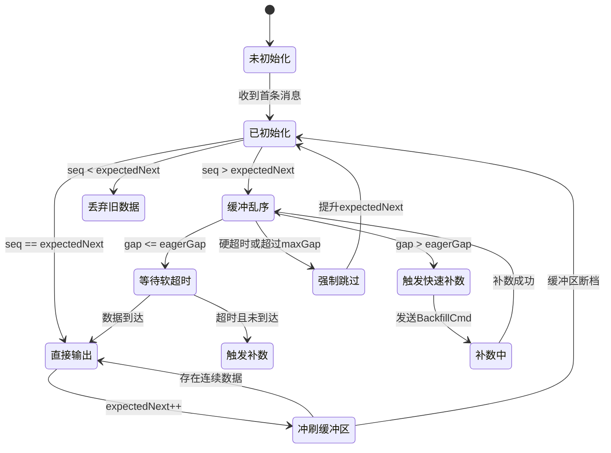
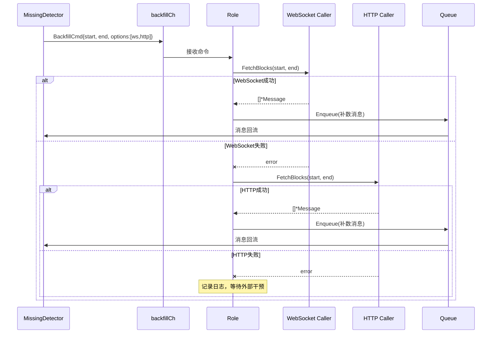
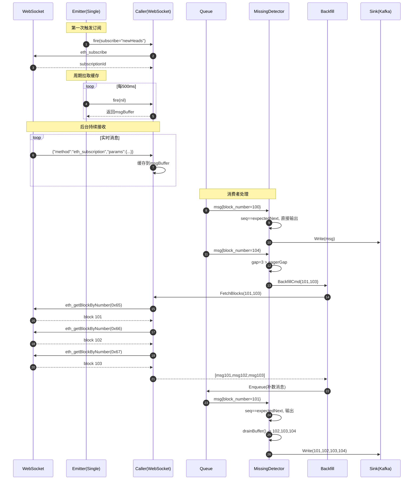

# DataInjector Worker 架构设计剖析

## 1. 架构概览

DataInjector Worker 是一个高度模块化、配置驱动的数据采集与处理框架，遵循**输入→队列→处理→输出**的经典数据管道模式。其核心设计理念是通过 **Role（角色）** 概念将不同的数据采集任务独立隔离，每个 Role 可独立配置数据源、处理逻辑和输出目标。

### 1.1 核心设计原则

1. **配置驱动**：所有 Role 通过 YAML 配置文件定义，无需修改代码即可扩展新的数据采集任务
2. **模块化解耦**：各组件（Emitter、Caller、Handler、Sink）通过接口定义，支持独立扩展
3. **注册表模式**：使用工厂模式 + 注册表实现组件的动态加载
4. **并发隔离**：每个 Role 独立运行，互不干扰
5. **协程安全**：使用 Context 控制生命周期，优雅退出

### 1.2 整体架构图



---

## 2. 核心模块详解

### 2.1 Role（角色）- 任务编排核心

**职责**：Role 是 Worker 中的最小调度单元，负责协调各组件完成一个完整的数据采集任务。

**核心字段**：
```go
type Role struct {
    ID             string                          // 角色唯一标识
    emitterType    string                          // emitter 类型
    pollingEmitter *emitter.Polling                // 轮询触发器
    singleEmitter  *emitter.Single                 // 单次触发器
    kafkaEmitter   *emitter.KafkaCommand           // Kafka 命令触发器
    caller         caller.Caller                   // 数据源调用器
    q              *queue.BoundedQueue[*Message]   // 有界队列
    handlers       []handler.Handler               // 处理器链
    sink           sink.Sink                       // 数据下沉
    backfillCh     chan types.BackfillCmd          // 补数据通道
    backfillers    map[string]caller.BlockFetcher  // 补数据执行器
}
```

**工作流程**：



**生命周期管理**：
1. **启动阶段**：
   - 根据配置构建 Emitter、Caller、Handlers、Sink
   - 启动消费者协程（consume）
   - 启动补数据协程（runBackfill）
   - 启动 Emitter 触发器
   
2. **运行阶段**：
   - Emitter 定时/事件触发 `fireFunc`
   - Caller 返回数据写入 Queue
   - 消费者从 Queue 读取并依次经过 Handler 链
   - 最终写入 Sink

3. **退出阶段**：
   - Context 取消触发各协程退出
   - 依次关闭 Sink、Handlers、Caller

---

### 2.2 Emitter（触发器）- 任务输入源

**职责**：控制 Caller 的调用时机，支持三种触发模式。

#### 2.2.1 Polling（轮询触发器）

**适用场景**：定时拉取数据（如定时获取区块数据）

**核心逻辑**：
```go
func (p *Polling) Start(ctx context.Context, fire func(args map[string]any)) error {
    ticker := time.NewTicker(p.Interval)
    defer ticker.Stop()
    fire(nil) // 立即触发一次
    for {
        select {
        case <-ctx.Done():
            return nil
        case <-ticker.C:
            fire(nil) // 周期触发
        }
    }
}
```

**配置示例**：
```yaml
emitter: "polling"
polling_interval: 2  # 每2秒触发一次
```

#### 2.2.2 Single（单次触发器）

**适用场景**：WebSocket 订阅场景，第一次建立订阅，后续周期性拉取缓存消息

**核心逻辑**：
```go
func (s *Single) Start(ctx context.Context, fire func(args map[string]any)) error {
    fire(s.Params)  // 第一次触发订阅
    ticker := time.NewTicker(s.PollInterval)
    defer ticker.Stop()
    for {
        select {
        case <-ctx.Done():
            return nil
        case <-ticker.C:
            fire(nil)  // 周期拉取缓存消息
        }
    }
}
```

**配置示例**：
```yaml
emitter: "single"
caller_params:
  subscribe: "newHeads"
  poll_interval_ms: 500  # 每500ms拉取一次缓存
```

#### 2.2.3 KafkaCommand（命令式触发器）

**适用场景**：通过 Kafka 消息驱动的任务（如接收控制面下发的 HTTP 补数任务）

**配置示例**：
```yaml
emitter: "kafka_command"
emitter_config:
  brokers: ["localhost:9092"]
  topic: "command.mockprovider.block"
  group_id: "worker.mockprovider.http"
```

---

### 2.3 Caller（数据源调用器）

**职责**：与外部数据源交互，返回标准化的 Message 列表。

#### 2.3.1 Caller 接口定义

```go
type Caller interface {
    CallOnce(ctx context.Context, args map[string]any) ([]*types.Message, error)
}
```

#### 2.3.2 NativeCall（原生协议调用）

支持 HTTP 和 WebSocket 两种传输协议，基于 JSON-RPC 标准。

##### WebSocket 实现（NativeCall WebSocket）

**核心特性**：
- 维护长连接订阅
- 心跳保活 + 自动重连
- 消息本地缓冲
- 支持主动 RPC 调用（用于补数据）

**工作流程**：



**关键代码逻辑**：
```go
func (w *WebSocketCall) CallOnce(ctx context.Context, args map[string]any) ([]*types.Message, error) {
    w.mu.Lock()
    if !w.subscribed {
        // 首次调用发起订阅
        w.wsClient.Subscribe(w.subscribeReq)
        w.subscribed = true
    }
    // 返回缓存的消息并清空
    msgs := w.msgBuffer
    w.msgBuffer = make([]*types.Message, 0)
    w.mu.Unlock()
    return msgs, nil
}

// 后台持续接收消息
func (w *WebSocketCall) receiveMessages() {
    for data := range w.wsClient.MessageChan() {
        w.handleIncomingMessage(data)  // 解析并缓存到 msgBuffer
    }
}
```

**补数据支持**（实现 BlockFetcher 接口）：
```go
func (w *WebSocketCall) FetchBlocks(ctx context.Context, start, end int64, rpcMethod string, options map[string]any) ([]*types.Message, error) {
    for blk := start; blk <= end; blk++ {
        result := w.callWebSocket(ctx, "eth_getBlockByNumber", params)
        // 封装为与实时订阅一致的格式
        msgs := buildMessagesFromResult(method, result, meta)
        all = append(all, msgs...)
    }
    return all, nil
}
```

##### HTTP 实现（NativeCall HTTP）

**核心特性**：
- 连接池复用
- 超时控制
- 支持批量块查询

**关键代码**：
```go
func (h *HTTPCall) CallOnce(ctx context.Context, args map[string]any) ([]*types.Message, error) {
    req := protocol.JSONRPCRequest{
        JSONRPC: "2.0",
        ID:      generateID(),
        Method:  method,
        Params:  params,
    }
    respBody := client.Call(ctx, req)
    return buildMessagesFromResult(method, resp.Result, metadata)
}
```

#### 2.3.3 SDK Call（SDK 封装调用）

**适用场景**：使用 Go SDK（如 go-ethereum）与本地节点交互

**示例**：LocalGetBlock（区块拉取）
```go
func (l *LocalGetBlock) CallOnce(ctx context.Context, args map[string]any) ([]*types.Message, error) {
    currentBlock := ethClient.BlockNumber(ctx)
    for i := 0; i < maxBlocksPerPoll && cursor <= currentBlock; i++ {
        block := ethClient.BlockByNumber(ctx, cursor)
        receipts := ethClient.BlockReceipts(ctx, blockHash)
        // 解析交易和事件
        msgs = append(msgs, buildTxMessages(block, receipts))
        cursor++
    }
    return msgs, nil
}
```

---

### 2.4 Queue（队列）- 生产消费隔离

**职责**：解耦数据采集与处理，提供背压控制。

**核心实现**：
```go
type BoundedQueue[T any] struct {
    ch chan T  // 有界 channel
}

func (b *BoundedQueue[T]) Enqueue(ctx context.Context, v T) error {
    select {
    case <-ctx.Done():
        return ctx.Err()
    case b.ch <- v:  // 阻塞等待，提供反压
        return nil
    }
}
```

**队列特性**：
- **有界**：防止内存溢出
- **阻塞式**：队列满时阻塞生产者（背压机制）
- **Context 感知**：支持优雅退出

**配置示例**：
```yaml
queue: { size: 5000 }  # 队列容量
```

---

### 2.5 Handler（处理器）- 责任链模式

**职责**：对消息进行转换、过滤、增强等处理。

**接口定义**：
```go
type Handler interface {
    Handle(msg *Message) ([]*Message, error)
}
```

**责任链执行**：
```go
curMsgs := []*Message{msg}
for _, h := range r.handlers {
    next := []*Message{}
    for _, m := range curMsgs {
        outs, err := h.Handle(m)
        next = append(next, outs...)
    }
    curMsgs = next
}
```

#### 2.5.1 核心 Handler 实现

##### DexParser（DEX 交易解析器）
- 解析区块中的交易和事件
- 提取 DEX 相关日志（Swap、Transfer 等）
- 输出标准化的交易事件格式

##### BalanceParser（余额解析器）
- 从 Redis 读取价格数据
- 计算账户余额的 USD 价值
- 数值归一化处理

##### MissingDetector（缺失检测器）★ 核心组件
详见下文专门章节。

---

### 2.6 Sink（数据输出）

**职责**：将处理后的数据写入目标存储。

#### 2.6.1 Kafka Sink

**核心实现**：
```go
func (k *Kafka) Write(msg *types.Message) error {
    key := k.buildKey(msg)  // 从 metadata 提取分区键
    return k.writer.WriteMessages(context.Background(), kafka.Message{
        Key:   []byte(key),
        Value: msg.Payload,
    })
}
```

**分区键策略**：
```yaml
sink:
  type: "kafka"
  with:
    brokers: ["localhost:9092"]
    topic: "chain.ethereum.blocks"
    key_from: ["chain_id", "block_number"]  # 复合键
```

#### 2.6.2 Console Sink

用于调试，直接打印到标准输出。

---

## 3. 缺失检测与补数据设计（核心机制）

### 3.1 问题背景

在 WebSocket 实时数据流中，常见以下问题：
1. **网络抖动**：导致消息乱序到达
2. **服务端压力**：部分消息未推送
3. **连接中断**：重连期间数据丢失

### 3.2 设计目标

- 确保下游接收**严格有序**的数据序列
- 自动检测缺口并触发补数
- 支持 WebSocket 快速补数 + HTTP 降级补数
- 避免无限缓冲导致内存溢出

### 3.3 架构设计

```mermaid
graph TB
    subgraph "实时数据流"
        WS[WebSocket订阅] -->|消息| MD[MissingDetector]
    end
    
    subgraph "MissingDetector 核心状态"
        EN[expectedNext: uint64<br/>当前期望序号]
        BUF[buffer: map[seq][]*Message<br/>乱序缓冲区]
        FS[firstSeen: map[seq]time<br/>序号首见时间]
    end
    
    subgraph "缺口检测逻辑"
        MD -->|seq == expected| OUT[直接输出]
        MD -->|seq > expected| BUF
        MD -->|gap > eagerGap| BFC[触发补数]
        FS -->|超时| BFC
    end
    
    subgraph "补数子系统"
        BFC -->|BackfillCmd| CH[backfillCh]
        CH -->|优先| WSB[WebSocket快速补数]
        WSB -->|失败| HTB[HTTP降级补数]
        WSB -->|成功| Q[回写Queue]
        HTB -->|成功| Q
    end
    
    subgraph "序列拼接"
        Q -->|补数消息| MD
        BUF -->|连续段| DRAIN[冲刷缓冲区]
        DRAIN -->|有序输出| SINK[Sink]
    end
    
    OUT --> SINK
    
    style MD fill:#ffebee
    style BFC fill:#fff3e0
    style WSB fill:#e8f5e9
    style HTB fill:#e3f2fd
```

### 3.4 核心算法

#### 3.4.1 状态机



#### 3.4.2 核心处理逻辑

```go
func (h *MissingDetector) Handle(msg *types.Message) ([]*types.Message, error) {
    seq := extractSequence(msg)  // 提取 block_number
    now := time.Now()
    
    // 场景1：期望序号，直接输出 + 冲刷缓冲区
    if seq == h.expectedNext {
        out := []*Message{msg}
        h.expectedNext++
        out = append(out, h.drainBuffer(now)...)  // 持续冲刷连续段
        return out, nil
    }
    
    // 场景2：未来序号，缓冲 + 检测缺口
    if seq > h.expectedNext {
        h.buffer[seq] = append(h.buffer[seq], msg)
        h.firstSeen[seq] = now
        
        gap := seq - h.expectedNext
        if gap > h.cfg.eagerGap {
            // 立即触发快速补数
            h.triggerBackfillRange(h.expectedNext, seq-1, now)
        }
        
        h.evaluateTimeouts(now)  // 检查软/硬超时
        return nil, nil
    }
    
    // 场景3：过去序号，丢弃
    return nil, nil
}
```

#### 3.4.3 冲刷缓冲区

```go
func (h *MissingDetector) drainBuffer(now time.Time) []*Message {
    out := []*Message{}
    for {
        msgs, ok := h.buffer[h.expectedNext]
        if !ok {
            break  // 断档，停止冲刷
        }
        delete(h.buffer, h.expectedNext)
        delete(h.firstSeen, h.expectedNext)
        out = append(out, msgs...)
        h.expectedNext++
    }
    return out
}
```

#### 3.4.4 超时策略

**软超时（主动补数）**：
```go
if now.Sub(firstSeen[expectedNext]) > maxDelay {
    // 等待时间过长，主动触发补数
    triggerBackfillRange(expectedNext, expectedNext+maxRange-1, now)
}
```

**硬超时（强制跳过）**：
```go
if now.Sub(firstSeen[expectedNext]) > hardTimeout || 
   seenMax - expectedNext > maxGap {
    // 跳过缺口，避免无限等待
    target := max(expectedNext+1, seenMax-maxGap)
    advanceExpected(target, now)
}
```

#### 3.4.5 周期清理

```go
func (h *MissingDetector) sweep(now time.Time) {
    // 1. 删除过期桶
    for seq, t := range h.firstSeen {
        if now.Sub(t) > bucketTTL {
            delete(h.buffer, seq)
            delete(h.firstSeen, seq)
        }
    }
    
    // 2. 限制缓冲区大小
    for len(h.buffer) > maxBuckets {
        seq := minBufferedSeq()
        triggerBackfillRange(seq, seq, now)  // 尝试单点补数
        delete(h.buffer, seq)
    }
}
```

### 3.5 补数据执行流程



### 3.6 数据封装一致性

**关键设计**：补数消息与实时消息格式完全一致

**WebSocket 订阅消息**：
```json
{
  "jsonrpc": "2.0",
  "method": "eth_subscription",
  "params": {
    "subscription": "0x123",
    "result": { "number": "0xa", "hash": "0x..." }
  }
}
```

**WebSocket 补数消息**：
```json
{
  "jsonrpc": "2.0",
  "method": "eth_subscription",
  "params": {
    "subscription": "mockprovider#eth_getBlockByNumber",
    "result": { "number": "0xa", "hash": "0x..." },
    "is_backfill": true  // 可选标记
  }
}
```

**HTTP 补数消息**：
```json
{
  "jsonrpc": "2.0",
  "method": "eth_subscription",
  "params": {
    "subscription": "chain#31337#eth_getBlockByNumber",
    "result": { "number": "0xa", "hash": "0x..." },
    "is_backfill": true
  }
}
```

**统一封装函数**：
```go
func wrapBlockPayload(block map[string]any, meta map[string]any, method string) map[string]any {
    subscriptionID := meta["subscription"]
    if subscriptionID == "" {
        subscriptionID = defaultSubscriptionID(meta, method)
    }
    params := map[string]any{
        "subscription": subscriptionID,
        "result":       block,
    }
    if meta["is_backfill"] == true {
        params["is_backfill"] = true
    }
    return map[string]any{
        "jsonrpc": "2.0",
        "method":  "eth_subscription",
        "params":  params,
    }
}
```

### 3.7 配置示例

```yaml
handlers:
  - type: "missing_detector"
    with:
      sequence_field: "block_number"     # 序列字段
      eager_gap: 3                       # 跨度超过3立即补数
      max_range: 20                      # 单次最多补20个块
      max_delay_ms: 800                  # 软超时：800ms
      hard_timeout_ms: 3000              # 硬超时：3秒强制跳过
      max_gap: 8                         # 最大未确认序列差
      sweep_interval_ms: 200             # 清理周期
      bucket_ttl_ms: 3000                # 缓存桶过期时间
      max_buckets: 2000                  # 最大缓存桶数量
      backfill:
        ws:
          enabled: true
          rpc_method: "eth_getBlockByNumber"
          include_full_tx: false
        http:
          enabled: true
          endpoint: "http://localhost:8545"
          rpc_method: "eth_getBlockByNumber"
```

---

## 4. 数据流与时序图

### 4.1 完整数据流（包含补数）



### 4.2 多 Role 并发运行

```mermaid
gantt
    title Worker 多 Role 并发时序
    dateFormat X
    axisFormat %L
    
    section Role1(LocalNode)
    Polling Trigger: 0, 2000
    Caller Execute: 2000, 2100
    Handler Process: 2100, 2150
    Kafka Write: 2150, 2200
    
    section Role2(WebSocket)
    Single Trigger: 0, 500
    WS Subscribe: 500, 600
    Receive Message: 1000, 1050
    Handler Process: 1050, 1100
    Kafka Write: 1100, 1150
    
    section Role3(Balance)
    Polling Trigger: 0, 60000
    Balance Query: 60000, 62000
    Price Enrich: 62000, 62500
    Kafka Write: 62500, 63000
```



---

## 5. 设计优点

### 5.1 架构层面

1. **高度解耦**
   - 各组件通过接口定义，职责单一
   - 模块间依赖清晰，易于测试和维护

2. **配置驱动**
   - 新增数据源无需修改代码，仅需配置
   - 支持热加载配置（潜在扩展点）

3. **并发安全**
   - Context 统一控制生命周期
   - Channel 天然线程安全
   - 关键路径使用 Mutex 保护

4. **可扩展性强**
   - 注册表模式支持动态加载新组件
   - Handler 责任链支持灵活组合
   - Sink 支持多目标输出

### 5.2 数据处理

1. **背压机制**
   - 有界队列阻塞生产者，防止内存溢出
   - 自动限流，保护下游系统

2. **容错能力**
   - WebSocket 自动重连
   - 补数据双通道（WS + HTTP）
   - 硬超时强制跳过，避免死锁

3. **数据一致性**
   - MissingDetector 确保严格有序输出
   - 去重逻辑（基于序列号）
   - 补数数据与实时数据格式统一

### 5.3 可观测性

1. **日志完善**
   - 关键路径均有日志记录
   - 错误日志包含上下文信息

2. **状态暴露**
   - 缓冲区大小、缺口检测、补数触发等关键事件可观测

---

## 6. 设计问题与建议

### 6.1 架构层面问题

#### 问题 1：缺少统一的错误处理策略

**现状**：
- 各模块错误处理方式不一致（有的直接 log，有的返回 error）
- 缺少重试机制和熔断保护
- 没有 Dead Letter Queue（DLQ）处理失败消息

**影响**：
- 偶发错误可能导致数据丢失
- 难以定位问题根因

**建议**：
```go
// 1. 引入统一的重试策略
type RetryConfig struct {
    MaxAttempts     int
    BackoffBase     time.Duration
    BackoffMax      time.Duration
    BackoffMultiple float64
}

// 2. 为 Caller 增加熔断器
type CircuitBreaker struct {
    FailureThreshold int
    Timeout          time.Duration
    State            State // Open/HalfOpen/Closed
}

// 3. 为 Sink 增加 DLQ
type KafkaSinkWithDLQ struct {
    writer    *kafka.Writer
    dlqWriter *kafka.Writer  // 失败消息写入 DLQ
}
```

#### 问题 2：资源管理不完善

**现状**：
- HTTP 连接池使用全局单例（`protocol.GetHTTPClient`）
- WebSocket 连接没有连接数限制
- 没有资源配额管理（如限流、QPS 控制）

**影响**：
- 高并发场景可能耗尽系统资源
- 难以隔离不同 Role 的资源使用

**建议**：
```go
// 1. 为每个 Role 分配独立资源池
type ResourcePool struct {
    MaxHTTPConns      int
    MaxWSConns        int
    RateLimiter       *rate.Limiter  // 限流器
    Semaphore         *semaphore.Weighted  // 并发控制
}

// 2. 在 Role 构建时注入资源池
func Build(rc config.RoleConfig, pool *ResourcePool) (*Role, error) {
    // 检查资源配额
    // 创建带限流的 Caller
}
```

#### 问题 3：配置校验不充分

**现状**：
- 配置校验仅在 `validate()` 中做基础检查
- 缺少配置合理性验证（如 `max_range` 是否过大）
- 没有配置版本管理

**影响**：
- 错误配置可能导致运行时崩溃或异常行为
- 配置变更难以追溯

**建议**：
```go
// 1. 增强配置校验
func (r *RoleConfig) validate() error {
    // 基础校验...
    
    // 业务逻辑校验
    if r.Handlers != nil {
        for _, h := range r.Handlers {
            if h.Type == "missing_detector" {
                maxRange := cfgInt(h.With, "max_range", 0)
                if maxRange > 1000 {
                    return fmt.Errorf("max_range %d too large, max 1000", maxRange)
                }
            }
        }
    }
    return nil
}

// 2. 配置版本管理
type Config struct {
    Version string       `yaml:"version"`  // 如 "v1.0"
    Roles   []RoleConfig `yaml:"roles"`
}
```

### 6.2 缺失检测设计问题

#### 问题 4：MissingDetector 假设过于理想

**现状**：
- 假设序列严格单调递增（`block_number` 连续 +1）
- 不支持分区场景（如多链、多合约）
- 不支持非整数序列（如时间戳）

**影响**：
- 无法处理分叉、重组等区块链特有场景
- 扩展性受限

**建议**：
```go
// 1. 支持分区键
type MissingDetector struct {
    sequenceField string
    partitionKeys []string  // 如 ["chain_id", "shard_id"]
    
    // 每个分区独立维护状态
    partitions map[string]*partitionState
}

type partitionState struct {
    expectedNext uint64
    buffer       map[uint64][]*Message
    firstSeen    map[uint64]time.Time
}

// 2. 支持自定义序列比较器
type SequenceComparator interface {
    Compare(a, b any) int  // -1: a<b, 0: a==b, 1: a>b
    Next(current any) any
}
```

#### 问题 5：补数据策略不灵活

**现状**：
- 补数据范围固定（`[expectedNext, seq-1]`）
- 不支持优先级（如优先补近期数据）
- 没有补数速率控制

**影响**：
- 大范围缺失时补数压力过大
- 可能影响实时数据处理

**建议**：
```go
// 1. 补数优先级队列
type PriorityBackfillQueue struct {
    heap *minHeap  // 按紧急程度排序
}

type BackfillTask struct {
    Start    int64
    End      int64
    Priority int  // 越小越紧急
    Deadline time.Time
}

// 2. 补数速率限制
type BackfillRateLimiter struct {
    MaxConcurrent int  // 最大并发补数任务
    QPS           int  // 每秒最多补数请求
}
```

#### 问题 6：内存管理存在风险

**现状**：
- `buffer` 和 `firstSeen` 可能无限增长
- 虽有 `maxBuckets` 限制，但删除策略过于简单（按最小序号）
- 没有监控内存使用

**影响**：
- 极端情况下可能 OOM
- 删除最小序号的桶可能导致数据丢失

**建议**：
```go
// 1. LRU 缓存策略
type LRUBuffer struct {
    capacity int
    cache    *lru.Cache  // 使用 LRU 淘汰算法
}

// 2. 内存监控
type MemoryMonitor struct {
    maxMemoryBytes int64
    currentUsage   int64
}

func (m *MemoryMonitor) CheckAndEvict(buffer map[uint64][]*Message) {
    if m.currentUsage > m.maxMemoryBytes {
        // 按策略淘汰（如 LRU、最老数据等）
    }
}
```

### 6.3 性能问题

#### 问题 7：消息序列化开销

**现状**：
- 每个 Message 的 Payload 都是 `[]byte`
- Handler 链中可能多次序列化/反序列化
- 没有复用 buffer

**影响**：
- 高吞吐场景下 CPU 和内存开销大

**建议**：
```go
// 1. 延迟序列化
type Message struct {
    Metadata map[string]any
    Payload  []byte
    
    // 新增：缓存反序列化结果
    parsedCache interface{}
    parsedOnce  sync.Once
}

func (m *Message) GetParsed() (interface{}, error) {
    m.parsedOnce.Do(func() {
        json.Unmarshal(m.Payload, &m.parsedCache)
    })
    return m.parsedCache, nil
}

// 2. 使用 sync.Pool 复用 buffer
var bufferPool = sync.Pool{
    New: func() interface{} {
        return new(bytes.Buffer)
    },
}
```

#### 问题 8：锁竞争

**现状**：
- WebSocketCall 的 `mu` 锁保护范围过大
- MissingDetector 没有使用锁（假设单消费者），但扩展时可能有问题

**影响**：
- 高并发场景下性能瓶颈

**建议**：
```go
// 1. 细化锁粒度
type WebSocketCall struct {
    // 将 mu 拆分为多个锁
    subscribeMu sync.Mutex  // 保护订阅状态
    bufferMu    sync.Mutex  // 保护消息缓冲
    pendingMu   sync.Mutex  // 保护待处理请求
}

// 2. 使用无锁数据结构
import "sync/atomic"

type AtomicBuffer struct {
    head atomic.Value  // *Node
    tail atomic.Value  // *Node
}
```

### 6.4 可观测性问题

#### 问题 9：缺少 Metrics 指标

**现状**：
- 仅有日志，没有结构化指标
- 难以监控系统健康状况

**建议**：
```go
// 引入 Prometheus metrics
import "github.com/prometheus/client_golang/prometheus"

var (
    messagesProcessed = prometheus.NewCounterVec(
        prometheus.CounterOpts{
            Name: "worker_messages_processed_total",
        },
        []string{"role_id", "status"},
    )
    
    queueSize = prometheus.NewGaugeVec(
        prometheus.GaugeOpts{
            Name: "worker_queue_size",
        },
        []string{"role_id"},
    )
    
    missingGapDetected = prometheus.NewHistogramVec(
        prometheus.HistogramOpts{
            Name:    "worker_missing_gap_size",
            Buckets: []float64{1, 3, 5, 10, 20, 50, 100},
        },
        []string{"role_id"},
    )
)
```

#### 问题 10：缺少分布式追踪

**现状**：
- 无法追踪单条消息的完整生命周期
- 难以定位跨模块的性能瓶颈

**建议**：
```go
// 引入 OpenTelemetry
import "go.opentelemetry.io/otel/trace"

func (r *Role) Start(ctx context.Context) error {
    tracer := otel.Tracer("worker")
    
    for {
        ctx, span := tracer.Start(ctx, "role.process")
        defer span.End()
        
        msg, _ := r.q.Dequeue(ctx)
        span.SetAttributes(
            attribute.String("role.id", r.ID),
            attribute.Int64("block.number", msg.Metadata["block_number"].(int64)),
        )
        
        // 处理消息...
    }
}
```

### 6.5 测试与质量问题

#### 问题 11：缺少单元测试

**现状**：
- 关键模块（如 MissingDetector）缺少充分测试
- 没有集成测试覆盖完整数据流

**建议**：
```go
// 1. 为 MissingDetector 编写单元测试
func TestMissingDetector_OrderedSequence(t *testing.T) {
    md := newMissingDetector(config)
    
    // 测试有序输入
    msg1 := &Message{Metadata: map[string]any{"block_number": 1}}
    out1, _ := md.Handle(msg1)
    assert.Equal(t, 1, len(out1))
}

func TestMissingDetector_GapDetection(t *testing.T) {
    md := newMissingDetector(config)
    
    // 测试缺口检测
    msg1 := &Message{Metadata: map[string]any{"block_number": 1}}
    msg2 := &Message{Metadata: map[string]any{"block_number": 5}}
    
    md.Handle(msg1)
    out2, _ := md.Handle(msg2)
    
    assert.Equal(t, 0, len(out2))  // 应缓冲
    assert.Equal(t, 1, len(md.buffer))  // 缓冲区有1个桶
}

// 2. 集成测试
func TestEndToEnd_WebSocketWithBackfill(t *testing.T) {
    // 启动 mock WebSocket 服务器
    // 模拟消息乱序
    // 验证最终输出有序
}
```

---

## 7. 改进建议优先级

### P0（高优先级 - 影响稳定性）

1. **增加错误重试机制**（问题1）
   - 影响：防止偶发错误导致数据丢失
   - 工作量：中等（约2-3天）
   
2. **完善资源管理**（问题2）
   - 影响：防止资源耗尽导致系统崩溃
   - 工作量：较大（约5-7天）

3. **增强配置校验**（问题3）
   - 影响：避免错误配置导致运行时异常
   - 工作量：小（约1天）

### P1（中优先级 - 提升可靠性）

4. **MissingDetector 支持分区**（问题4）
   - 影响：支持多链、分片等复杂场景
   - 工作量：较大（约5天）

5. **优化补数策略**（问题5）
   - 影响：提升补数效率和系统稳定性
   - 工作量：中等（约3-4天）

6. **改进内存管理**（问题6）
   - 影响：防止极端情况 OOM
   - 工作量：中等（约3天）

### P2（低优先级 - 性能优化）

7. **减少序列化开销**（问题7）
   - 影响：提升吞吐量
   - 工作量：中等（约3天）

8. **优化锁竞争**（问题8）
   - 影响：提升高并发性能
   - 工作量：较大（约5天）

9. **增加 Metrics 和 Tracing**（问题9、10）
   - 影响：提升可观测性
   - 工作量：中等（约4天）

10. **完善测试覆盖**（问题11）
    - 影响：提升代码质量
    - 工作量：持续投入

---

## 8. 总结

### 8.1 整体评价

DataInjector Worker 是一个**设计良好、模块化程度高**的数据采集框架，具备以下亮点：

✅ **清晰的架构分层**：Emitter/Caller/Queue/Handler/Sink 职责明确  
✅ **强大的扩展性**：注册表 + 配置驱动支持灵活扩展  
✅ **完善的缺失检测机制**：MissingDetector 设计巧妙，能有效处理乱序和缺失  
✅ **双通道补数**：WebSocket + HTTP 降级保证数据完整性  

### 8.2 关键改进方向

⚠️ **错误处理需加强**：引入重试、熔断、DLQ  
⚠️ **资源管理需完善**：独立资源池、限流、配额控制  
⚠️ **可观测性需提升**：Metrics、Tracing、Alerting  
⚠️ **测试覆盖需增加**：单元测试、集成测试、压力测试  

### 8.3 适用场景

该架构**特别适合**以下场景：
- ✅ 区块链数据采集（区块、交易、事件）
- ✅ 需要保证顺序性的消息流处理
- ✅ 多数据源聚合（HTTP + WebSocket + SDK）
- ✅ 需要容错和补数的实时数据管道

**不太适合**以下场景：
- ❌ 超高吞吐（百万 TPS 级别）- 需要进一步性能优化
- ❌ 强事务一致性要求 - 当前设计偏向最终一致性
- ❌ 复杂的事件驱动编排 - 建议引入工作流引擎

---

## 附录

### A. 关键数据结构速查

```go
// 消息
type Message struct {
    Metadata map[string]any  // 如 chain_id, block_number
    Payload  []byte          // JSON 序列化后的数据
}

// 补数命令
type BackfillCmd struct {
    Start   int64
    End     int64
    Options []BackfillOption  // 按优先级排序
}

// Role 配置
type RoleConfig struct {
    RoleID          string
    Emitter         string  // "polling" | "single" | "kafka_command"
    Caller          string  // "sdk_call" | "native_call"
    CallerConfig    map[string]any
    CallerParams    map[string]any
    Handlers        []HandlerConfig
    Sink            SinkConfig
    Queue           struct{ Size int }
}
```

### B. 配置模板速查

```yaml
# Polling + SDK Call
- role_id: "localnode-block"
  emitter: "polling"
  polling_interval: 2
  caller: "sdk_call"
  caller_class: "LocalGetBlock"
  
# Single + WebSocket + MissingDetector
- role_id: "mockprovider-websocket"
  emitter: "single"
  caller: "native_call"
  caller_config:
    protocol: "websocket"
    url: "ws://localhost:8090/ws"
  caller_params:
    subscribe: "newHeads"
    poll_interval_ms: 500
  handlers:
    - type: "missing_detector"
      with:
        sequence_field: "block_number"
        eager_gap: 3
        max_range: 20
  
# Kafka Command + HTTP
- role_id: "http-backfill"
  emitter: "kafka_command"
  emitter_config:
    brokers: ["localhost:9092"]
    topic: "command.block"
  caller: "native_call"
  caller_config:
    protocol: "http"
    endpoint: "http://localhost:8545"
```

### C. 性能参考指标

基于当前实现的预估性能（需实际测试验证）：

| 指标 | 预估值 | 说明 |
|------|--------|------|
| 单 Role 吞吐量 | 1000-5000 msg/s | 取决于 Handler 复杂度 |
| Queue 延迟 | < 1ms | 空闲时几乎无延迟 |
| 缺失检测延迟 | 800ms (软超时) | 可配置 max_delay_ms |
| WebSocket 补数延迟 | 50-200ms | 取决于网络和服务端性能 |
| 内存占用 | 50-500MB | 取决于 Queue 和 Buffer 大小 |

---

**文档版本**：v1.0  
**最后更新**：2025-10-13  
**作者**：AI Assistant  
**审阅状态**：待审阅

