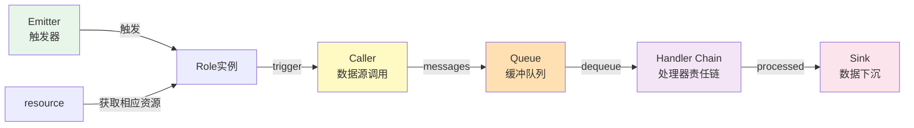
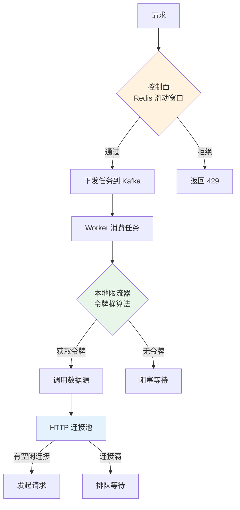
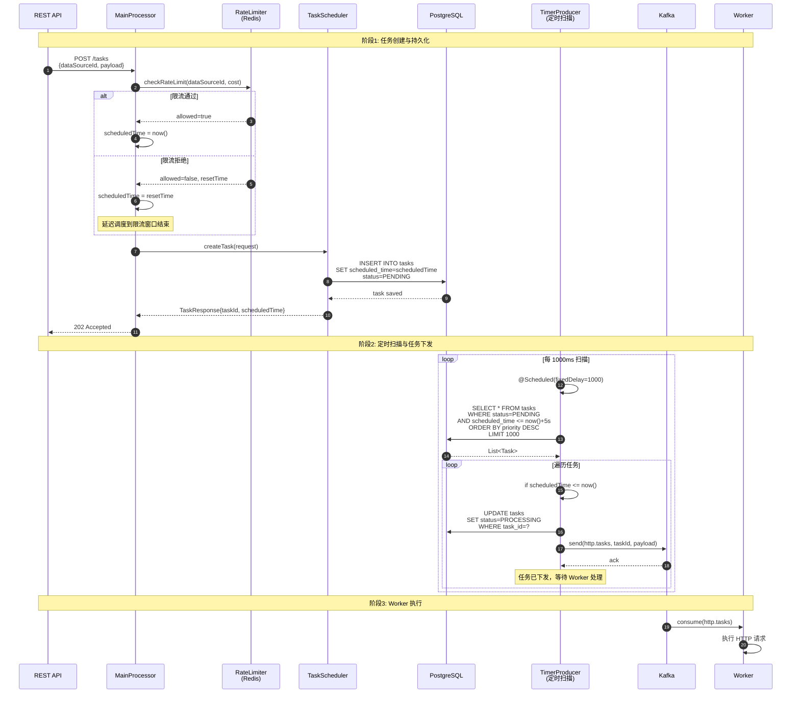
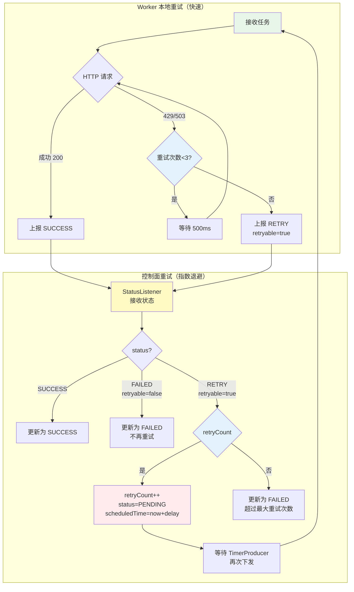
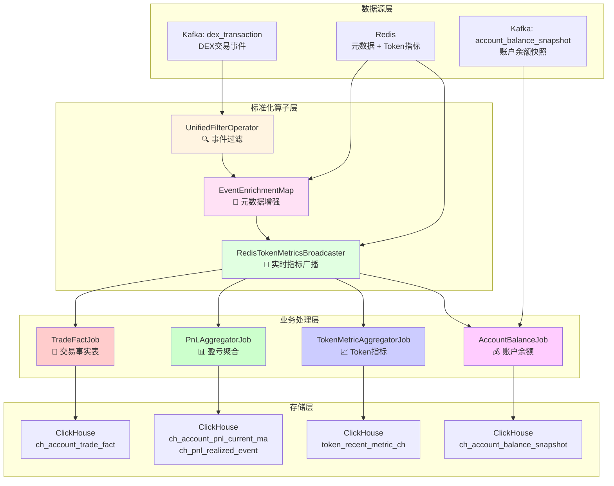
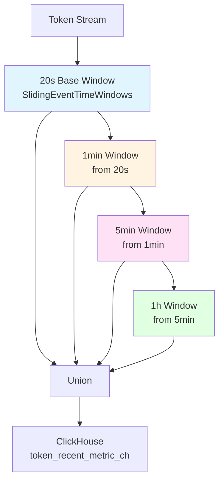
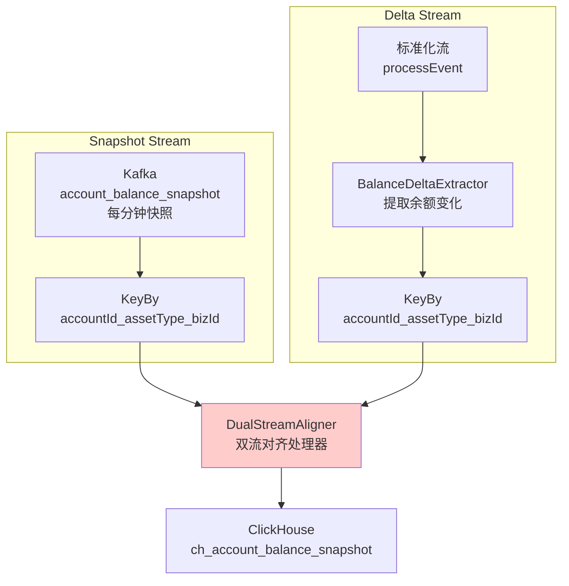
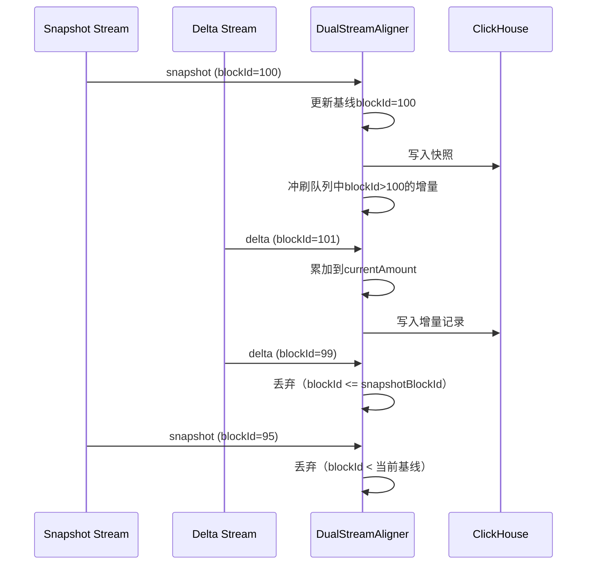

# 统一数据接入层

采用控制面与数据面分离的方式，控制面负责任务生命周期管理（下发、重试与状态管理）、全局限流、数据质量检测等。数据面通过**配置驱动的方式拉取相应数据。**

### **配置驱动的统一 Worker 框架**

- 解耦任务与运行实例:通过抽象和组件化将主链路从业务代码中完全剥离,新增数据源只需修改配置文件，所有业务代码在可插拔的组件中
- 职责分离与组件化
- 适合技术主导的团队，比维护平台更灵活高效。

### 职责分离与组件化



### 组件说明

- **Role:** 任务的执行单元，可弹性为worker集群分配任务，符合云原生理念。
- **Emitter**：控制任务触发时机,包括Polling(定时)/Single(基于配置变更)/KafkaCommand(事件驱动)
- **Resource**: 对资源的统一抽象，role调用caller需先获取相应resource，如http连接池、websocket连接数、限流token等。
- **Protocol:** 底层协议管理，负责单连接管理如websocket断线重连、心跳等。
- **Caller：**业务适配层，调用协议层完成数据拉取。
    - NativeCall(HTTP/WS)：原生协议，通常简单参数组装。
    - SDKCall(如go-ethereum)：通常需实现自定义caller类来调用相应api。
- **Queue：**解耦采集与处理的有界 channel
- **Handler：**责任链模式的数据处理链。handler与业务无关。

### 配置示例

```yaml
roles:
  - role_id: "ethereum-blocks"
    emitter: "single"              # 触发方式：single=WebSocket订阅
    caller: "native_call"          # 调用方式：native_call=原生协议
    caller_config:
      protocol: "websocket"
      url: "wss://eth-mainnet.g.alchemy.com/v2/{key}"
    caller_params:
      subscribe: "newHeads"        # 订阅主题
      heartbeat_ms: 30000
      poll_interval_ms: 500
    handlers:
      - type: "missing_detector"   # 缺失检测
        with:
          sequence_field: "block_number"
          eager_gap: 3
    sink:
      type: "kafka"
      with:
        topic: "chain.ethereum.blocks"
```

### WebSocket 缺失检测与补数据

- **背景**：websocket当前仍广泛应用，但普遍存在乱序、数据缺失等问题。
- **主要场景**
    - **短时故障：**如网络抖动、连接断开，服务端或worker短时宕机。
    - **长时故障**： 此时数据缺口较大且服务端可能长期无响应，由控制面统一进行可退避重试的补数据。
- **设计：采用本地快速补数与控制面兜底的双重保障。**

### 本地快速检测

- 缓冲buffer: 数据出现乱序或缺失则写入buffer
- 补数触发：缺口超出阈值触发补数，失败可降级至http。
- 定时清理：通过时间与序列号gap来进行buffer清理。未

### 控制面兜底

- 通过轻量flink job将数据面sink的数据包的序列号汇总到统一topic。
- 控制面订阅该topic进行缺失检测
- 下发补数任务到http worker。补回原topic.

## 分层限流

### 限流策略：控制面 + Worker 两级限流

- 背景：调研了binance、cmc等各种数据源的限流额度文档，发现数据源限流策略存在差异，如带权重、按endpoint粒度、时间粒度、隐性限流（如瞬时高峰）。
- 策略：配置化+层级化的限流方案
    - **配置化**：可灵活配置限流的范围、权重、时间粒度
    - **层级化**：月粒度定时校验与报警即可。其余粒度通过控制面全局限流管控，worker局部限流负责平滑高峰。



## 基于持久化时间戳的任务可延时下发

### 核心思想

**方案**：将任务持久化到 PostgreSQL，使用定时扫描器（TimerProducer）根据 `scheduled_time` 字段定期捞取到期任务并发送到 Kafka，实现**延时调度**和**可靠投递**。

- **亮点**
    - **任务不丢失**：要么持久化、要么返回失败到请求侧。
    - **可延时调度**：基于定时器+批量扫描投递kafka方式。
    - **限流管控**：若触发限流，支持直接计算并将调度时间设置为下一允许请求的时间。

### 完整流程



## 任务状态管理与重试机制

**方案**：采用**两级重试架构**：

1. **Worker 本地快速重试**：处理瞬时网络抖动
2. **控制面指数退避重试**：基于状态上报的智能重试

### 两级重试架构



### 任务表结构

```sql
CREATE TABLE tasks (
    id BIGSERIAL PRIMARY KEY,
    task_id VARCHAR(64) UNIQUE NOT NULL,
    data_source_id VARCHAR(64) NOT NULL,
    status VARCHAR(16) NOT NULL,           -- PENDING/PROCESSING/SUCCESS/FAILED
    retry_count INT DEFAULT 0,             -- 当前重试次数
    max_retry_count INT DEFAULT 3,         -- 最大重试次数
    scheduled_time TIMESTAMP NOT NULL,     -- 调度时间（核心）
    started_at TIMESTAMP,                  -- 开始执行时间
    completed_at TIMESTAMP,                -- 完成时间
    status_code INT,                       -- HTTP 状态码
    message TEXT,                          -- 错误信息
    duration_ms BIGINT,                    -- 执行耗时
    payload JSONB,                         -- 任务负载
    metadata JSONB,                        -- 元数据（含重试历史）
    created_at TIMESTAMP DEFAULT NOW(),
    updated_at TIMESTAMP DEFAULT NOW()
);

CREATE INDEX idx_tasks_status_scheduled ON tasks(status, scheduled_time);
CREATE INDEX idx_tasks_data_source ON tasks(data_source_id);

```

## 仿真数据源

除接入binance，cmc,quicknode等真实节点外，为了更好复现生产环境中的偶发事件，项目设计了仿真数据源来还原功能与非功能性问题。

### localnode

- **自建dex:** 参考uniswap v2并基于solidity 0.8.x在本地hardhat node搭建的dex。
- **初始化**：部署多种token（最小代理）与dex,为多账户初始化token、流动性。
- **交易模拟器**：多账户在本地节点不断交易。

### **MockDataProvider**

- 验证数据接入层非功能性处理能力
- **dataGenerator**: mock数据生成器
- **faultInjector：**故障注入器
    - **http故障注入**：请求失败（可重试、不可重试）
    - **websocket故障注入**：连接断开、数据缺失、心跳异常


# 数据处理层



### 设计亮点

- **标准化流程** : 所有Job共享统一前置算子流
- **极小状态** ：PnL仅6个字段，内存占用小，性能高
- **层级窗口 ：**采用增量聚合，减少重复计算
- **双流对齐：**快照+增量协同，保证数据准确性

## 标准化算子层

### UnifiedFilterOperator（统一事件过滤）

- **职责**：从KafkaMessage中提取并过滤事件，生成ProcessEvent
- **特点**：支持多种过滤策略（Builder模式），工厂方法预配置不同业务场景

### EventEnrichmentMap（元数据增强）

- **职责**：从Redis加载元数据， 根据事件类型智能增强ProcessEvent。
- **增强内容**：
    - **AccountMetadata**: 账户ID、地址、标签位图
    - **TokenMetadata**: TokenID、Symbol、Decimals
    - **PairMetadata**: PairID、Token0/Token1信息

### **RedisTokenMetricsBroadcaster（实时指标广播）**

- **职责**：将Token价格和市场指标广播到所有并行实例
- **广播内容**：
    - `tokenPriceUsd`: Token价格
    - `mcap`: 市值
    - `fdv`: 完全稀释估值
    - `liquidityUsd`: 流动性
- **实现机制**：
    - 使用Flink BroadcastState机制
    - Redis定期拉取（默认30秒）
    - 自动填充到ProcessEvent的TokenMetrics字段

### 统一输出

```markdown
ProcessEvent {
  基础字段: eventName, contractAddress, blockId, timestamp...
  
  业务类型: contractType ("erc20" | "dex")
  
  事件数据 (互斥):
    - erc20Data:    {toAddress, amount}
    - dexSwapData:  {amount0In, amount0Out, amount1In, amount1Out}
    - lpMintData:   {amount0, amount1, sender, to}
    - lpBurnData:   {amount0, amount1, sender, to}
  
  元数据 (增强后填充):
    - accountMetadata: {id, address, tagBitmap}
    - tokenMetadata:   {id, symbol, tokenMetrics}
    - pairMetadata:    {pairId, token0, token1}
}
```

## **Job详细设计**

### **TradeFactJob - 交易事实表处理**

- **职责 ：**交易事实作为单独job，简单处理直接sink clickhouse
- **核心处理器：TradeFactProcessor**

### **PnLAggregatorJob - 盈亏聚合**

### **3.2.1 数据流图**

### **核心算法：移动平均成本法（Moving Average Cost）**

**状态设计（极小状态）**：

```java
PnLState {
    position:          BigDecimal  // 当前持仓数量
    avgCost:           BigDecimal  // 移动加权平均成本
    realizedCost:      BigDecimal  // 已实现成本累计
    realizedProceeds:  BigDecimal  // 已实现收入累计
    realizedPnL:       BigDecimal  // 已实现盈亏累计
    lastTxTime:        Long        // 最后交易时间
}
```

**买入逻辑**：

- 新持仓 = 原持仓 + 买入数量
- 新平均成本 = (原持仓 × 原成本 + 买入数量 × 买入价格) / 新持仓

**卖出逻辑**：

- 实际卖出数量 = min(卖出数量, 当前持仓)  // 防止超卖
- 已实现成本 = 实际卖出数量 × 平均成本
- 已实现收入 = 实际卖出数量 × 卖出价格
- 已实现盈亏 = 已实现收入 - 已实现成本
- 新持仓 = 原持仓 - 实际卖出数量

**指标计算**：

- 未实现盈亏 = 持仓数量 × (当前价格 - 平均成本)
- 总盈亏 = 已实现盈亏 + 未实现盈亏
- 投资回报率ROI = 总盈亏 / (已实现成本 + 持仓数量 × 平均成本)

### **侧输出流**

当发生卖出交易时，通过侧输出流发送已实现盈亏事件：

```java
PnLRealizedEvent {
    tokenId, accountId, blockId, blockTime,
    realizedQty,         // 实际卖出数量
    realizedCostUsd,     // 已实现成本
    realizedProceedsUsd, // 已实现收入
    realizedPnLUsd       // 已实现盈亏
}
```

### **TokenMetricAggregatorJob - Token指标聚合**

### **层级化窗口架构**



### **窗口聚合逻辑**

**TokenWindowManager**：

- 使用`SlidingEventTimeWindows`实现滑动窗口
- 层级聚合：上层窗口从下层窗口的输出聚合
- 允许延迟（allowedLateness）配置

**聚合指标**：

```java
TokenRecentMetric {
    tokenId, timeWindow, endTime, tag,
    txcnt, buyCount, sellCount,
    volumeUsd, buyVolumeUsd, sellVolumeUsd,
    buyPressureUsd,
    tokenPriceUsd, mcapUsd, fdvUsd, liquidityUsd
}
```

### **AccountBalanceJob - 账户余额处理**

### **双流对齐架构**



### **核心处理器：DualStreamAligner**

**对齐规则**：

1. **快照流**: `blockId >= 当前记录的blockId` 才写入
2. **增量流**: `blockId > 快照流的blockId` 才写入

**状态管理**：

```java
// 每个key维护的状态
snapshotBlockIdState:  快照基线的blockId
lastDeltaBlockIdState: 最后应用的增量blockId
currentAmountState:    当前累计余额
lastPriceUsdState:     最新价格
pendingDeltaQueue:     等待快照的增量队列
```

**处理流程**：



### **标签**

- Key：label:{chain_id}:{address}
- Value（bitset，UInt16）：
    - 1<<0 EX（cex）
    - 1<<1 SM（smart）
    - 1<<2 WH（whale）
    - 1<<3 PF（public）
    - 1<<4 FR（fresh）
    - 1<<5 TP（TopPnL）

# **统一处理流程深度技术分析**

## **2. 非功能性需求深度分析**

### **分区策略（Partitioning）**

- kafka ：使用txhash分区，数据均衡

数据倾斜问题

### 并行度设计

- source:与kafka分区数一致、若kafka分区数过大可缩减
- map:与source协同
- 广播：并行度为1

### Source → map → keyBy → stateful 算子

- **状态算子（聚合、CEP、窗口）**：并行度由 **key 的基数分布**决定。
    - 并行度过低 → 单个 subtask 状态太大、反压。
    - 并行度过高 → Key group 分散，状态管理成本升高（RocksDB checkpoint 更慢）。

**经验值**：

- 并行度 ≈ 2–4 × CPU 核数（每 TaskManager），再结合 key 分布调优。

### **Exactly-Once语义保障**

- kafka source: Offset存储在Flink Checkpoint中，避免了kafka原生consumer的重复或丢失问题
- clickhouse sink:采用ReplacingMergeTree保证幂等性，通过checkpoint 防止数据丢失
- 局限: 窗口聚合缺失去重，taskmanager宕机可能导致数据重复消费

## **性能优化措施**：

### **BroadcastState访问优化**

todo: 将BroadcastState加入本地缓存Caffeine,通过淘汰策略与ttl来控制缓存利用率与数据新鲜度