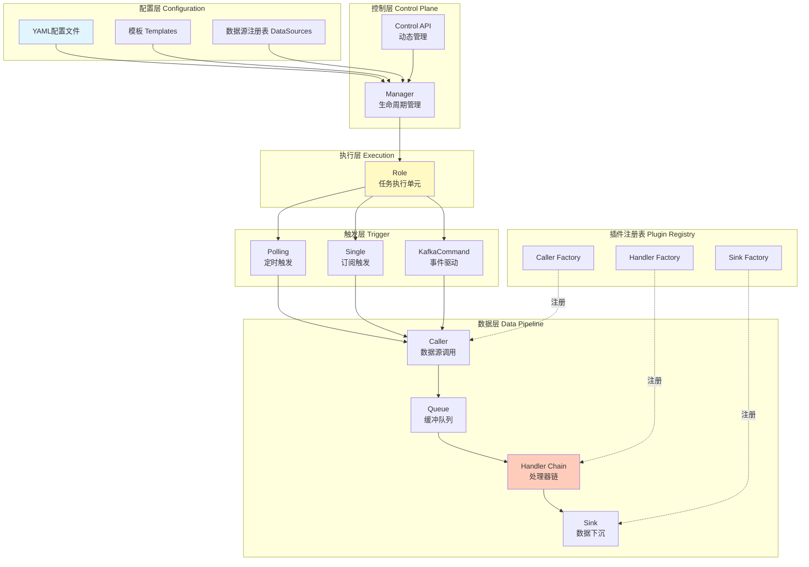
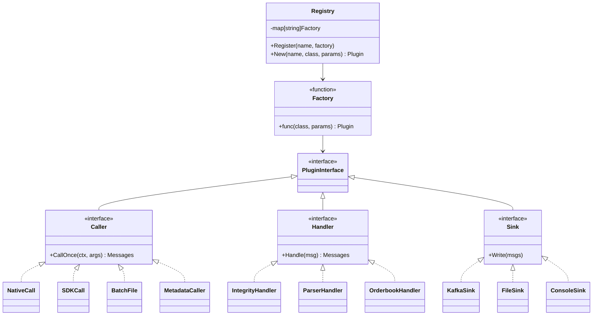
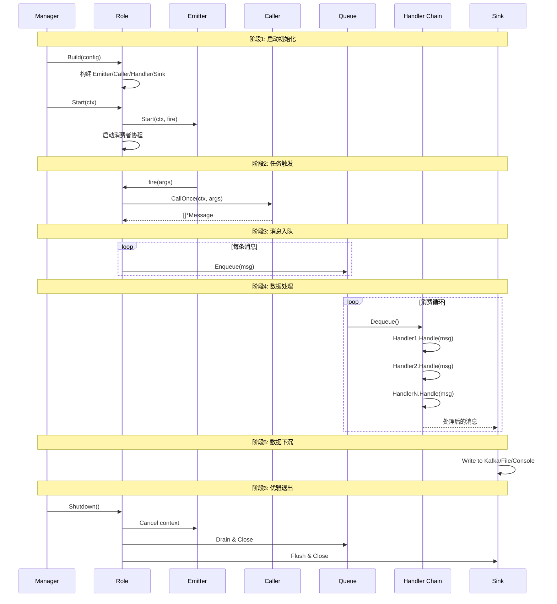
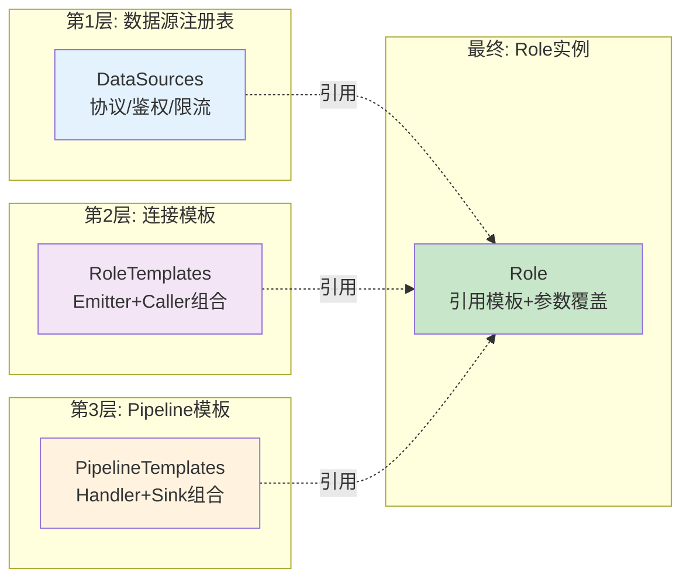
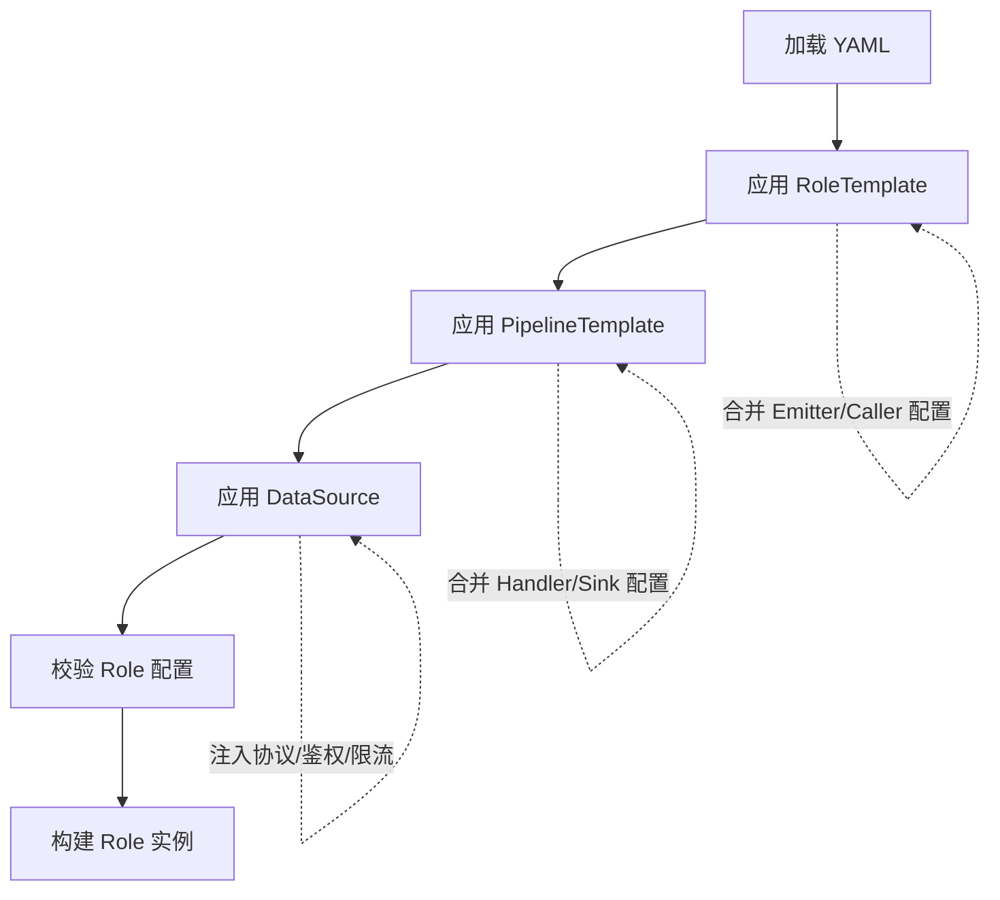
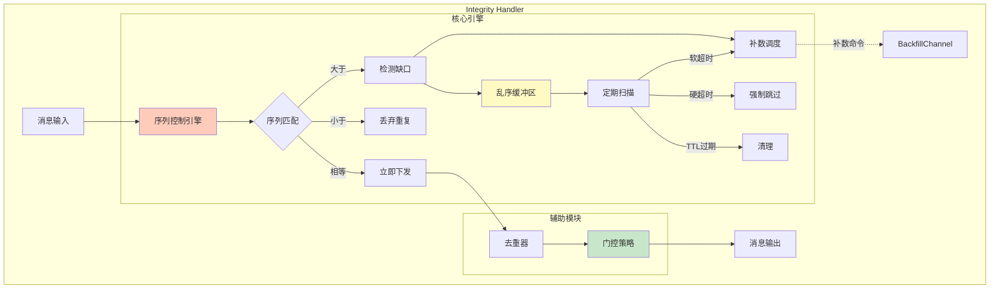
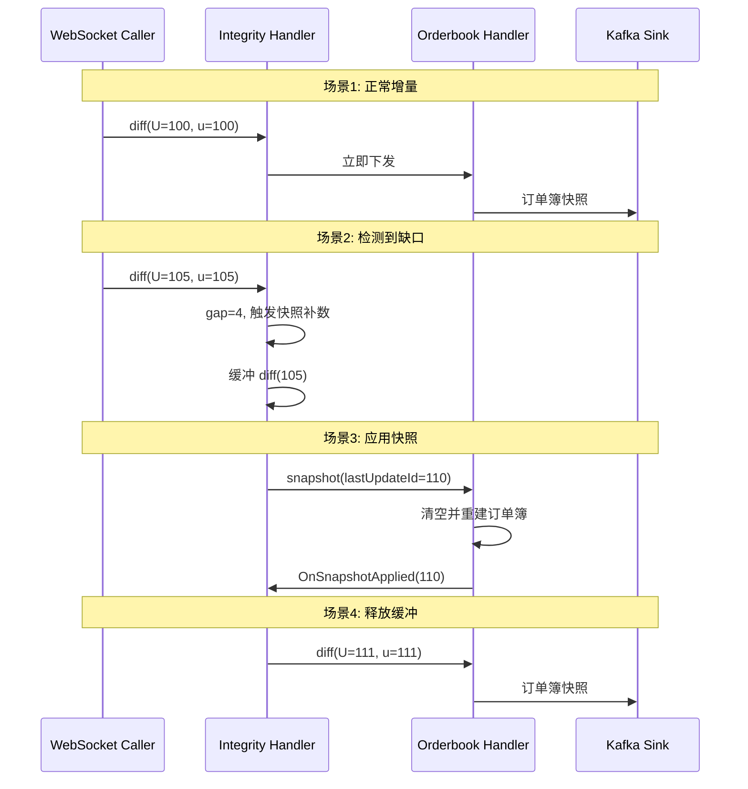
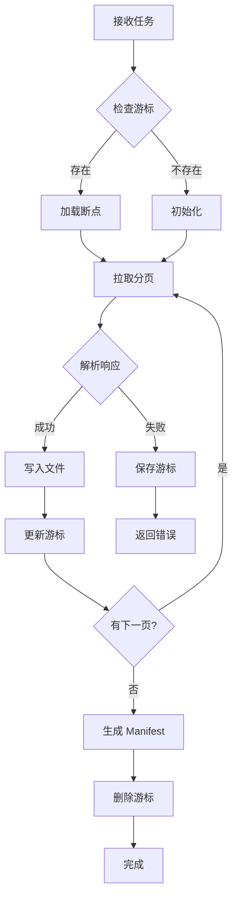

# Worker 架构设计文档

## 1. 概述

Worker 是 DataInjector 的核心数据接入层，采用**配置驱动 + 插件化**架构实现统一的数据拉取框架。通过组件解耦和注册机制，新增数据源只需修改配置文件和实现标准接口，无需修改主链路代码。

### 1.1 核心设计理念

| 设计原则 | 实现方式 | 收益 |
|---------|---------|------|
| **配置驱动** | YAML 定义任务，支持模板复用 | 降低接入成本，支持热更新 |
| **插件化架构** | 工厂注册表 + 标准接口 | 组件独立扩展，解耦主框架 |
| **责任链模式** | Handler 链式处理 | 数据处理流程可组合 |
| **协议抽象** | Caller 统一封装 | HTTP/WebSocket/SDK 调用透明 |
| **数据完整性** | Integrity 模块内置 | 自动处理乱序/缺失/重复 |

### 1.2 适用场景

- **区块链数据**: 实时区块、交易、事件拉取（Ethereum、BSC）
- **交易所行情**: WebSocket 订阅 K线、深度、成交（Binance、Hyperliquid）
- **批量文件拉取**: REST API 分页拉取并落盘（Dune Token Holders、BigQuery Results）
- **元数据采集**: 定期采集数据库/消息队列元数据（ClickHouse、Kafka、Postgres）

---

## 2. 整体架构

### 2.1 分层架构



### 2.2 核心组件职责

| 组件 | 职责 | 生命周期 | 线程模型 |
|------|------|---------|---------|
| **Manager** | 管理所有 Role 的创建/销毁/重载 | 进程级单例 | 主协程 |
| **Role** | 任务执行单元，协调各组件完成数据接入 | 配置动态创建 | 每个 Role 独立协程池 |
| **Emitter** | 控制任务触发时机 | Role 启动时创建 | 独立协程 |
| **Caller** | 封装底层协议调用，返回统一消息 | Role 构建时创建 | 同步调用 |
| **Queue** | 解耦拉取与处理，提供背压控制 | Role 启动时创建 | 基于 channel |
| **Handler** | 责任链处理消息（解析/完整性/业务） | Role 构建时链式创建 | 消费者协程 |
| **Sink** | 数据下沉到目标系统 | Role 构建时创建 | 批量写入 |

---

## 3. 插件化架构

### 3.1 工厂注册模式



### 3.2 注册机制实现

**Caller 注册**:
```go
// 在 init() 中注册
func init() {
    caller.Register("native_call", func(class string, params map[string]any) (Caller, error) {
        return NewNativeCall(params)
    })
}

// Role 构建时动态创建
caller, err := caller.New(config.Caller, config.CallerClass, params)
```

**Handler 注册**:
```go
func init() {
    handler.Register("integrity", func(cfg map[string]any) (Handler, error) {
        return NewIntegrityHandler(cfg)
    })
}
```

**Sink 注册**:
```go
func init() {
    sink.Register("kafka", func(cfg map[string]any) (Sink, error) {
        return NewKafkaSink(cfg)
    })
}
```

### 3.3 扩展点设计

通过实现标准接口扩展功能，无需修改框架代码：

| 扩展点 | 接口 | 典型实现 |
|-------|------|---------|
| **触发策略** | `Emitter.Start(ctx, fire)` | Polling, Single, KafkaCommand |
| **数据源调用** | `Caller.CallOnce(ctx, args)` | NativeCall, SDKCall, BatchFile |
| **数据处理** | `Handler.Handle(msg)` | Parser, Integrity, Business |
| **数据下沉** | `Sink.Write(msgs)` | Kafka, File, Console |
| **补数感知** | `BackfillCommandAware` | IntegrityHandler |
| **快照监听** | `SnapshotListener` | OrderbookHandler |

---

## 4. 数据流转全链路

### 4.1 完整流程



### 4.2 Pipeline 模式

支持两种数据流转模式：

**Queue 模式** (默认):
```
Caller → Queue(缓冲) → Handler → Sink
         ↓ 解耦
    背压控制 + 异步处理
```

**Direct 模式**:
```
Caller → Handler → Sink
    ↓ 同步处理
  适用于批量文件拉取场景
```

配置方式：
```yaml
pipeline_mode: "direct"  # 或 "queue"
queue:
  mode: "none"           # 或 "bounded"
  size: 5000             # queue 模式下的容量
```

---

## 5. 配置驱动设计

### 5.1 三层配置复用



### 5.2 配置示例

**数据源注册表**（复用协议和鉴权配置）:
```yaml
datasources:
  - id: "dune.sim"
    protocol: "http"
    auth:
      type: "api_key_env"
      header: "X-Sim-Api-Key"
      api_key_env: "DUNE_SIM_API_KEY"
    rate_limit_profile: "dune_low"
```

**连接模板**（复用 Emitter+Caller 组合）:
```yaml
role_templates:
  - id: "http_paged_batch_to_files"
    emitter: "kafka_command"
    caller: "batch_file"
    pipeline_mode: "direct"
    caller_config:
      page_size: 500
      output_format: "json"
```

**Pipeline 模板**（复用 Handler+Sink 组合）:
```yaml
pipeline_templates:
  - id: "perp_orderbook_pipeline"
    domain: "cex.perp.orderbook"
    handlers:
      - type: "binance"
        with:
          kind: "depth"
      - type: "integrity"
        with:
          profile: "binance_depth"
    sink:
      type: "kafka"
      with:
        topic: "perp.orderbook"
```

**最终 Role**（引用模板 + 参数覆盖）:
```yaml
roles:
  - role_id: "binance-btc-orderbook"
    datasource_id: "binance.perp.depth"  # 引用数据源
    pipeline: "perp_orderbook_pipeline"   # 引用 Pipeline 模板
    caller_params:
      streams: ["btcusdt@depth@100ms"]    # 覆盖参数
```

### 5.3 配置解析流程



---

## 6. Integrity 模块（数据完整性保障）

### 6.1 核心能力



### 6.2 补数触发策略

| 触发条件 | 检测方式 | 行为 |
|---------|---------|------|
| **急切补数** | gap ≤ eagerGap | 立即发送补数命令 |
| **软超时补数** | 等待时间 > maxDelay | 发送补数命令 |
| **硬超时强制** | 等待时间 > hardTimeout | 强制跳过缺口，释放后续消息 |
| **缓冲清理** | 消息 TTL 过期 | 清理过期缓冲 |

### 6.3 Profile 预设

通过 Profile 简化常见场景配置：

| Profile | 适用场景 | 序列匹配规则 | 门控模式 |
|---------|----------|--------------|----------|
| **generic** | 通用单调序列 | seq == expected | none |
| **chain_blocks** | 区块链区块流 | seq == expected | finality |
| **binance_depth** | Binance 订单簿 | 范围覆盖 | snapshot_hold |

配置示例：
```yaml
handlers:
  - type: "integrity"
    with:
      profile: "binance_depth"          # 引用预设
      sequence_field: "final_update_id"
      stream_key_field: "binance_symbol"
      eager_gap: 20                     # 覆盖预设参数
```

### 6.4 门控策略 (Gate)

**Snapshot Hold**: Binance 订单簿场景
- 缓冲所有 diff 消息，等待快照到达
- 快照应用后释放所有后续 diff

**Finality**: 区块链场景
- 缓冲最近 N 个区块
- 只下发确认深度之前的区块

**Noop**: 默认无门控

---

## 7. 典型场景实现

### 7.1 Binance 订单簿维护

**工作流程**:


**配置**:
```yaml
role_id: "binance-perp-btc-orderbook"
emitter: "single"
caller: "native_call"
caller_config:
  protocol: "websocket"
  url: "wss://fstream.binance.com/ws"
  backfill:
    http:
      endpoint: "https://fapi.binance.com/fapi/v1/depth"
      query:
        symbol: "BTCUSDT"
        limit: "500"
caller_params:
  streams: ["btcusdt@depth@100ms"]
handlers:
  - type: "binance"
    with:
      kind: "depth"
  - type: "integrity"
    with:
      profile: "binance_depth"
      sequence_field: "final_update_id"
      gate_mode: "snapshot_hold"
  - type: "orderbook_diff"
    with:
      symbol: "BTCUSDT"
sink:
  type: "kafka"
  with:
    topic: "perp.orderbook"
```

### 7.2 批量文件拉取（Dune/BigQuery）

**工作流程**:


**BigQuery 查询结果拉取配置**:
```yaml
role_id: "bigquery-results-batch"
emitter: "kafka_command"
emitter_config:
  brokers: ["localhost:9092"]
  topic: "batch.tasks"
  group_id: "worker.bigquery.batch"

caller: "batch_file"
caller_config:
  endpoint: "https://bigquery.googleapis.com/bigquery/v2"
  path_template: "/projects/{project_id}/queries/{job_id}"
  headers:
    Authorization: "Bearer ${GOOGLE_CLOUD_API_KEY}"
  
  # BigQuery 特定配置
  page_size: 10000
  cursor_param: "pageToken"
  cursor_field: "pageToken"
  data_field: "rows"
  
  output_dir: "runtime/data/bigquery/results/{project_id}/{job_id}"
  output_format: "json"
  max_records_per_file: 50000
  
  rate_limit:
    capacity: 100
    refill_rate: 10

pipeline_mode: "direct"
queue:
  mode: "none"
```

**任务参数**（通过 Kafka 发送）:
```json
{
  "task_id": "bq-test-001",
  "project_id": "ethereal-cache-481306-e5",
  "job_id": "US.bquxjob_2a1e2f66_19b2be99427"
}
```

**输出文件结构**:
```
runtime/data/bigquery/results/{project_id}/{job_id}/
├── results_0000.json    # 数据文件 (JSON Lines)
├── results_0001.json
├── .cursor.json         # 游标文件 (任务完成后删除)
└── manifest.json        # 完整性清单
```

### 7.3 元数据采集

**配置**:
```yaml
role_id: "metadata-clickhouse"
emitter: "polling"
polling_interval: 300  # 5分钟

caller: "metadata_clickhouse"
caller_params:
  endpoint: "http://localhost:8123"
  cluster: "ch-local"
  databases: ["default"]

handlers:
  - type: "metadata_envelope"
    with:
      platform: "clickhouse"
      entity_type: "table"

sink:
  type: "kafka"
  with:
    topic: "metadata.raw.clickhouse"
    key_from: ["cluster", "database", "table"]
```

---

## 8. 扩展指南

### 8.1 新增 Caller

**步骤**:
1. 实现 `Caller` 接口
2. 注册到 Registry
3. 配置使用

**示例**:
```go
// 1. 实现接口
type MyCaller struct {
    endpoint string
}

func (c *MyCaller) CallOnce(ctx context.Context, args map[string]any) ([]*types.Message, error) {
    // 实现数据拉取逻辑
    return msgs, nil
}

// 2. 注册
func init() {
    caller.Register("my_caller", func(class string, params map[string]any) (caller.Caller, error) {
        return &MyCaller{
            endpoint: util.GetString(params, "endpoint"),
        }, nil
    })
}
```

**配置**:
```yaml
caller: "my_caller"
caller_params:
  endpoint: "https://api.example.com"
```

### 8.2 新增 Handler

**示例**:
```go
type MyHandler struct {
    config map[string]any
}

func (h *MyHandler) Handle(msg *types.Message) ([]*types.Message, error) {
    // 实现处理逻辑
    return []*types.Message{msg}, nil
}

func init() {
    handler.Register("my_handler", func(cfg map[string]any) (handler.Handler, error) {
        return &MyHandler{config: cfg}, nil
    })
}
```

**配置**:
```yaml
handlers:
  - type: "my_handler"
    with:
      custom_param: "value"
```

### 8.3 新增 Integrity Profile

在 `integrity/config_parser.go` 中添加预设：

```go
func getProfileDefaults(profile string) Config {
    switch profile {
    case "my_profile":
        return Config{
            Sequence: SequenceConfig{
                EagerGap:    5,
                MaxDelay:    time.Second,
                HardTimeout: 10 * time.Second,
            },
            Gate: GateConfig{
                Mode: "none",
            },
        }
    }
}
```

---

## 9. 监控与可观测性

### 9.1 Prometheus 指标

暴露在端口 9100（可配置）：

| 指标 | 类型 | 说明 |
|------|------|------|
| `worker_messages_total` | Counter | 消息处理总数 |
| `worker_messages_failed_total` | Counter | 消息处理失败数 |
| `worker_queue_size` | Gauge | 队列当前大小 |
| `worker_handler_duration_seconds` | Histogram | Handler 处理耗时 |
| `worker_backfill_triggered_total` | Counter | 补数触发次数 |
| `worker_integrity_buffer_size` | Gauge | Integrity 缓冲区大小 |

### 9.2 分布式追踪

支持 OpenTelemetry 追踪，配置示例：

```yaml
tracing:
  enabled: true
  service_name: "datainjector-worker"
  sample_ratio: 0.01              # 采样率 1%
  force_sample_run_id: true       # 强制采样包含 run_id 的任务
  force_sample_role_ids:          # 强制采样特定 Role
    - "binance-btc-orderbook"
```

### 9.3 关键日志

| 日志 | 级别 | 说明 |
|------|------|------|
| `role.starting` | INFO | Role 启动 |
| `caller.error` | ERROR | Caller 调用失败 |
| `integrity.gap_detected` | WARN | 检测到序列间隙 |
| `integrity.backfill_triggered` | INFO | 触发补数 |
| `integrity.hard_timeout` | ERROR | 硬超时强制跳过 |
| `orderbook.snapshot.emit` | INFO | 订单簿 snapshot 事件下沉（periodic/backfill） |

---

## 10. 目录结构

```
datainjector/worker/
├── cmd/worker/main.go              # 入口
├── configs/
│   ├── base.yaml                   # 主配置
│   └── dune_token_holders.yaml     # 专用配置
├── internal/
│   ├── config/                     # 配置解析
│   │   └── config.go
│   ├── role/                       # Role 管理
│   │   ├── role.go                 # Role 实现
│   │   └── manager.go              # 生命周期管理
│   ├── emitter/                    # 触发器
│   │   ├── polling.go
│   │   ├── single.go
│   │   └── kafka_command.go
│   ├── caller/                     # 数据源调用
│   │   ├── caller.go               # 接口定义
│   │   ├── native_call_*.go
│   │   ├── sdk_*.go
│   │   ├── batch_file_caller.go
│   │   └── metadata_*.go
│   ├── protocol/                   # 底层协议
│   │   ├── websocket.go
│   │   ├── http_client.go
│   │   └── jsonrpc.go
│   ├── queue/queue.go              # 有界队列
│   ├── handler/                    # 处理器
│   │   ├── handler.go              # 接口定义
│   │   ├── registry.go             # 注册表
│   │   ├── integrity_handler.go    # Integrity 适配器
│   │   ├── integrity/              # Integrity 核心
│   │   │   ├── handler.go
│   │   │   ├── sequence_engine.go
│   │   │   ├── buffer.go
│   │   │   ├── dedupe.go
│   │   │   ├── gate.go
│   │   │   ├── scheduler.go
│   │   │   └── config_parser.go
│   │   ├── parser/                 # 解析器
│   │   │   ├── binance_parser.go
│   │   │   └── hyperliquid_parser.go
│   │   ├── orderbook_handlers.go
│   │   └── binance_handlers.go
│   ├── sink/                       # 数据下沉
│   │   ├── registry.go
│   │   ├── kafka.go
│   │   ├── file.go
│   │   └── console.go
│   ├── manifest/                   # Manifest 生成
│   │   ├── types.go
│   │   └── generator.go
│   ├── observability/              # 可观测性
│   │   ├── metrics/
│   │   ├── logging/
│   │   ├── tracing/
│   │   └── status/
│   ├── types/                      # 核心类型
│   │   ├── message.go
│   │   └── backfill.go
│   └── util/                       # 工具函数
└── DESIGN.md                       # 本文档
```

---

## 11. 核心概念总结

### 11.1 设计模式应用

| 模式 | 应用场景 | 收益 |
|------|---------|------|
| **工厂模式** | 插件注册与创建 | 解耦框架与实现 |
| **责任链模式** | Handler 链式处理 | 处理流程可组合 |
| **策略模式** | Emitter/Gate/Profile | 行为可切换 |
| **适配器模式** | Caller 协议封装 | 统一接口抽象 |
| **观察者模式** | BackfillCommandAware/SnapshotListener | 事件驱动 |
| **模板方法模式** | 配置模板复用 | 减少重复配置 |

### 11.2 关键抽象

1. **Message**: 统一的数据载体，包含 Payload + Metadata
2. **Caller**: 数据源调用抽象，屏蔽底层协议差异
3. **Handler**: 处理逻辑抽象，支持责任链组合
4. **Integrity**: 数据完整性保障，内置序列控制/补数/去重
5. **Role**: 任务执行单元，协调各组件完成数据接入

### 11.3 架构优势

- **低耦合**: 插件化架构，组件独立扩展
- **高内聚**: 每个组件职责单一，易于维护
- **可扩展**: 通过实现接口即可扩展功能
- **可配置**: 配置驱动，无需修改代码
- **可测试**: 组件独立，易于单元测试
- **可观测**: 内置 Metrics/Tracing/Logging

---

## 12. 变更历史

| 日期 | 版本 | 变更说明 |
|------|------|----------|
| 2025-12-27 | 3.0 | 重构文档，聚焦架构设计，合并最新变更（BigQuery 支持） |
| 2025-12-17 | 2.1 | 新增 BigQuery 结果拉取 Role |
| 2025-12-17 | 2.0 | 重构文档，删除冗余内容 |
| 2025-12-16 | 1.5 | 新增 BatchFile Caller 和 Manifest 支持 |
| 2025-12-15 | 1.4 | Integrity 模块重构，引入 Profile 机制 |
| 2025-12-10 | 1.3 | 新增订单簿维护逻辑 |
| 2025-12-01 | 1.0 | 初始版本 |


