# 订单簿维护逻辑完整解析

## 目录
1. [整体架构概述](#整体架构概述)
2. [核心组件详解](#核心组件详解)
3. [数据流与状态机](#数据流与状态机)
4. [冗余问题分析](#冗余问题分析)
5. [重构建议](#重构建议)

---

## 整体架构概述

订单簿维护系统由三个核心模块组成，它们协同工作以维护一个实时、准确的订单簿状态：

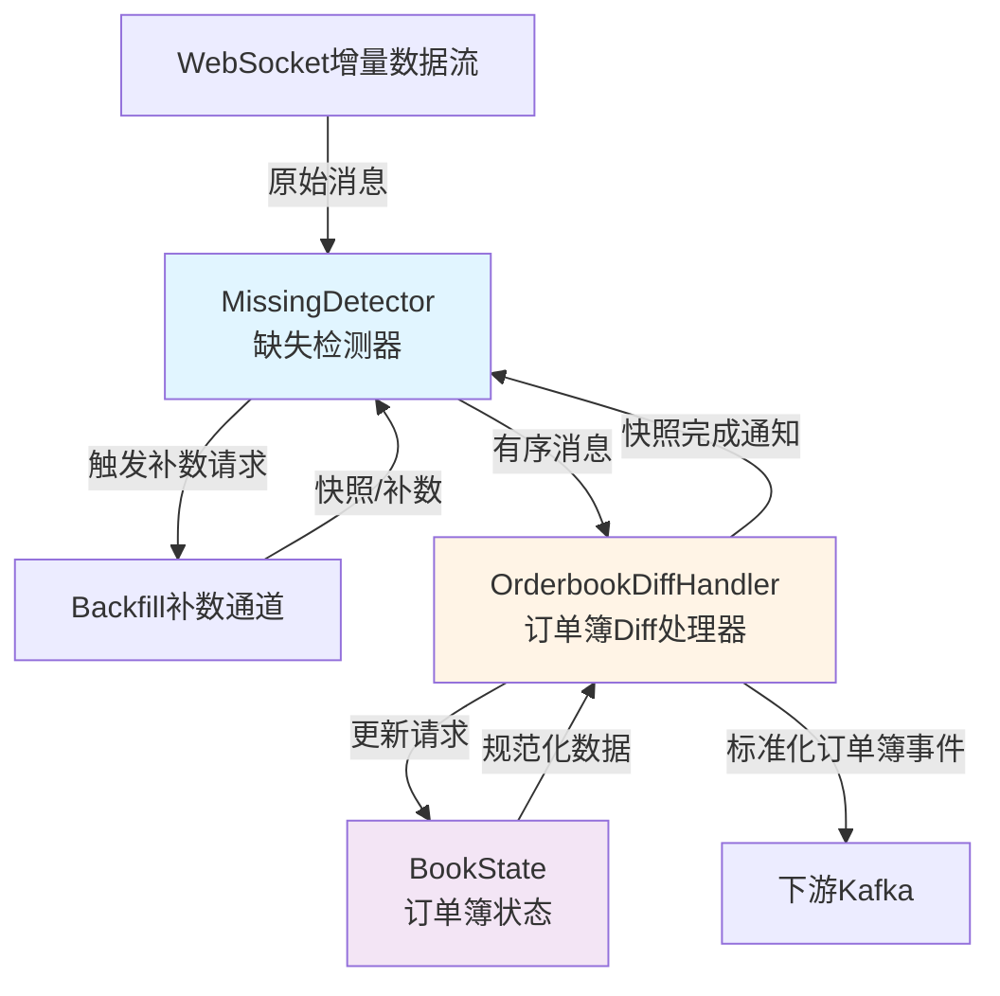

### 关键职责划分

| 模块 | 文件 | 核心职责 | 状态管理 |
|------|------|----------|----------|
| **数据正确性** | `integrity_handler.go` | 序列控制、乱序缓冲、幂等、补数 | 期望序列号、缓冲区、时间戳 |
| **Diff处理器** | `orderbook_handlers.go` | 快照/Diff应用、消息转换 | 无状态（委托给BookState） |
| **订单簿状态** | `orderbook.go` | 内存订单簿维护、价格档位管理 | lastUpdateID、bids/asks映射 |

---

## 核心组件详解

### 1. MissingDetector（缺失检测器）

#### 设计目标
处理 WebSocket 增量数据流的**乱序、丢失、重复**问题，确保下游接收到有序、完整的消息序列。

#### 核心数据结构

```go
type MissingDetector struct {
    // 序列号配置
    sequenceField   string  // 从 metadata 提取序列号的字段名（如 "seq"）
    rangeStartField string  // 可选：范围起始字段（用于快照类消息）
    
    // 状态追踪
    expectedNext     uint64 // 期望的下一个序列号
    initialized      bool   // 是否已初始化
    awaitingSnapshot bool   // 是否正在等待快照应用完成
    
    // 乱序缓冲
    buffer    map[uint64][]*types.Message // 乱序消息缓冲区（seq -> 消息列表）
    firstSeen map[uint64]time.Time        // 每个序列号首次缓冲的时间
    seenMax   uint64                      // 目前见到的最大序列号
    
    // 补数控制
    lastBackfill backfillRecord           // 上次补数记录（用于去重）
    backfillCh   chan<- types.BackfillCmd // 补数请求发送通道
    
    // 配置参数
    cfg detectorConfig
}
```

#### 五大核心规则

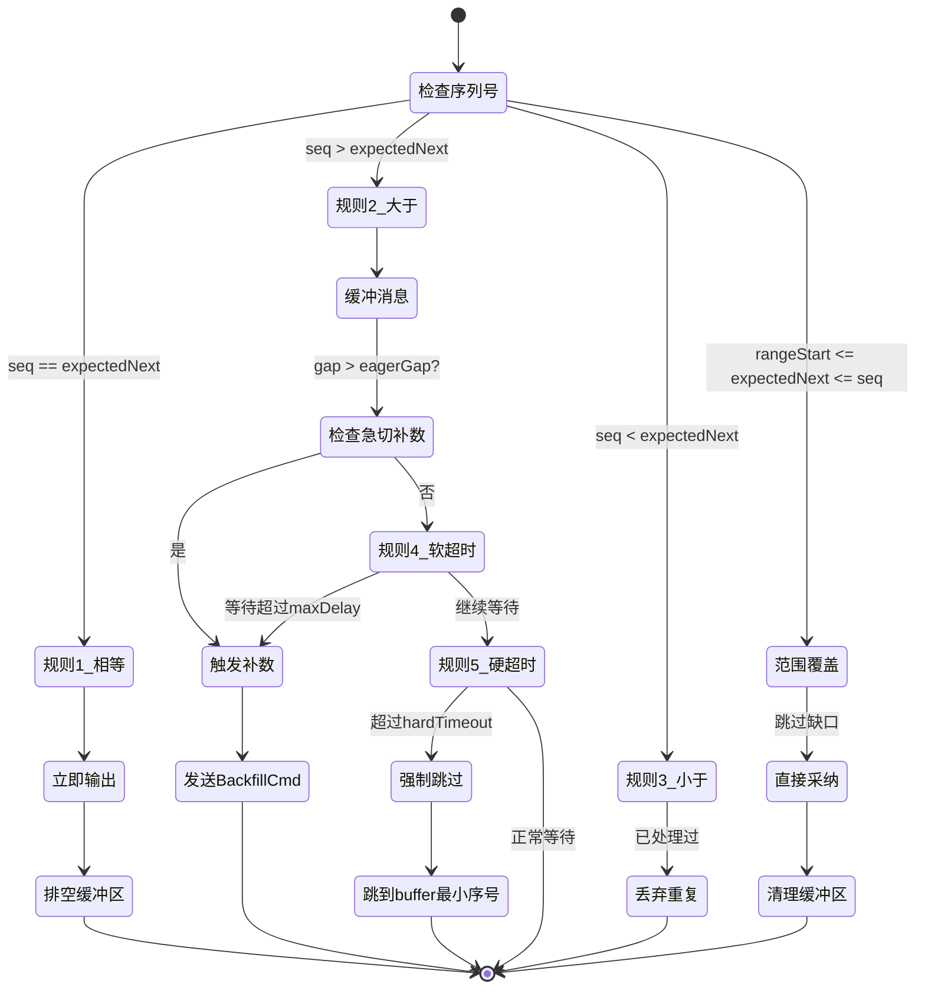

##### 规则详解

| 规则 | 触发条件 | 行为 | 代码位置 |
|------|----------|------|----------|
| **规则1：相等** | `seq == expectedNext` | 立即输出，expectedNext++，排空连续缓冲 | L202-222 |
| **规则2：大于** | `seq > expectedNext` | 缓冲消息，检查是否触发急切补数 | L254-281 |
| **规则3：小于** | `seq < expectedNext` | 丢弃重复消息 | L225-228 |
| **规则4：软超时** | `waitTime > maxDelay && <= hardTimeout` | 触发补数 [expectedNext, minBuffered-1] | L328-361 |
| **规则5：硬超时** | `waitTime > hardTimeout` | 强制跳过缺口到 buffer 最小序号 | L364-407 |
| **范围覆盖** | `rangeStart <= expectedNext && seq >= expectedNext` | 直接采纳，清理 <= seq 的缓冲 | L230-252 |

#### 补数触发机制

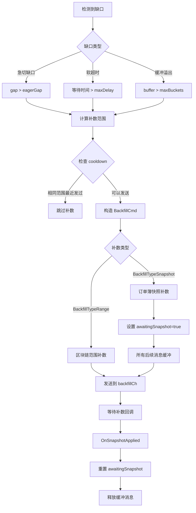

**补数配置示例（订单簿场景）：**

```yaml
backfill_type: "snapshot"
backfill:
  http:
    enabled: true
    endpoint: "https://fapi.binance.com/fapi/v1/depth"
    method: "GET"
    query:
      symbol: "BTCUSDT"
      limit: 1000
```

#### 清理机制

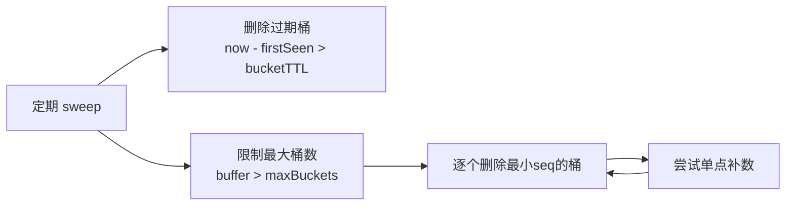

---

### 2. OrderbookDiffHandler（Diff处理器）

#### 设计目标
作为订单簿业务的编排层，协调 MissingDetector 和 BookState，处理快照和增量更新。

#### 核心职责拆解

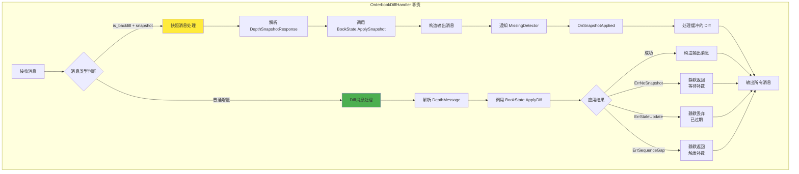

#### 关键代码流程

**快照处理流程（L113-153）：**

```go
func (h *orderbookDiffHandler) applySnapshotFromMessage(msg *types.Message) ([]*types.Message, int64, error) {
    // 1. 解析快照响应
    var snapshot binance.DepthSnapshotResponse
    json.Unmarshal(msg.Payload, &snapshot)
    
    // 2. 应用到 BookState
    book, err := h.state.ApplySnapshot(orderbook.Snapshot{
        LastUpdateID: snapshot.LastUpdateID,
        Bids:         toLevels(snapshot.Bids),
        Asks:         toLevels(snapshot.Asks),
    })
    
    // 3. 构造标准化输出
    out := buildOrderbookMessage(book, h.symbol, h.exchange, exchangeTS)
    
    return []*types.Message{out}, snapshot.LastUpdateID, nil
}
```

**Diff处理流程（L155-220）：**

```go
func (h *orderbookDiffHandler) handleDiffMessage(msg *types.Message) ([]*types.Message, error) {
    // 1. 解析 Diff（从缓存或原始数据）
    depth := msg.Metadata["binance_depth"].(*binance.DepthMessage)
    
    // 2. 应用到 BookState
    book, applied, err := h.state.ApplyDiff(orderbook.Diff{
        FirstUpdateID: depth.FirstUpdateID,
        FinalUpdateID: depth.FinalUpdateID,
        PrevFinalID:   depth.PrevFinalUpdateID,
        Bids:          toLevels(depth.Bids),
        Asks:          toLevels(depth.Asks),
    })
    
    // 3. 错误处理（静默返回）
    if err != nil {
        switch err {
        case orderbook.ErrNoSnapshot:  return nil, nil // 等待快照
        case orderbook.ErrStaleUpdate: return nil, nil // 丢弃
        case orderbook.ErrSequenceGap: return nil, nil // 触发补数
        }
    }
    
    // 4. 构造输出
    return []*types.Message{buildOrderbookMessage(book, ...)}, nil
}
```

#### 监听器模式

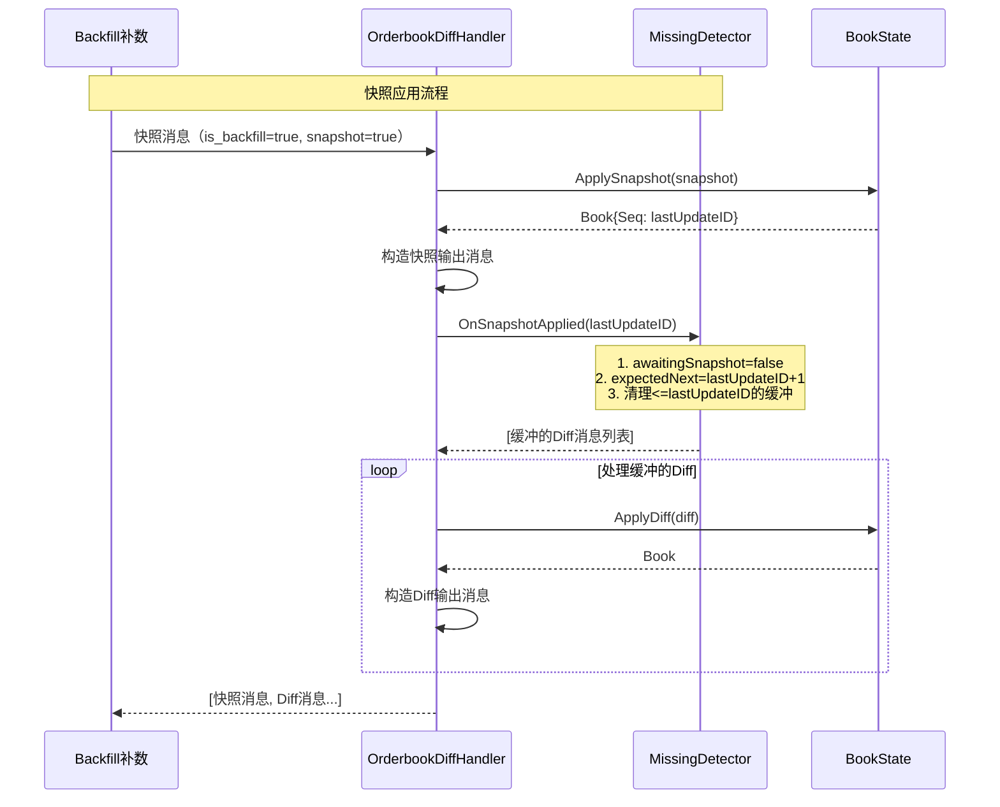

---

### 3. BookState（订单簿状态）

#### 设计目标
维护内存中的**完整订单簿状态**，提供快照和增量更新的原子操作。

#### 数据结构设计

```go
type BookState struct {
    mu           sync.Mutex       // 保护并发访问
    lastUpdateID int64            // 最后应用的更新ID（核心同步点）
    maxDepth     int              // 输出深度限制
    bids         map[string]string // price -> size 映射
    asks         map[string]string // price -> size 映射
}
```

**关键设计点：**
- 使用 `map[string]string` 而非数值类型，避免浮点精度问题
- `lastUpdateID` 是唯一的同步状态，决定是否接受新的 Diff
- 输出时才进行排序和深度截断

#### 状态转换图

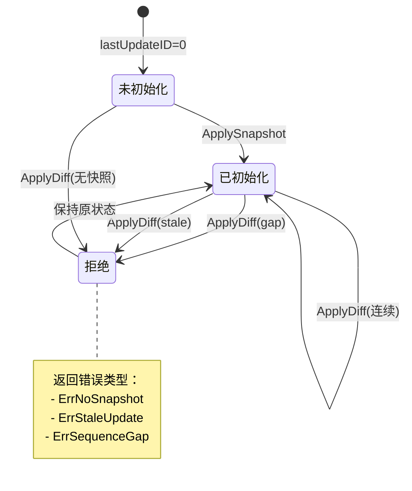

#### 核心方法详解

##### ApplySnapshot（快照应用）

```go
func (s *BookState) ApplySnapshot(snapshot Snapshot) (Book, error) {
    s.mu.Lock()
    defer s.mu.Unlock()
    
    // 1. 重置状态
    s.lastUpdateID = snapshot.LastUpdateID
    s.bids = make(map[string]string, len(snapshot.Bids))
    s.asks = make(map[string]string, len(snapshot.Asks))
    
    // 2. 加载所有价格档位（过滤零数量）
    for _, lv := range snapshot.Bids {
        if !isZeroDecimal(lv.Size) {
            s.bids[normalizeDecimal(lv.Price)] = normalizeDecimal(lv.Size)
        }
    }
    // ... 同样处理 asks
    
    // 3. 构造并返回完整订单簿
    return s.buildBookLocked(true), nil
}
```

##### ApplyDiff（增量应用）

```go
func (s *BookState) ApplyDiff(diff Diff) (Book, bool, error) {
    s.mu.Lock()
    defer s.mu.Unlock()
    
    // 1. 前置检查
    if s.lastUpdateID == 0 {
        return Book{}, false, ErrNoSnapshot // 必须先有快照
    }
    if diff.FinalUpdateID <= s.lastUpdateID {
        return Book{}, false, ErrStaleUpdate // 已过期
    }
    
    // 2. 连续性检查（核心逻辑）
    expected := s.lastUpdateID + 1
    if diff.FirstUpdateID > expected {
        return Book{}, false, ErrSequenceGap // 缺失中间更新
    }
    if expected > diff.FinalUpdateID {
        return Book{}, false, ErrStaleUpdate // 过时更新
    }
    
    // 3. 检查 PrevFinalID（仅完全连续时）
    if diff.FirstUpdateID == expected && 
       diff.PrevFinalID != 0 && 
       diff.PrevFinalID != s.lastUpdateID {
        return Book{}, false, ErrSequenceGap
    }
    
    // 4. 应用价格档位变更
    s.applyDiffLocked(diff)
    
    // 5. 返回更新后的订单簿
    return s.buildBookLocked(false), true, nil
}
```

**连续性检查逻辑详解：**

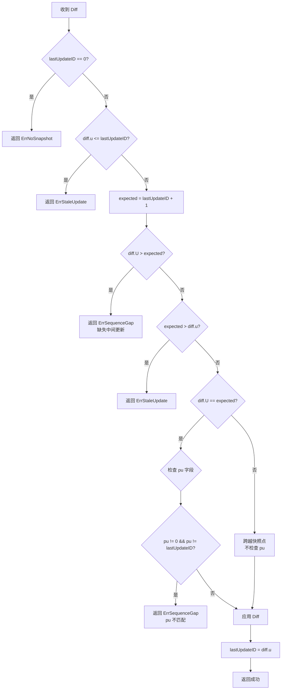

**Binance Diff 规范说明：**

| 字段 | 含义 | 用途 |
|------|------|------|
| `U` (FirstUpdateID) | 本次 Diff 的起始更新ID | 判断是否连续 |
| `u` (FinalUpdateID) | 本次 Diff 的结束更新ID | 更新 lastUpdateID |
| `pu` (PrevFinalUpdateID) | 上次 Diff 的 u 值 | 冗余校验（完全连续时） |

**正常序列示例：**
```
快照: lastUpdateID = 1000
Diff1: U=1001, u=1010, pu=1000  ✓ 应用成功
Diff2: U=1011, u=1020, pu=1010  ✓ 应用成功
```

**跨越快照点示例：**
```
快照: lastUpdateID = 1000
Diff: U=995, u=1005, pu=990     ✓ 应用成功（U < expected，但 u >= expected）
说明：这个 Diff 跨越了快照点，包含了快照前后的更新
```

##### buildBookLocked（输出构造）

```go
func (s *BookState) buildBookLocked(snapshot bool) Book {
    return Book{
        Bids:     s.sortedLevels(s.bids, true),  // 价格降序
        Asks:     s.sortedLevels(s.asks, false), // 价格升序
        Seq:      s.lastUpdateID,
        Snapshot: snapshot,
    }
}

func (s *BookState) sortedLevels(levels map[string]string, desc bool) [][]string {
    // 1. 将 map 转为数组并解析价格用于排序
    out := []level{}
    for price, size := range levels {
        val, _ := strconv.ParseFloat(price, 64)
        out = append(out, level{price, size, val})
    }
    
    // 2. 排序（买单降序，卖单升序）
    sort.Slice(out, func(i, j int) bool {
        if desc { return out[i].sort > out[j].sort }
        return out[i].sort < out[j].sort
    })
    
    // 3. 截断到 maxDepth 并转为字符串数组
    limit := min(s.maxDepth, len(out))
    result := [][]string{}
    for i := 0; i < limit; i++ {
        result = append(result, []string{out[i].price, out[i].size})
    }
    return result
}
```

---

## 数据流与状态机

### 完整消息处理流程

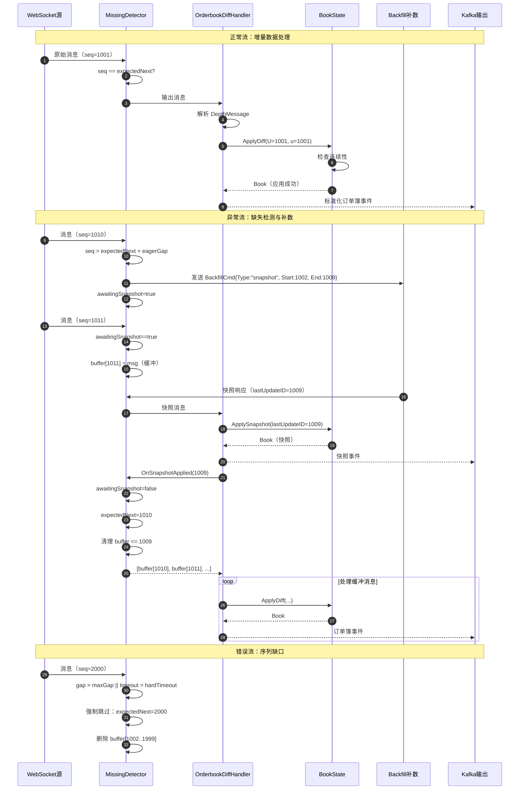

### 状态机总览

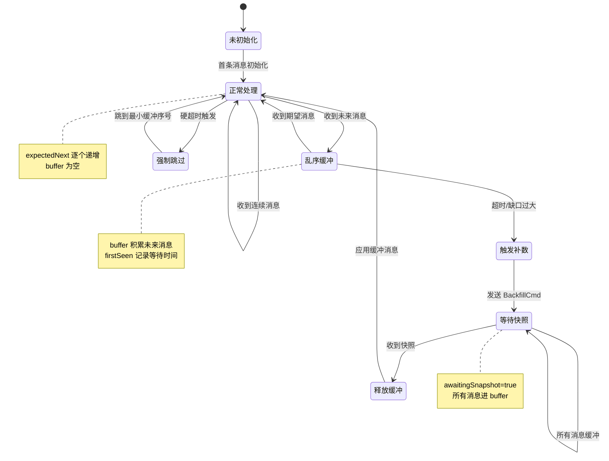

---

## 冗余问题分析

### 1. 职责重叠问题

#### 问题1：序列号检查的双重验证

**现状：**
- `MissingDetector` 维护 `expectedNext`，检查消息序列
- `BookState` 也维护 `lastUpdateID`，重复检查序列连续性

**重叠代码：**

```go
// MissingDetector (L202-228)
if seq == h.expectedNext {
    out = append(out, msg)
    h.expectedNext++
} else if seq < h.expectedNext {
    return nil, nil // 丢弃
}

// BookState (L144-155)
if diff.FinalUpdateID <= s.lastUpdateID {
    return Book{}, false, ErrStaleUpdate
}
expected := s.lastUpdateID + 1
if diff.FirstUpdateID > expected {
    return Book{}, false, ErrSequenceGap
}
```

**冗余原因：**
- `MissingDetector` 本应只关心"缺失检测"和"补数触发"
- `BookState` 因为要保证业务正确性，也必须验证序列
- 导致两层验证逻辑

#### 问题2：缓冲机制的混淆

**现状：**
- `MissingDetector.buffer` 缓冲**乱序消息**（按 seq 分桶）
- `MissingDetector.awaitingSnapshot` 期间**所有消息**进 buffer

**混淆点：**

```go
// 两种缓冲逻辑混在一起
if h.awaitingSnapshot {
    // 场景1：等待快照期间，无条件缓冲
    h.buffer[seq] = append(h.buffer[seq], msg)
    return nil, nil
}

// ... 后面的代码

if seq > h.expectedNext {
    // 场景2：乱序缓冲
    h.buffer[seq] = append(h.buffer[seq], msg)
}
```

**问题：**
- `buffer` 的语义不清晰（是"乱序缓冲"还是"等待快照缓冲"？）
- `OnSnapshotApplied` 释放逻辑复杂（L587-656，69行代码）

#### 问题3：错误传播路径过长

**现状：**

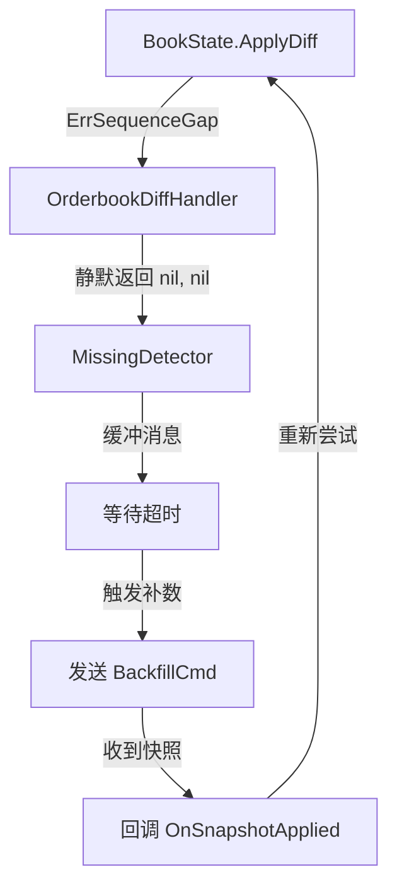

**问题：**
- `BookState` 返回 `ErrSequenceGap` 后，`OrderbookDiffHandler` 静默吞掉
- 依赖 `MissingDetector` 的超时机制触发补数
- 错误没有及时转化为补数请求

### 2. 配置与硬编码问题

#### 问题4：补数配置耦合在 MissingDetector

**现状：**
```go
// integrity/handler.go (关键段落)
backfillType := cfgString(cfg, "backfill_type", types.BackfillTypeRange)
if wsCfg, ok := bfRaw["ws"].(map[string]any); ok {
    // 解析 WebSocket 配置
    params := map[string]any{}
    if endpoint, ok := wsCfg["endpoint"].(string); ok {
        params["endpoint"] = endpoint // 订单簿特定配置
    }
}
```

**问题：**
- `MissingDetector` 是通用的序列检测器，不应了解业务细节（如订单簿快照URL）
- 补数配置应该由 `OrderbookDiffHandler` 提供

#### 问题5：硬编码的快照 URL

**现状：**
```go
// orderbook_handlers.go (L16)
const defaultSnapshotURL = "https://fapi.binance.com/fapi/v1/depth"
```

**问题：**
- 写死在代码中，不同交易所或环境需要修改代码
- 应该从配置文件读取

### 3. 逻辑复杂度问题

#### 问题6：OnSnapshotApplied 逻辑过于复杂

**现状：**
```go
// integrity/sequence_engine.go (逻辑段落)
func (h *MissingDetector) OnSnapshotApplied(lastSeq uint64) []*types.Message {
    // 69 行代码，包含：
    // 1. 状态重置
    // 2. 清理 <= lastSeq 的缓冲
    // 3. 逐个检查 buffer 中的消息
    // 4. 判断是否为范围覆盖消息
    // 5. 重新应用 drainBuffer
}
```

**问题：**
- 混合了"状态重置"和"缓冲释放"两个职责
- 范围覆盖逻辑（L623-638）与主流程重复

#### 问题7：规则判断的优先级不明确

**现状：**
```go
// integrity/buffer.go (缓存段落)
func (h *MissingDetector) Handle(msg *types.Message) ([]*types.Message, error) {
    // 规则分散在 120 行代码中：
    // - L194-200: 等待快照处理
    // - L202-223: 规则1 相等
    // - L225-228: 规则3 小于
    // - L230-252: 范围覆盖
    // - L254-281: 规则2 大于 + 急切补数
    // - L274-277: 调用软/硬超时（规则4/5）
}
```

**问题：**
- 规则顺序不直观（范围覆盖在规则2之前，但逻辑上是特殊情况）
- 超时检查分散在多处调用

### 4. 性能与资源问题

#### 问题8：无界 map 的风险

**现状：**
```go
// integrity 模块
buffer    map[uint64][]*types.Message
firstSeen map[uint64]time.Time

// orderbook.go
bids map[string]string
asks map[string]string
```

**问题：**
- `buffer` 虽然有 `maxBuckets` 限制，但清理逻辑是被动的（依赖 sweep）
- 极端乱序情况下，map 可能快速膨胀

#### 问题9：不必要的重复解析

**现状：**
```go
// orderbook_handlers.go (L155-172)
func (h *orderbookDiffHandler) handleDiffMessage(msg *types.Message) {
    var depth *binance.DepthMessage
    if v, ok := msg.Metadata["binance_depth"].(*binance.DepthMessage); ok {
        depth = v // 尝试从缓存读取
    }
    if depth == nil {
        parsed, _, err := binance.DecodeDepthMessage(msg.Payload)
        // ... 重新解析
    }
}
```

**问题：**
- 依赖 `metadata` 缓存机制避免重复解析
- 但缓存逻辑不透明，容易遗漏

---

## 重构建议

### 方案1：职责清晰化重构（推荐）

#### 目标
- **MissingDetector**：纯粹的序列检测器，不感知业务
- **OrderbookDiffHandler**：业务编排层，处理错误并触发补数
- **BookState**：纯粹的状态存储，不返回业务错误

#### 重构步骤

**步骤1：简化 BookState**

```go
// 修改后的 BookState.ApplyDiff
func (s *BookState) ApplyDiff(diff Diff) (Book, DiffResult, error) {
    s.mu.Lock()
    defer s.mu.Unlock()
    
    if s.lastUpdateID == 0 {
        return Book{}, NeedSnapshot, nil // 不再返回错误
    }
    
    expected := s.lastUpdateID + 1
    if diff.FinalUpdateID <= s.lastUpdateID {
        return Book{}, Stale, nil
    }
    if diff.FirstUpdateID > expected {
        return Book{}, Gap{Missing: [2]int64{expected, diff.FirstUpdateID - 1}}, nil
    }
    
    // 应用更新
    s.applyDiffLocked(diff)
    return s.buildBookLocked(false), Applied, nil
}

// 新增结果类型
type DiffResult interface{}
type Applied struct{}
type Stale struct{}
type NeedSnapshot struct{}
type Gap struct{ Missing [2]int64 }
```

**步骤2：增强 OrderbookDiffHandler**

```go
func (h *orderbookDiffHandler) handleDiffMessage(msg *types.Message) ([]*types.Message, error) {
    depth := h.parseDepth(msg)
    
    book, result, err := h.state.ApplyDiff(...)
    if err != nil {
        return nil, err // 真正的错误
    }
    
    switch r := result.(type) {
    case Applied:
        return []*types.Message{buildOrderbookMessage(book, ...)}, nil
        
    case NeedSnapshot:
        // 主动触发快照请求
        h.requestSnapshot(depth.Symbol)
        return nil, nil
        
    case Gap:
        // 触发范围补数
        h.requestRangeFill(r.Missing[0], r.Missing[1])
        return nil, nil
        
    case Stale:
        return nil, nil
    }
}

// 新增补数请求方法
func (h *orderbookDiffHandler) requestSnapshot(symbol string) {
    if h.backfillCh != nil {
        h.backfillCh <- types.BackfillCmd{
            Type: types.BackfillTypeSnapshot,
            Options: []types.BackfillOption{{
                Transport: types.BackfillTransportHTTP,
                Params: map[string]any{
                    "endpoint": h.snapshotURL,
                    "query":    map[string]any{"symbol": symbol, "limit": 1000},
                },
            }},
        }
    }
}
```

**步骤3：剥离 MissingDetector 的业务逻辑**

```go
// 移除 backfill_type、endpoint 等业务配置
type detectorConfig struct {
    eagerGap      uint64
    maxDelay      time.Duration
    hardTimeout   time.Duration
    // 移除：backfillType、backfillOptions
}

// 新增回调接口
type GapCallback interface {
    OnGapDetected(start, end uint64)
    OnHardTimeout(current uint64)
}

type MissingDetector struct {
    // ...
    gapCallback GapCallback // 由上层注入
}

func (h *MissingDetector) Handle(msg *types.Message) ([]*types.Message, error) {
    // ... 原有逻辑
    
    if gap > h.cfg.eagerGap {
        // 不再直接发送 BackfillCmd，而是回调上层
        if h.gapCallback != nil {
            h.gapCallback.OnGapDetected(h.expectedNext, seq-1)
        }
    }
}
```

#### 重构后架构

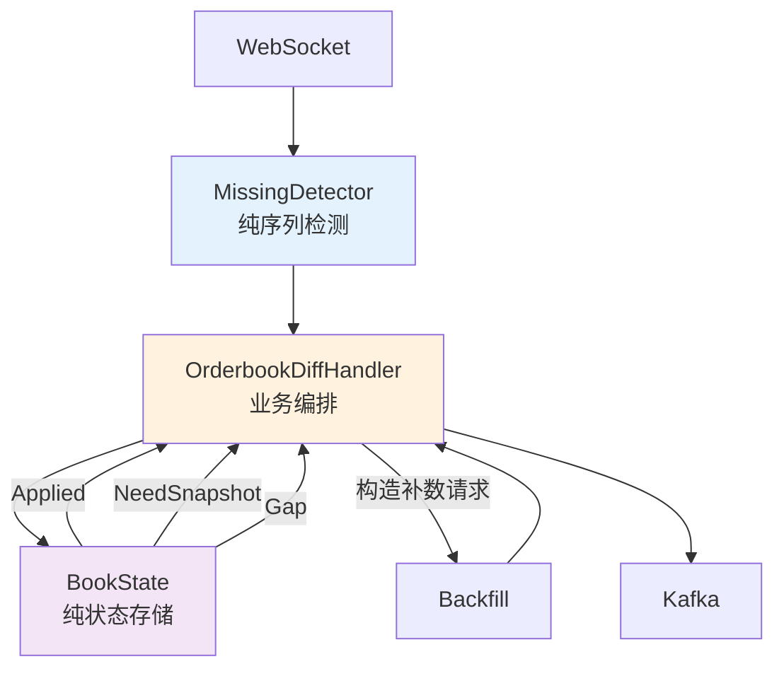

**优势：**
- 每个模块职责单一
- 补数逻辑集中在业务层（OrderbookDiffHandler）
- 序列检测逻辑通用化（可复用到其他场景）

### 方案2：合并 MissingDetector 到业务层

#### 目标
- 将序列检测逻辑内置到 `OrderbookDiffHandler`
- 删除 `MissingDetector`，减少抽象层次

#### 重构步骤

**步骤1：扩展 BookState**

```go
type BookState struct {
    mu           sync.Mutex
    lastUpdateID int64
    maxDepth     int
    bids         map[string]string
    asks         map[string]string
    
    // 新增：乱序缓冲
    buffer       map[int64][]Diff
    firstSeen    map[int64]time.Time
}

func (s *BookState) HandleDiff(diff Diff, now time.Time) ([]Book, []BackfillRequest, error) {
    s.mu.Lock()
    defer s.mu.Unlock()
    
    // 合并序列检测 + 状态更新逻辑
    // ...
}
```

**步骤2：简化 OrderbookDiffHandler**

```go
func (h *orderbookDiffHandler) Handle(msg *types.Message) ([]*types.Message, error) {
    depth := h.parseDepth(msg)
    
    // 直接调用 BookState，返回多个结果
    books, requests, err := h.state.HandleDiff(toOrderbookDiff(depth), time.Now())
    
    // 发送补数请求
    for _, req := range requests {
        h.sendBackfill(req)
    }
    
    // 构造输出消息
    out := []*types.Message{}
    for _, book := range books {
        out = append(out, buildOrderbookMessage(book, ...))
    }
    return out, nil
}
```

**优势：**
- 代码更紧凑，减少模块间通信
- 订单簿特定优化更方便（如价格档位级别的缓存）

**劣势：**
- 失去了序列检测的通用性
- 其他场景（如区块链数据）需要重新实现

### 方案3：引入状态机库（工程化方案）

#### 目标
- 使用状态机框架明确状态转换
- 提高代码可维护性和可测试性

#### 示例（伪代码）

```go
type OrderbookStateMachine struct {
    fsm *fsm.FSM
    state *BookState
}

func NewOrderbookStateMachine() *OrderbookStateMachine {
    return &OrderbookStateMachine{
        fsm: fsm.NewFSM(
            "uninitialized",
            fsm.Events{
                {Name: "receiveSnapshot", Src: []string{"uninitialized", "gapDetected"}, Dst: "synced"},
                {Name: "receiveDiff", Src: []string{"synced"}, Dst: "synced"},
                {Name: "detectGap", Src: []string{"synced"}, Dst: "gapDetected"},
                {Name: "timeout", Src: []string{"gapDetected"}, Dst: "requestBackfill"},
            },
            fsm.Callbacks{
                "enter_requestBackfill": func(e *fsm.Event) { /* 触发补数 */ },
            },
        ),
        state: NewBookState(100),
    }
}

func (sm *OrderbookStateMachine) Handle(msg *types.Message) ([]*types.Message, error) {
    if isSnapshot(msg) {
        sm.fsm.Event("receiveSnapshot", msg)
    } else {
        sm.fsm.Event("receiveDiff", msg)
    }
    // ...
}
```

**优势：**
- 状态转换可视化
- 容易添加新状态和转换规则

**劣势：**
- 引入额外依赖
- 学习成本

---

## 总结与行动计划

### 核心问题总结

| 问题类别 | 具体问题 | 影响 | 优先级 |
|---------|---------|------|--------|
| **职责重叠** | 序列号检查双重验证 | 代码冗余，性能损耗 | P1 |
| **职责重叠** | 缓冲机制混淆 | 逻辑复杂，难以维护 | P0 |
| **职责重叠** | 错误传播路径过长 | 补数延迟，状态不透明 | P1 |
| **配置耦合** | 补数配置在通用模块 | 可复用性差 | P2 |
| **硬编码** | 快照 URL 写死 | 灵活性差 | P3 |
| **逻辑复杂** | OnSnapshotApplied 过长 | 难以理解和测试 | P1 |
| **逻辑复杂** | 规则优先级不明确 | 维护困难 | P2 |
| **性能风险** | 无界 map | 内存泄漏风险 | P2 |
| **性能浪费** | 重复解析 | CPU 浪费 | P3 |

### 推荐重构路径

**阶段1：快速优化（1-2天）**
1. ✅ 提取 `metadata` 解析逻辑到独立函数，消除重复解析
2. ✅ 将快照 URL 移到配置文件
3. ✅ 为 `buffer` 添加主动清理逻辑（在 `Handle` 入口检查）

**阶段2：职责分离（3-5天）**
1. ✅ 实现方案1的步骤1：简化 `BookState`，返回结构化结果
2. ✅ 实现方案1的步骤2：增强 `OrderbookDiffHandler`，处理补数请求
3. ✅ 实现方案1的步骤3：剥离 `MissingDetector` 业务逻辑

**阶段3：测试与验证（2-3天）**
1. ✅ 编写单元测试覆盖所有规则
2. ✅ 集成测试：模拟缺口、超时、快照场景
3. ✅ 性能测试：高频数据流下的内存和延迟表现

**阶段4：文档与监控（1-2天）**
1. ✅ 更新设计文档
2. ✅ 添加关键指标日志（缺口次数、补数延迟、缓冲区大小）
3. ✅ 配置告警规则

### 关键指标定义

```go
// 建议添加到日志中的指标
type OrderbookMetrics struct {
    // 序列检测指标
    GapDetectedCount    int64         // 检测到的缺口次数
    BackfillTriggered   int64         // 触发补数次数
    BufferSize          int           // 当前缓冲区大小
    MaxBufferSize       int           // 缓冲区峰值
    
    // 性能指标
    AvgDiffApplyLatency time.Duration // Diff 应用平均延迟
    AvgBackfillLatency  time.Duration // 补数完成平均延迟
    
    // 业务指标
    SnapshotAppliedCount int64        // 快照应用次数
    DiffAppliedCount     int64        // Diff 应用次数
    StaleUpdateCount     int64        // 丢弃的过期更新数
}
```

---

## 附录

### A. 配置文件示例

```yaml
# 订单簿维护配置示例
orderbook:
  symbol: "BTCUSDT"
  exchange: "binance"
  max_depth: 100
  
  # 快照配置（移出 MissingDetector）
  snapshot:
    url: "https://fapi.binance.com/fapi/v1/depth"
    limit: 1000
    timeout_ms: 5000
  
  # 序列检测配置
  sequence_detector:
    sequence_field: "seq"
    range_start_field: "range_start"
    
    # 补数触发条件
    eager_gap: 3          # 缺口超过3立即补数
    max_delay_ms: 800     # 等待超过800ms触发补数
    hard_timeout_ms: 3000 # 硬超时强制跳过
    max_gap: 8            # 最大允许缺口
    
    # 缓冲管理
    sweep_interval_ms: 200
    bucket_ttl_ms: 3000
    max_buckets: 2000
```

### B. 测试用例清单

| 用例 | 输入 | 预期输出 | 覆盖规则 |
|------|------|----------|---------|
| TC01 | 连续序列 1,2,3,4 | 全部输出 | 规则1 |
| TC02 | 乱序 1,3,2,4 | 全部输出（按序） | 规则1+2 |
| TC03 | 缺口 1,2,5,6 | 输出1,2后触发补数 | 规则2+急切补数 |
| TC04 | 重复 1,2,2,3 | 丢弃第二个2 | 规则3 |
| TC05 | 超时等待 | 触发补数 | 规则4 |
| TC06 | 硬超时 | 强制跳过 | 规则5 |
| TC07 | 快照覆盖 | 直接采纳快照 | 范围覆盖 |
| TC08 | 缓冲溢出 | 清理旧桶 | sweep |

### C. Mermaid 图表汇总

本文档共包含 10 个 Mermaid 图表：
1. 整体架构概述图
2. 五大核心规则状态图
3. 补数触发流程图
4. OrderbookDiffHandler职责图
5. 监听器模式序列图
6. BookState状态转换图
7. 连续性检查逻辑图
8. 完整消息处理序列图
9. 状态机总览图
10. 重构后架构图

---

**文档版本：** v1.0  
**创建日期：** 2025-10-31  
**维护者：** DataPlatform Team  
**相关文件：** 
- `datainjector/worker/internal/handler/integrity/handler.go`
- `datainjector/worker/internal/handler/orderbook_handlers.go` (284行)
- `datainjector/worker/internal/resource/orderbook/orderbook.go` (261行)


