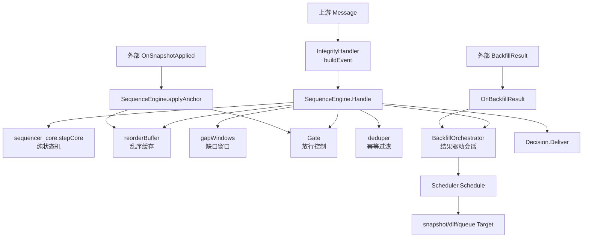
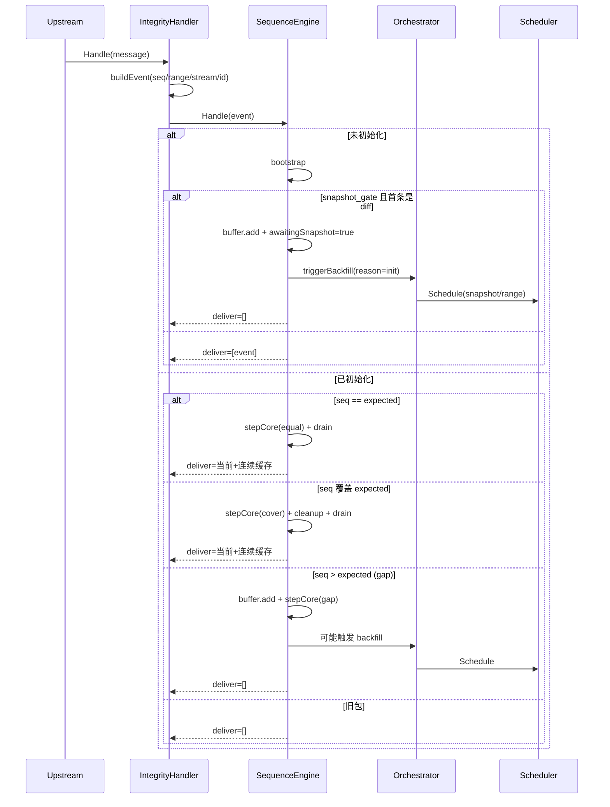
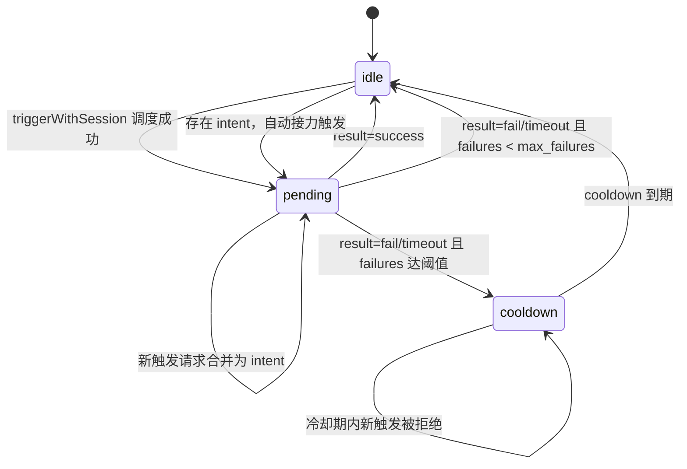
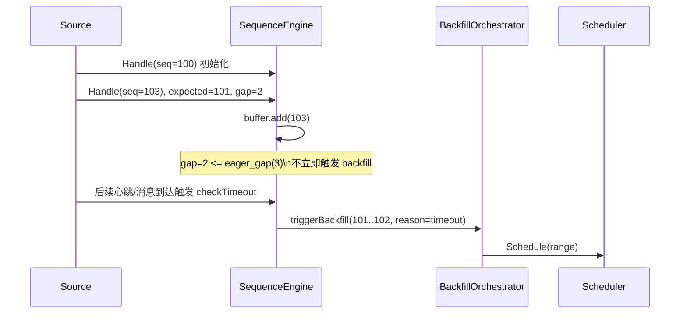
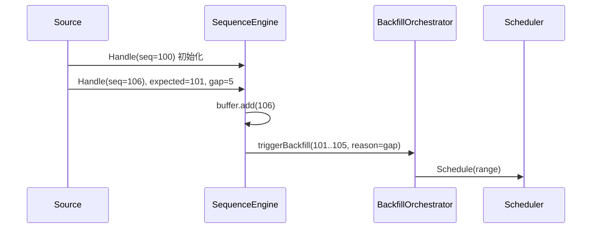
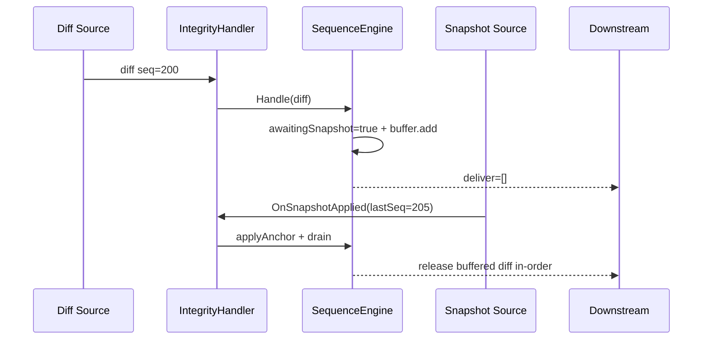
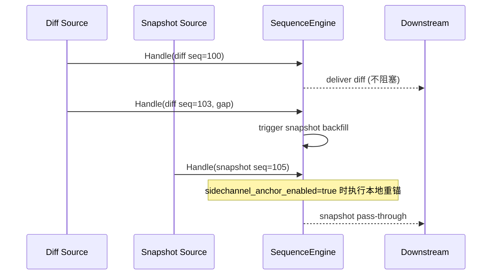
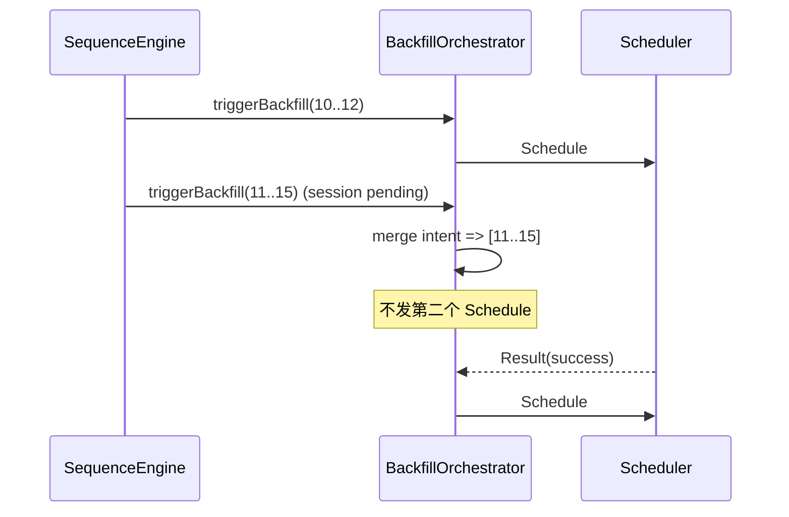
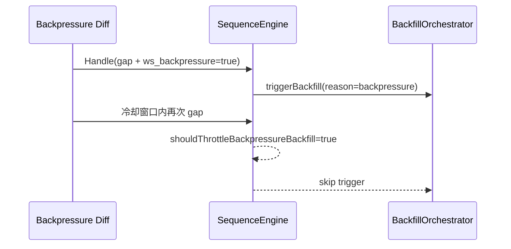

# integrity 模块说明

## 1. 模块定位
`integrity` 是 DataInjector Worker 的“数据完整性与顺序控制层”，核心目标是：
- 保证消息按期望序列输出（支持乱序缓存与连续 drain）。
- 检测缺口（gap）并触发 backfill。
- 在 snapshot 场景下控制 diff 放行时机（`snapshot_gate`）或旁路透传（`snapshot_sidechannel`）。
- 提供结果驱动的 backfill 会话闭环（singleflight、失败冷却、意图合并）。
- 可选去重（dedupe）与补偿重放（persistent compensation）。

模块入口在：
- `handler.NewIntegrityHandler` -> `integrity.NewIntegrityHandler`
- 适配器：`datainjector/worker/internal/handler/integrity_handler.go`

## 2. 核心文件与职责
- `handler.go`：`IntegrityHandler` 外观层，负责消息转 `Event` 与对外 API。
- `sequence_engine.go`：主状态机执行层（收包、buffer、gap、timeout、backfill、deliver）。
- `sequencer_core.go`：纯函数核心状态机（`stepCore`），只做“状态+动作”推导。
- `backfill_orchestrator.go`：结果驱动会话编排（pending/cooldown/intent）。
- `scheduler.go`：补数调度器与目标选择（`snapshot`/`diff`/`queue`）。
- `buffer.go`：乱序缓存，支持 `drain/cleanup/sweep`。
- `gap_window.go`：缺口窗口聚合、合并、过期与统计。
- `gate.go`：放行控制面（`noop`/`snapshotHold`/`finality`）。
- `dedupe.go`：内存 TTL 去重。
- `config_parser.go` + `types.go`：配置解析、归一化、默认值与 profile 覆写。

## 3. 总体架构


## 4. 主处理流程（Handle）


## 5. Backfill 会话状态机（结果驱动模式）
开启条件：`backfill_result_driven_enabled=true`



关键语义：
- 单飞粒度是 `BackfillSessionKey(role_id, stream_key, type)`。
- `pending` 期间不会重复调度，只扩展意图区间 `[intent_start, intent_end]`。
- 收到有效结果后，如果有 intent，会立刻触发下一轮。
- `resolvePendingTimeout` 会把超时 pending 主动转成 `timeout` 结果，复用统一收敛逻辑。

## 6. snapshot_gate 与 snapshot_sidechannel 对比
| 维度 | snapshot_gate | snapshot_sidechannel |
|---|---|---|
| 典型场景 | Binance depth 主链路依赖快照 | snapshot 旁路独立消费 |
| diff 首包行为 | 进入 `awaitingSnapshot` 并缓存 | 直接透传 |
| snapshot 事件 | 驱动锚点与释放缓存 | 直接透传，可选本地锚点 |
| gate | 通常 `snapshot_hold` | 强制 `none` |
| 是否阻塞 diff | 是 | 否 |

## 7. 配置说明（按层）
### 7.1 关键字段映射（`buildEvent`）
- `sequence_field` / `seq_field`：必填，主序列字段。
- `range_start_field`：可选，范围起点（如 `first_update_id`）。
- `stream_key_field`：可选，流身份。
- `message_id_fields`：可选，业务幂等键拼接字段。

### 7.2 顺序与超时
- `eager_gap`：gap 超过阈值时立即触发补数。
- `max_range`：单次补数最大跨度。
- `max_delay_ms`：软超时，优先触发补数。
- `hard_timeout_ms`：硬超时，允许前跳推进 expected。
- `max_gap`：SeenMax 与 ExpectedNext 的预算差值上限。

### 7.3 缓存与窗口
- `bucket_ttl_ms`：buffer/gap window 生存时间。
- `max_buckets`：buffer/gap window 容量上限。
- `sweep_interval_ms`：buffer 周期清理间隔。

### 7.4 backfill
- `backfill.ws.enabled` / `backfill.http.enabled`：补数通道开关。
- `backfill_cooldown_ms`：同范围冷却（非结果驱动模式）。
- `backfill_result_driven_enabled`：开启会话闭环。
- `backfill_max_failures` + `backfill_exhaust_cooldown_ms`：失败阈值与冷却。
- `backpressure_gap_cooldown_ms`：背压 gap 限频。
- `backfill_enqueue_timeout_ms`：调度入队超时。
- `backfill_persistent_compensation` + `backfill_compensation_file`：持久化补偿队列。
- `backfill_replay_interval_ms` + `backfill_compensation_max_pending`：补偿重放节流与上限。

### 7.5 feature flag
- `hard_timeout_priority_enabled`：用核心状态机统一处理 hard/soft timeout 优先级。
- `sidechannel_anchor_enabled`：sidechannel snapshot 到达时执行本地重锚。
- `gap_window_metrics_enabled`：指标以 gap window 真实视图统计。

## 8. profile 归一化规则
- `generic`：使用默认值。
- `binance_depth`：
  - 默认 `range_start_field=first_update_id`
  - `SnapshotBased=true`
  - `orderbook_mode` 默认 `snapshot_gate`
  - 当 `orderbook_mode=snapshot_sidechannel` 时强制 `gate_mode=none`
- `chain_blocks`：默认 `gate_mode=finality`，`finality_blocks=12`

## 9. 对外接口契约
- `Handle(*types.Message) ([]*types.Message, error)`：
  - 返回可立即下发的消息（可能 0 条）。
  - 不直接返回 backfill 命令，backfill 由 scheduler target 通道异步下发。
- `SetBackfillTarget(name, chan)`：注册补数输出通道。
- `OnSnapshotApplied(lastSeq)`：快照成功应用后，触发 anchor 与可能的缓冲释放。
- `OnBackfillResult(result)`：回传补数执行结果，驱动会话状态收敛。

## 10. 关键边界行为
- `seq < expected`：直接丢弃（旧包）。
- `buffer.sweep` 清理掉未命中的 seq 后，会触发 `reason=buffer_sweep` 补数。
- 开启 `dedupe` 时，优先使用 `MessageID`；否则退化为 `stream_key:seq`。
- `snapshot_gate` 下触发补数后会进入 `AwaitingSnapshot`；sidechannel 模式不会。
- 持久化补偿重放时，如果会话仍是 pending，会跳过重放避免并发重复调度。

## 11. 最小接入示例
```yaml
handlers:
  - type: integrity
    with:
      profile: binance_depth
      sequence_field: final_update_id
      range_start_field: first_update_id
      stream_key_field: symbol
      orderbook_mode: snapshot_gate
      backfill_result_driven_enabled: true
      backfill_max_failures: 3
      backfill_exhaust_cooldown_ms: 30000
      backfill:
        http:
          enabled: true
          endpoint: https://api.binance.com/api/v3/depth
          method: GET
          range_window: true
          range_start_param: fromId
          range_limit_param: limit
```

## 12. 测试覆盖建议入口
- `sequence_engine_session_test.go`：会话单飞、intent 合并、sidechannel/snapshot_gate。
- `sequencer_core_test.go`：纯状态机分支正确性。
- `compensation_test.go`：补偿持久化与重放。
- `buffer_test.go` / `gap_window_test.go`：缓存与窗口清理边界。

## 13. Golden Example（覆盖矩阵 + 一图一例一测试）
本节把关键配置组合拆成独立场景，目标是覆盖大多数生产路径，而不是只展示主 happy path。

### 13.1 场景覆盖矩阵
| 编号    | 场景                    | 关键配置组合                                | 预期行为                          | 测试状态   |
| ----- | --------------------- | ------------------------------------- | ----------------------------- | ------ |
| GE-01 | 小 gap 不立即补数           | `eager_gap=3`，`gap=2`                 | 先缓存等待，超时后触发 backfill          | 建议补充   |
| GE-02 | 大 gap 立即补数            | `eager_gap=3`，`gap=5`                 | 立刻触发 `range backfill`         | 已有核心覆盖 |
| GE-03 | snapshot_gate 阻塞 diff | `orderbook_mode=snapshot_gate`        | diff 缓存，等待快照锚定                | 已有核心覆盖 |
| GE-04 | sidechannel 不阻塞 diff  | `orderbook_mode=snapshot_sidechannel` | diff 透传，snapshot 可选锚定         | 已有核心覆盖 |
| GE-05 | 单会话单飞 + intent 合并     | `result_driven=true`                  | pending 时合并请求，结果后接力           | 已有核心覆盖 |
| GE-06 | 背压限频                  | `backpressure_gap_cooldown_ms>0`      | cooldown 内跳过重复补数              | 建议补充   |
| GE-07 | hard timeout 优先前跳     | `hard_timeout_priority_enabled=true`  | hard timeout 优先于 soft timeout | 已有核心覆盖 |
| GE-08 | max-gap 预算前跳          | `max_gap` 较小                          | head lag 过大时 advance expected | 已有核心覆盖 |

### 13.2 GE-01：`gap <= eager_gap` 时不立即补数（超时触发）


示例（Given/When/Then）：
- Given：`eager_gap=3`，当前 `expected=101`，收到 `seq=103`（gap=2）。
- When：gap 被检测到但未超过 eager 阈值。
- Then：先缓存不补数，直到 `max_delay` 超时才触发 backfill。

测试落点：
- 已有：`datainjector/worker/internal/handler/integrity/sequencer_core_test.go`（timeout 分支有覆盖）。
- 建议补充：`TestSequenceEngineGapBelowEagerThenTimeoutBackfill`，显式断言“首次不触发，超时后触发”。

### 13.3 GE-02：`gap > eager_gap` 立即触发 backfill


示例（Given/When/Then）：
- Given：`eager_gap=3`，`max_range` 足够。
- When：收到 `seq=106` 且当前 `expected=101`。
- Then：立即触发 gap backfill，不等待 timeout。

测试落点：
- 已有：`datainjector/worker/internal/handler/integrity/sequencer_core_test.go`（`TestStepCoreTable/gap eager triggers backfill`）。

### 13.4 GE-03：`snapshot_gate` 下 diff 先缓存，快照后释放


示例（Given/When/Then）：
- Given：`orderbook_mode=snapshot_gate`。
- When：先到 diff，后到 snapshot anchor。
- Then：diff 先缓存；anchor 后按序释放。

测试落点：
- 已有：`datainjector/worker/internal/handler/integrity/sequence_engine_session_test.go`（`TestSequenceEngineSnapshotAppliedReleasesBufferedInOrder`）。

### 13.5 GE-04：`snapshot_sidechannel` 下 diff 透传 + 可选锚定


示例（Given/When/Then）：
- Given：`orderbook_mode=snapshot_sidechannel`。
- When：diff 发生 gap 且 snapshot 到达。
- Then：diff 主流不被 gate 阻塞；snapshot 透传，按 feature flag 决定是否锚定。

测试落点：
- 已有：`datainjector/worker/internal/handler/integrity/sequence_engine_session_test.go`（`TestSequenceEngineOrderbookSideChannelDoesNotBlockDiff`、`TestSequenceEngineSideChannelSnapshotAppliesAnchor`）。

### 13.6 GE-05：结果驱动单飞（pending 合并 intent）


示例（Given/When/Then）：
- Given：`backfill_result_driven_enabled=true`。
- When：同一会话在 pending 期间再次触发。
- Then：不重复调度，先合并 intent，结果返回后接力发送。

测试落点：
- 已有：`datainjector/worker/internal/handler/integrity/sequence_engine_session_test.go`（`TestSequenceEnginePendingDedupAndMergedIntent`）。

### 13.7 GE-06：背压场景触发限频


示例（Given/When/Then）：
- Given：`backpressure_gap_cooldown_ms=2000` 且事件携带 `ws_backpressure=true`。
- When：冷却窗口内连续发生 gap。
- Then：只第一次触发 backfill，后续按 cooldown 跳过。

测试落点：
- 建议补充：`TestSequenceEngineBackpressureGapCooldown`。

### 13.8 GE-07/08：超时与预算保护（状态机治理）
本组场景建议重点绑定 `stepCore` 表驱动测试，不强制再画完整时序图。

示例（Given/When/Then）：
- GE-07（hard timeout priority）
- Given：`hard_timeout_priority_enabled=true`，`elapsed > hard_timeout`。
- When：执行 timeout 检查。
- Then：优先 `advance expected`，而非继续等待 soft timeout backfill。
- GE-08（max-gap budget）
- Given：`seen_max - expected > max_gap`。
- When：执行 budget 检查。
- Then：触发 `advance expected` 以控制 head lag 与缓存压力。

测试落点：
- 已有：`datainjector/worker/internal/handler/integrity/sequencer_core_test.go`（`hard timeout takes precedence`、`budget triggers advance`）。
