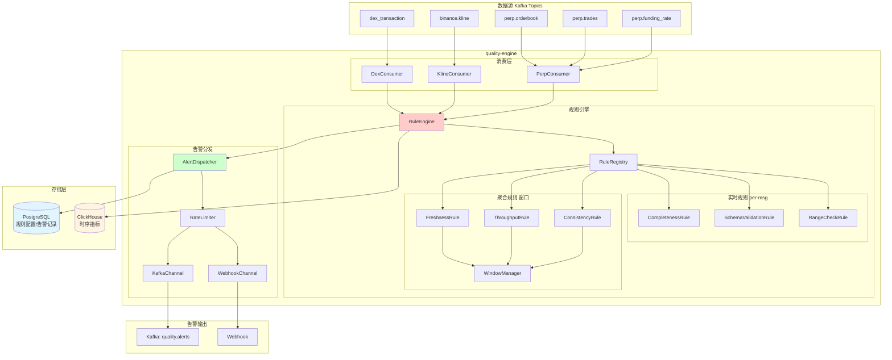

# 数据质量引擎MVP设计方案

## 1. 系统架构图



## 2. 模块结构

```
quality-engine/
├── pom.xml
├── src/main/java/com/twilight/quality/
│   ├── QualityEngineApplication.java
│   ├── config/
│   │   ├── KafkaConsumerConfig.java
│   │   ├── ClickHouseConfig.java
│   │   └── AlertConfig.java
│   ├── domain/
│   │   ├── enums/
│   │   │   ├── QualityDimension.java      # 质量维度枚举
│   │   │   ├── AlertLevel.java            # 告警级别
│   │   │   └── DataDomain.java            # 业务域(DEX/CEX_KLINE/CEX_PERP)
│   │   ├── rule/
│   │   │   ├── QualityRule.java           # 规则定义
│   │   │   └── RuleResult.java            # 检测结果
│   │   ├── metric/
│   │   │   ├── QualityMetric.java         # 质量指标
│   │   │   └── StreamHealthMetric.java    # 流健康度指标
│   │   └── alert/
│   │       └── QualityAlert.java          # 告警事件
│   ├── rule/
│   │   ├── RuleEngine.java                # 规则引擎入口
│   │   ├── RuleRegistry.java              # 规则注册中心
│   │   ├── base/
│   │   │   ├── BaseRule.java              # 规则基类
│   │   │   └── AggregateRule.java         # 聚合规则基类
│   │   ├── realtime/                      # 实时规则(per-message)
│   │   │   ├── CompletenessRule.java      # 完整性检测
│   │   │   ├── SchemaValidationRule.java  # 模式校验
│   │   │   └── RangeCheckRule.java        # 数值范围检测
│   │   └── aggregate/                     # 聚合规则(窗口)
│   │       ├── FreshnessRule.java         # 时效性检测
│   │       ├── ThroughputRule.java        # 吞吐量检测
│   │       └── ConsistencyRule.java       # 一致性检测
│   ├── consumer/
│   │   ├── DexTransactionConsumer.java    # DEX交易消费者
│   │   ├── KlineConsumer.java             # K线消费者
│   │   └── PerpConsumer.java              # 永续合约消费者
│   ├── aggregator/
│   │   ├── StreamHealthAggregator.java    # 流健康度聚合
│   │   └── WindowMetricAggregator.java    # 窗口指标聚合
│   ├── alert/
│   │   ├── AlertDispatcher.java           # 告警分发器
│   │   ├── channel/
│   │   │   ├── AlertChannel.java          # 告警通道接口
│   │   │   ├── KafkaAlertChannel.java     # Kafka告警通道
│   │   │   └── WebhookAlertChannel.java   # Webhook告警通道
│   │   └── AlertRateLimiter.java          # 告警限流
│   ├── sink/
│   │   └── QualityMetricSink.java         # 指标落库
│   └── api/
│       └── QualityController.java         # 查询API
└── src/main/resources/
    ├── application.yml
    └── rules/
        └── default-rules.yml              # 默认规则配置
```

## 3. 核心数据模型

### 3.1 质量维度枚举

```java
public enum QualityDimension {
    COMPLETENESS,    // 完整性：必填字段缺失
    TIMELINESS,      // 时效性：数据延迟、断流
    ACCURACY,        // 准确性：数值范围、格式
    CONSISTENCY,     // 一致性：跨源对比、时序连续
    SCHEMA           // 模式合规：字段类型变更
}
```

### 3.2 业务域枚举

```java
public enum DataDomain {
    DEX_UNISWAP("dex.uniswap", "dex_transaction"),
    DEX_HYPERLIQUID("dex.hyperliquid", "dex_transaction"),
    CEX_KLINE("cex.kline", "binance.kline"),
    CEX_PERP_ORDERBOOK("cex.perp.orderbook", "perp.orderbook"),
    CEX_PERP_TRADES("cex.perp.trades", "perp.trades"),
    CEX_PERP_FUNDING("cex.perp.funding", "perp.funding_rate");
    
    private final String domainId;
    private final String kafkaTopic;
}
```

### 3.3 质量指标模型

```java
@Data
@Builder
public class QualityMetric {
    private String metricId;           // 指标ID
    private DataDomain domain;         // 业务域
    private String streamKey;          // 流标识(如symbol)
    private QualityDimension dimension;// 质量维度
    private String ruleName;           // 规则名称
    
    private Double value;              // 指标值
    private Double threshold;          // 阈值
    private Boolean passed;            // 是否通过
    
    private Long windowStart;          // 窗口开始时间
    private Long windowEnd;            // 窗口结束时间
    private Long messageCount;         // 消息数量
    
    private Instant collectedAt;       // 采集时间
}
```

### 3.4 告警事件模型

```java
@Data
@Builder
public class QualityAlert {
    private String alertId;
    private AlertLevel level;          // INFO/WARNING/CRITICAL
    private DataDomain domain;
    private String streamKey;
    private QualityDimension dimension;
    private String ruleName;
    
    private String message;            // 告警描述
    private Double metricValue;        // 当前值
    private Double threshold;          // 阈值
    private String contextJson;        // 上下文快照
    
    private Long alertTime;
    private Long processTime;
}
```

## 4. 规则引擎设计

### 4.1 规则接口（策略模式）

```java
public interface QualityRule<T> {
    String getRuleName();
    DataDomain[] getSupportedDomains();
    QualityDimension getDimension();
    
    // 实时检测（每条消息）
    Optional<RuleResult> evaluate(T message, RuleContext context);
    
    // 是否为聚合规则
    default boolean isAggregateRule() { return false; }
}
```

### 4.2 聚合规则接口

```java
public interface AggregateRule<T> extends QualityRule<T> {
    // 累加消息到窗口
    void accumulate(T message, WindowState state);
    
    // 窗口结束时评估
    Optional<RuleResult> evaluateWindow(WindowState state);
    
    // 窗口大小（毫秒）
    long getWindowSizeMs();
}
```

### 4.3 规则注册中心

```java
@Component
public class RuleRegistry {
    private final Map<DataDomain, List<QualityRule<?>>> rules = new HashMap<>();
    
    @PostConstruct
    public void init() {
        // 注册DEX规则
        register(DataDomain.DEX_UNISWAP, 
            new DexCompletenessRule(),
            new DexAmountRangeRule(),
            new DexThroughputRule());
        
        // 注册Kline规则
        register(DataDomain.CEX_KLINE,
            new KlineCompletenessRule(),
            new KlineFreshnessRule(),
            new KlineGapDetectionRule());
        
        // 注册Perp规则
        register(DataDomain.CEX_PERP_ORDERBOOK,
            new OrderbookCompletenessRule(),
            new OrderbookDepthRule(),
            new OrderbookFreshnessRule());
    }
}
```

## 5. MVP版本规则清单

### 5.1 实时规则（per-message）

| 规则名称 | 维度 | 适用域 | 检测内容 |

|---------|------|--------|---------|

| `completeness.required_fields` | 完整性 | ALL | 必填字段缺失检测 |

| `accuracy.amount_range` | 准确性 | DEX | 金额范围校验(0-合理上限) |

| `accuracy.price_range` | 准确性 | KLINE/PERP | 价格范围校验 |

| `schema.type_check` | 模式 | ALL | 字段类型校验 |

### 5.2 聚合规则（窗口）

| 规则名称 | 维度 | 窗口 | 检测内容 |

|---------|------|------|---------|

| `timeliness.freshness` | 时效性 | 1min | 数据延迟检测(event_time vs process_time) |

| `timeliness.throughput` | 时效性 | 1min | 吞吐量骤降检测(与历史基线对比) |

| `consistency.sequence_gap` | 一致性 | 1min | 序列号/时间戳断流检测 |

| `consistency.cross_source` | 一致性 | 5min | 跨源价格偏离检测(Kline vs Perp) |

## 6. 告警机制

### 6.1 告警级别

```java
public enum AlertLevel {
    INFO(1),       // 观察性告警，仅记录
    WARNING(2),    // 需关注，发送Kafka事件
    CRITICAL(3);   // 严重异常，Kafka+Webhook
}
```

### 6.2 告警分发配置

```yaml
# application.yml
quality:
  alert:
    channels:
      kafka:
        enabled: true
        topic: "quality.alerts"
        min-level: WARNING
      webhook:
        enabled: true
        url: "${WEBHOOK_URL:}"
        min-level: CRITICAL
    rate-limit:
      window-seconds: 60
      max-alerts-per-rule: 5  # 每分钟每规则最多5条
```

## 7. ClickHouse存储设计

### 7.1 质量指标表

```sql
CREATE TABLE quality_metrics (
    metric_id String,
    domain LowCardinality(String),
    stream_key String,
    dimension LowCardinality(String),
    rule_name LowCardinality(String),
    
    value Float64,
    threshold Float64,
    passed UInt8,
    
    window_start DateTime64(3),
    window_end DateTime64(3),
    message_count UInt64,
    
    collected_at DateTime64(3),
    
    INDEX idx_domain domain TYPE set(100) GRANULARITY 1,
    INDEX idx_dimension dimension TYPE set(10) GRANULARITY 1
) ENGINE = MergeTree()
PARTITION BY toYYYYMMDD(collected_at)
ORDER BY (domain, stream_key, rule_name, collected_at)
TTL collected_at + INTERVAL 30 DAY;
```

### 7.2 告警事件表

```sql
CREATE TABLE quality_alerts (
    alert_id String,
    level LowCardinality(String),
    domain LowCardinality(String),
    stream_key String,
    dimension LowCardinality(String),
    rule_name LowCardinality(String),
    
    message String,
    metric_value Float64,
    threshold Float64,
    context_json String,
    
    alert_time DateTime64(3),
    process_time DateTime64(3),
    
    INDEX idx_level level TYPE set(5) GRANULARITY 1,
    INDEX idx_domain domain TYPE set(100) GRANULARITY 1
) ENGINE = MergeTree()
PARTITION BY toYYYYMMDD(alert_time)
ORDER BY (domain, level, alert_time)
TTL alert_time + INTERVAL 90 DAY;
```

## 8. 配置示例

### 8.1 规则配置(rules/default-rules.yml)

```yaml
rules:
  # DEX完整性规则
  - name: "dex.completeness.required_fields"
    domain: DEX_UNISWAP
    dimension: COMPLETENESS
    enabled: true
    config:
      required_fields:
        - "transaction_hash"
        - "block_number"
        - "from_address"
        - "events"
      alert_level: CRITICAL
      
  # K线时效性规则
  - name: "kline.timeliness.freshness"
    domain: CEX_KLINE
    dimension: TIMELINESS
    enabled: true
    config:
      window_ms: 60000
      max_delay_ms: 5000        # 5秒延迟告警
      critical_delay_ms: 30000  # 30秒严重告警
      
  # 永续订单簿完整性
  - name: "perp.orderbook.completeness"
    domain: CEX_PERP_ORDERBOOK
    dimension: COMPLETENESS
    enabled: true
    config:
      required_fields:
        - "symbol"
        - "bids"
        - "asks"
        - "update_id"
      min_depth: 10  # 至少10档深度
```

## 9. 扩展性设计

### 9.1 新增业务域

1. 在`DataDomain`枚举添加新域
2. 创建对应Consumer订阅Kafka topic
3. 实现域特定规则，注册到RuleRegistry

### 9.2 新增质量规则

1. 实现`QualityRule`或`AggregateRule`接口
2. 在规则配置文件添加配置
3. RuleRegistry自动扫描加载

### 9.3 新增告警通道

1. 实现`AlertChannel`接口
2. 注册到AlertDispatcher
3. 配置文件启用

## 10. 实施计划

| 阶段 | 内容 | 预估工作量 |

|-----|------|-----------|

| P0 | 模块骨架 + Kafka消费 + 规则引擎框架 | 1天 |

| P1 | 实时规则(完整性/准确性) + ClickHouse落库 | 1天 |

| P2 | 聚合规则(时效性/吞吐量) + 窗口管理 | 1天 |

| P3 | 告警分发(Kafka+Webhook) + 限流 | 0.5天 |

| P4 | 查询API + 测试 | 0.5天 |